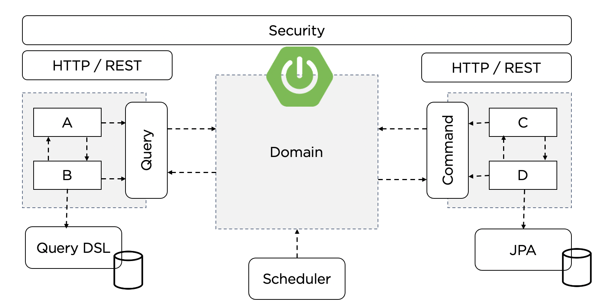
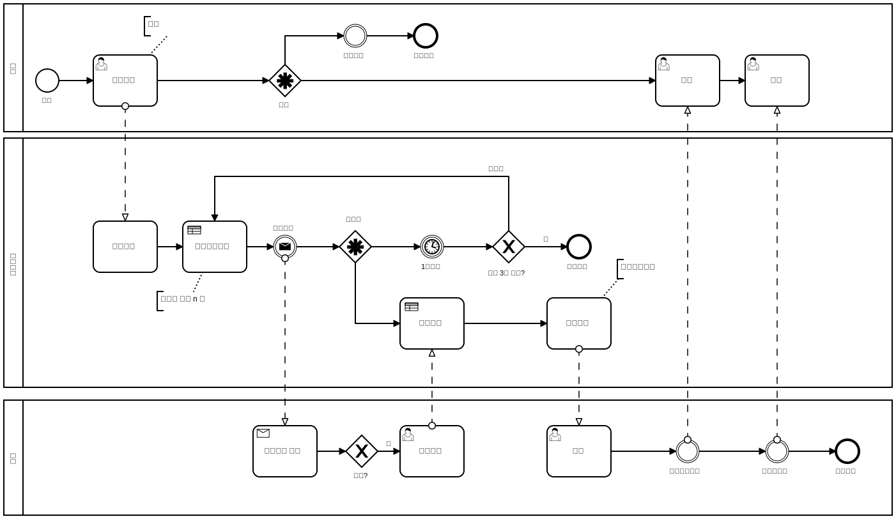
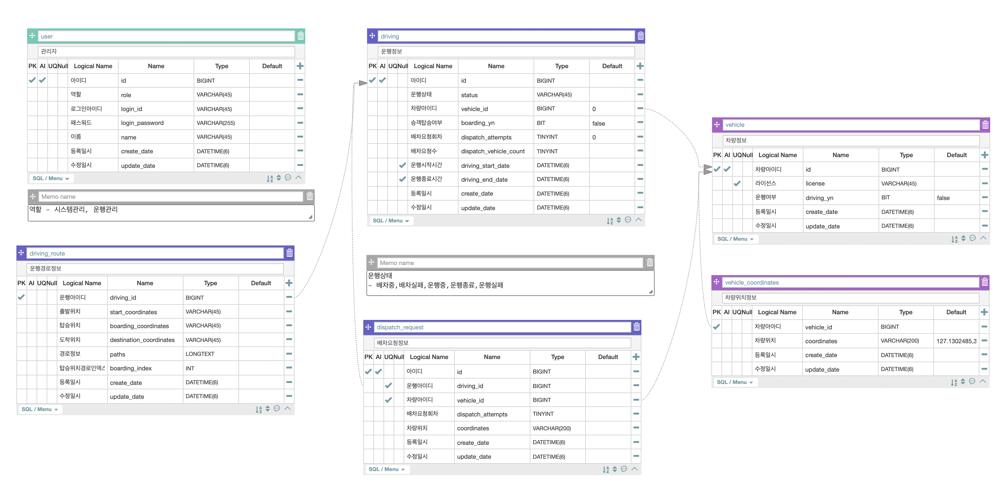

# 벡엔드 Overview

## 학습목표

1. 모빌리티 서비스의 기능요건과 비기능요건을 분석하고 모놀리씩 아키텍트를 위한 도메인 설계를 진행한다.
2. 분석된 도메인 설계를 바탕으로 SpringBoot, JPA, QueryDSL 로 Rest API 서비스를 만든다.
3. Spring Quartz 로 스케쥴 작업을 등록하고 관리하는 실습을 해 본다.
4. Spring Security 를 통해 권한있는 사용자에게만 API 를 제공 해 보는 실습을 한다.

## 비즈니스 시나리오

1. 승객이 출발지와 목적지를 입력후 운행을 요청한다.
2. 출발지에서 가장 가까운 배차 대기중인 4 대의 차량에게 배차요청을 한다.
3. 1분 후 아무 차량도 배차수락을 하지 않을 경우 다음 가까운 4 대의 차량 (총 8대)에게 배차요청을 한다.
4. 2분 후 아무 차량도 배차수락을 하지 않을 경우 다음 가까운 8 대의 차량 (총 16대)에게 배차요청을 한다.
5. 3분 후 아무 차량도 배차수락을 하지 않을 경우 배차실패로 운행을 종료한다.
6. 차량이 배차수락을 할 경우 최초 1대의 차량에게 배차되고, 현재 위치로부터 출발지, 목적지까지 경로를 안내받고 운행을 시작한다.
7. 승객이 목적지에 도착하면 운행이 종료된다.
8. 승객은 운행을 취소할 수 있다.
9. 승객은 운행상태 및 차량 위치를 실시간으로 볼 수 있으며, 운행중인 차량은 10초마다 위치 갱신을 한다.

## 다이어그램과 스키마

## 실습 간소화를 위한 규칙

1. 차량을 등록할 시 모든 차량은 임의의 위치에서 움직이지 않고 대기하고있다.
2. 모든 차량은 운행이 종료되거나 배차가 취소될 시 그자리에서 움직이지 않고 대기하고 있다.
3. 모든 차량은 목적지까지 최단거리로 운행하며, 도로상황에 상관없이 시속 100km 로 운행한다.
4. 모든 승객은 승하차시 시간에 딜레이가 없다.

## 앞으로 진행 할것.

1. SpringBoot 프로젝트 시작하기와 Gradle 구성 
2. Mysql 세팅과 Flyway 스키마 관리
3. 도메인 모델과 JPA Repository
4. QueryDSL 을 사용한 쿼리
5. HTTP Method 와 REST API
6. 비즈니스 로직과 트랜잭션 (차량관리)
7. 비즈니스 로직과 트랜잭션 (운행관리)
8. 비즈니스 로직과 트랜잭션 (스케쥴러)
9. SpringSecurity 인증처리 (사용자관리)
10. SpringBoot 프로파일과 운영환경 분리

