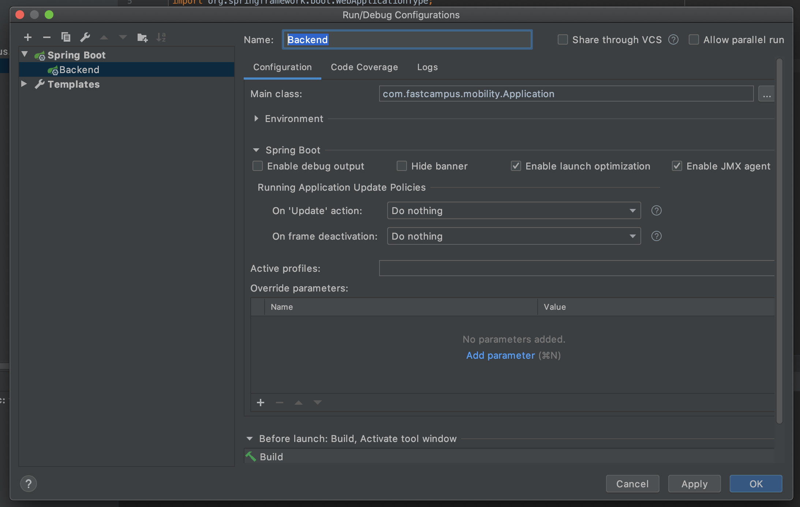
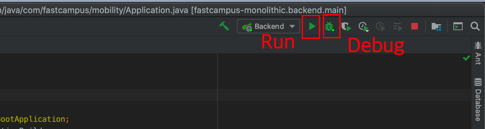
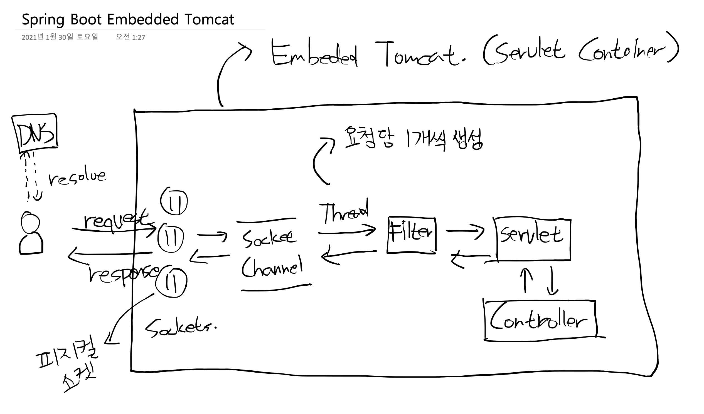
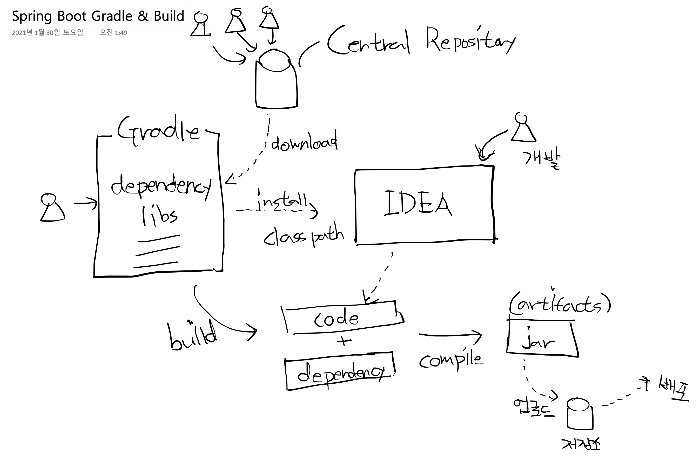

# SpringBoot 프로젝트 시작하기와 Gradle 구성

## 왜 Spring Boot 로 실습하나요?

- Spring Boot 는 Java 개발자가 바로 실행할 수 있도록 전체 Spring 구성 설정없이 최소 구성으로 시작할 수 있다.
- 국내 시장은 Java 개발자가 수요가 많음.
- 대부분의 디지털트랜스포메이션 또는 MSA 신규사업 프로젝트가 SpringBoot 를 기반으로 진행되고있음.
- 이유는? 대다수의 대한민국 서비스가 Spring 이기 때문에, SpringBoot 전환시 Risk 가 적음.
- 마이크로서비스 패턴에 친화적인 Spring Cloud   

### 장점

- 이해하기 쉽고 빠르게 스프링 애플리케이션 개발
- 생산성 향상
- 개발 시간 단축
- Spring 에서 복잡한 XML 구성을 제거
- 더 쉬운 방법으로 Spring 애플리케이션을 개발
- 서블릿 컨테이너 Tomcat 이 내장되어 별도 WAS 구축이 필요없음

## Gradle 구성

Intellij > File > New Project > Gradle > SDK11 > fastcampus-monolithic 이름 > 생성

`/gradle/wrapper/gradle-wrapper.properties`

```properties
distributionBase=GRADLE_USER_HOME
distributionPath=wrapper/dists
distributionUrl=https\://services.gradle.org/distributions/gradle-6.8.1-bin.zip
zipStoreBase=GRADLE_USER_HOME
zipStorePath=wrapper/dists

```


`/build.gradle`

```groovy
group = 'com.fastcampus'
version = '0.0.1-SNAPSHOT'

buildscript {
    ext {
        springBootVersion = '2.3.7'
        springBootGradleVersion = '2.3.7.RELEASE'
        lombokVersion = '1.18.4'
    }
    repositories {
        mavenCentral()
        maven { url "https://plugins.gradle.org/m2/" }
    }
    dependencies {
        classpath "org.springframework.boot:spring-boot-gradle-plugin:${springBootGradleVersion}"
    }
}

subprojects {

    apply plugin: 'java'
    apply plugin: 'groovy'
    apply plugin: 'idea'
    apply plugin: 'org.springframework.boot'
    apply plugin: 'io.spring.dependency-management'

    targetCompatibility = '11'
    sourceCompatibility = '11'
    compileJava.options.encoding = 'UTF-8'

    configurations {
        compileOnly {
            extendsFrom annotationProcessor
        }
    }

    repositories {
        mavenCentral()
        maven { url "https://plugins.gradle.org/m2/" }
    }

    dependencies {
        compileOnly 'org.projectlombok:lombok'
        annotationProcessor 'org.projectlombok:lombok'
        testCompile('org.springframework.boot:spring-boot-starter-test')
    }

    jar.enabled = false
    jar.dependsOn test
}
```

`/setting.gradle`

```groovy
rootProject.name = 'fastcampus-monolithic'
include 'backend'
```

`/backend/build.gradle`

```groovy
bootJar {
    launchScript()
    mainClassName('com.fastcampus.mobility.Application')
    archiveName('backend.jar')
}

dependencyManagement {
    imports {
        mavenBom 'org.springframework.cloud:spring-cloud-dependencies:Hoxton.SR8'
    }
}

dependencies {
    compile 'org.springframework.boot:spring-boot-starter-web'
    compile 'org.springframework.boot:spring-boot-starter-actuator'
    testCompile "org.springframework.security:spring-security-test"
}
```

`backend/src/main/resources/logback-spring.xml`

```xml
<?xml version="1.0" encoding="UTF-8"?>
<configuration scan="true" scanPeriod="30 seconds">

  <property name="CONSOLE_LOG_PATTERN"
    value="%clr(%d{yyyy-MM-dd HH:mm:ss.SSS}){faint} %X{transactionId} %clr(${LOG_LEVEL_PATTERN:-%5p}) %clr(${PID:- }){magenta} %clr(---){faint} %clr([%15.15t]){faint} %clr(%-40.40logger{39}){cyan} %clr(:){faint} %m%n${LOG_EXCEPTION_CONVERSION_WORD:-%wEx}"/>

  <springProfile name="local">
    <include resource="org/springframework/boot/logging/logback/base.xml"/>
    <logger name="org.springframework.web" level="DEBUG"/>
    <logger name="org.springframework.web.servlet.handler" level="INFO"/>
    <logger name="org.hibernate.SQL" level="info"/>
    <logger name="org.hibernate.type" level="info"/>
    <root level="INFO">
      <appender-ref ref="CONSOLE"/>
    </root>
  </springProfile>
  <jmxConfigurator/>
</configuration>
```

우측 Gradle 창 > 리프레쉬 아이콘 클릭 > 프로젝트 동기화 확인

## Main 클래스 작성과 구동

`backend/com/fastcampus/mobility/Application.java`

```java
package com.fastcampus.mobility;

import lombok.extern.slf4j.Slf4j;
import org.springframework.boot.Banner;
import org.springframework.boot.WebApplicationType;
import org.springframework.boot.autoconfigure.SpringBootApplication;
import org.springframework.boot.builder.SpringApplicationBuilder;

@SpringBootApplication
@Slf4j
public class Application {

  public static void main(String[] args) {
    new SpringApplicationBuilder()
        .sources(Application.class)
        .web(WebApplicationType.SERVLET)
        .bannerMode(Banner.Mode.OFF)
        .build()
        .run(args);
  }
}
```

`backend/com/fastcampus/mobility/Controller.java`

```java
package com.fastcampus.mobility;

import org.springframework.web.bind.annotation.GetMapping;
import org.springframework.web.bind.annotation.RequestMapping;
import org.springframework.web.bind.annotation.RestController;

@RestController
@RequestMapping("")
public class Controller {

  @GetMapping(value = "/hello")
  public String hello() {
    return "Hello";
  }
}

```

우측상단 Add Configuration > + Spring Boot >
- Name: Backend
- Main Class: com.fastcampus.mobility.Application



Run 또는 Debug 실행



- 8080 포트로 서버 부팅 메시지 확인
- [http://localhost:8080/hello](http://localhost:8080/hello) 접속시 Hello 확인


## 빌드와 구동

하단 터미널 탭에서 다음 명령어 실행

```shell script
$ gradle :backend:build

...
BUILD SUCCESSFUL in 2s
2 actionable tasks: 1 executed, 1 up-to-dat
```

하단 Run 또는 Debug 탭에서 Intellij 에서 실행중인 어플리케이션 중지 후 터미널 탭에서 다음 실행 

```shell script
$ java -jar backend/build/libs/backend.jar
```

- [http://localhost:8080/hello](http://localhost:8080/hello) 접속시 Hello 확인


## Spring Boot 통신 과정



## Build & Artifact




