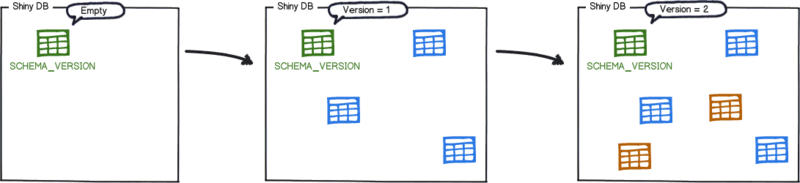
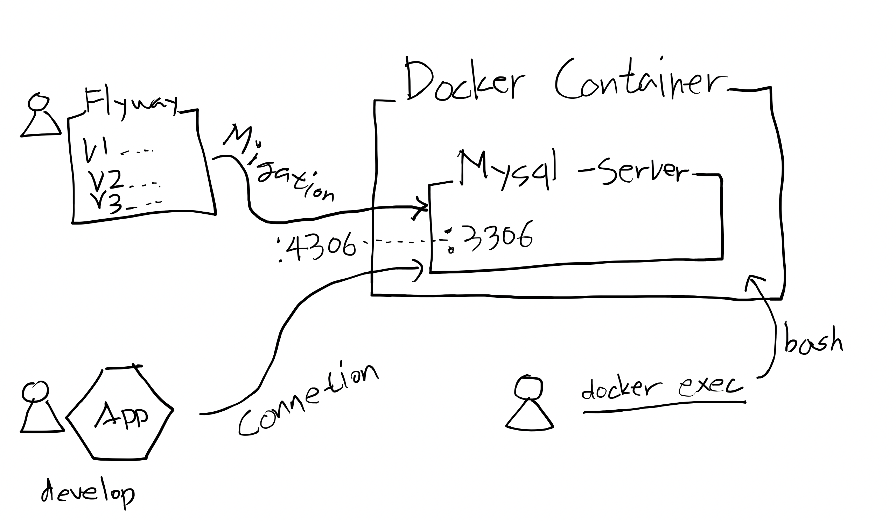

# Mysql 세팅과 Flyway 스키마 관리

## Flyway?



- 파일명은 V(숫자)__(설명).sql 형식으로 지정.  버전숫자 순서대로 스키마 구성

| 파일명 예시 | 설명 | 
|------|-----|
|V11__init_table.sql | 최초 테이블들 구성 |
|V12__add_data_vehicle.sql | 차량 정보 테이블 시드데이터 구성 |
|V13__alter_table_vehicle.sql | 차량 정보 컬럼 업데이트 |
|V14__add_table_driving.sql | 운행 정보 테이블 추가 |


## 실습에서 할 것은?



## Mysql Docker 실행

`/docker-resources.yml`

```yaml
version: '3.3'

services:
  db:
    image: mysql/mysql-server:5.7
    container_name: monolithic_db
    ports:
      - "4306:3306"
    environment:
      - MYSQL_ROOT_PASSWORD=root
      - MYSQL_ROOT_HOST=%
      - MYSQL_DATABASE=mobility
    command: ["--character-set-server=utf8mb4", "--collation-server=utf8mb4_unicode_ci", "--skip-character-set-client-handshake"]
```

다음 명령어로 docker-compose 실행

```shell script
$ docker-compose -f docker-resources.yml up
  Creating network "fastcampus-monolithic_default" with the default driver
  Creating monolithic_db ... done
  Attaching to monolithic_db
  monolithic_db | [Entrypoint] MySQL Docker Image 5.7.29-1.1.15
  monolithic_db | [Entrypoint] Initializing database
  monolithic_db | [Entrypoint] Database initialized
  ....
  monolithic_db | [Entrypoint] Starting MySQL 5.7.29-1.1.15
```

### 데몬모드 실행방법

```
$ docker-compose -f docker-resources.yml up -d
Starting monolithic_db ... done

// 확인
$ docker ps
CONTAINER ID        IMAGE                    COMMAND                  CREATED             STATUS                             PORTS                               NAMES
e7b4f41c9897        mysql/mysql-server:5.7   "/entrypoint.sh --ch…"   4 minutes ago       Up 16 seconds (health: starting)   33060/tcp, 0.0.0.0:4306->3306/tcp   monolithic_db
```

### Trouble shooting

docker 비정상 종료로 인해 docker-compose 를 다시 실행할 수 없을 떄 에러:

```shell script
$ docker-compose -f docker-resources.yml up
Creating network "fastcampus-monolithic_default" with the default driver
Creating monolithic_db ... error

ERROR: for monolithic_db  Cannot create container for service db: Conflict. The container name "/monolithic_db" is already in use by container "e0b7df88484d7164f2958b0a37f63c2e9766fa9010406f0f842df267e4e02918". You have to remove (or rename) that container to be able to reuse that name.

ERROR: for db  Cannot create container for service db: Conflict. The container name "/monolithic_db" is already in use by container "e0b7df88484d7164f2958b0a37f63c2e9766fa9010406f0f842df267e4e02918". You have to remove (or rename) that container to be able to reuse that name.
ERROR: Encountered errors while bringing up the project.
```

방법1. docker-compose down 후 재시작

```shell script
$ docker-compose -f docker-resources.yml down
$ docker-compose -f docker-resources.yml up
```

방법2. 모든 비활성 컨테이너 삭제 후 재시작

```shell script
$ docker container prune
WARNING! This will remove all stopped containers.
Are you sure you want to continue? [y/N] y
$ docker-compose -f docker-resources.yml up
```

## Mysql Docker 접속 정보

* host / port: `localhost:4306`
* username: `root`
* password: `root`
* database: mobility

### Docker Mysql 접속

```shell script
$ docker exec -it monolithic_db /bin/bash
bash-4.2# mysql -uroot -proot
mysql> show databases;
+--------------------+
| Database           |
+--------------------+
| information_schema |
| mobility           |
| mysql              |
| performance_schema |
| sys                |
+--------------------+
5 rows in set (0.00 sec)
```


### Mysql Workbench 로 접속

- [https://downloads.mysql.com/archives/workbench/](https://downloads.mysql.com/archives/workbench/) 접속
- OS 와 버젼 선택 후 다운로드
- `+` 버튼 신규 커넥션 > Hostname : 127.0.0.1, Port: 4306, Username: root, Password: root > 생성 > 사용

## flyway 설정과 스키마 파일추가

`/build.gradle` 수정

```groovy
buildscript {
    ext {
        //추가
        flywayVersion = '5.1.4'
    }
    dependencies {
        //추가
        classpath "gradle.plugin.com.boxfuse.client:gradle-plugin-publishing:${flywayVersion}"
    }
}
```

`settings.gradle` 수정

```groovy
//추가
include 'migration'
```

`migration/build.gradle`

```groovy
bootJar.enabled = false
jar.enabled = false

dependencies {
    compile("mysql:mysql-connector-java")
}

apply plugin: "org.flywaydb.flyway"

task initFlyway() {
    project.ext['flyway.url'] = "jdbc:mysql://localhost:4306/mobility"
    project.ext['flyway.user'] = "root"
    project.ext['flyway.password'] = "root"
    project.ext['flyway.locations'] = "filesystem:${file('.').absolutePath}"
    project.ext['flyway.encoding'] = "UTF-8"
    project.ext['flyway.outOfOrder'] = true
    project.ext['flyway.validateOnMigrate'] = true
}
```

`migration/V11__init_차량.sql`

```sql
-- vehicle Table Create SQL
CREATE TABLE vehicle
(
    `id`          BIGINT      NOT NULL AUTO_INCREMENT COMMENT '차량아이디',
    `license`     VARCHAR(45) NOT NULL COMMENT '라이선스',
    `driving_yn`  BIT         NOT NULL DEFAULT false COMMENT '운행여부',
    `create_date` DATETIME(6) NOT NULL COMMENT '등록일시',
    `update_date` DATETIME(6) NOT NULL COMMENT '수정일시',
    PRIMARY KEY (id)
);

ALTER TABLE vehicle
    COMMENT '차량정보';

ALTER TABLE vehicle
    ADD CONSTRAINT UC_license UNIQUE (license);
CREATE INDEX ix_vehicle_create_date ON vehicle (create_date);

CREATE TABLE vehicle_coordinates
(
    `vehicle_id`  BIGINT       NOT NULL COMMENT '차량아아디',
    `coordinates` VARCHAR(200) NOT NULL DEFAULT '127.1302485,37.3752388' COMMENT '차량위치',
    `create_date` DATETIME(6)  NOT NULL COMMENT '등록일시',
    `update_date` DATETIME(6)  NOT NULL COMMENT '수정일시',
    PRIMARY KEY (vehicle_id)
);

ALTER TABLE vehicle_coordinates
    COMMENT '차량위치정보';
```

`migration/V12__init_운행.sql`

```sql
-- driving Table Create SQL
CREATE TABLE driving
(
    `id`                     BIGINT      NOT NULL AUTO_INCREMENT COMMENT '아이디',
    `status`                 VARCHAR(45) NOT NULL COMMENT '운행상태',
    `vehicle_id`             BIGINT      NOT NULL DEFAULT 0 COMMENT '차량아이디',
    `boarding_yn`            BIT         NOT NULL DEFAULT false COMMENT '승객탑승여부',
    `dispatch_attempts`      TINYINT     NOT NULL DEFAULT 0 COMMENT '배차요청회차',
    `dispatch_vehicle_count` TINYINT     NOT NULL COMMENT '배차요청수',
    `driving_start_date`     DATETIME(6) NULL COMMENT '운행시작시간',
    `driving_end_date`       DATETIME(6) NULL COMMENT '운행종료시간',
    `create_date`            DATETIME(6) NOT NULL COMMENT '등록일시',
    `update_date`            DATETIME(6) NOT NULL COMMENT '수정일시',
    PRIMARY KEY (id)
);

ALTER TABLE driving
    COMMENT '운행정보';

CREATE INDEX ix_driving_vehicle_id ON driving (vehicle_id);
CREATE INDEX ix_driving_create_date ON driving (create_date);

-- driving_route Table Create SQL
CREATE TABLE driving_route
(
    `driving_id`              BIGINT      NOT NULL COMMENT '운행아이디',
    `start_coordinates`       VARCHAR(45) NOT NULL COMMENT '출발위치',
    `boarding_coordinates`    VARCHAR(45) NOT NULL COMMENT '탑승위치',
    `destination_coordinates` VARCHAR(45) NOT NULL COMMENT '도착위치',
    `paths`                   LONGTEXT    NOT NULL COMMENT '경로정보',
    `boarding_index`          INT         NOT NULL COMMENT '탑승위치인덱스',
    `create_date`             DATETIME(6) NOT NULL COMMENT '등록일시',
    `update_date`             DATETIME(6) NOT NULL COMMENT '수정일시',
    PRIMARY KEY (driving_id)
);


ALTER TABLE driving_route
    COMMENT '운행경로정보';

-- dispatch_request Table Create SQL
CREATE TABLE dispatch_request
(
    `id`                BIGINT       NOT NULL AUTO_INCREMENT COMMENT '아이디',
    `driving_id`        BIGINT       NOT NULL COMMENT '운행아이디',
    `vehicle_id`        BIGINT       NOT NULL COMMENT '차량아이디',
    `dispatch_attempts` TINYINT      NOT NULL COMMENT '배차요청회차',
    `coordinates`       VARCHAR(200) NOT NULL COMMENT '차량위치',
    `create_date`       DATETIME(6)  NOT NULL COMMENT '등록일시',
    `update_date`       DATETIME(6)  NOT NULL COMMENT '수정일시',
    PRIMARY KEY (id)
);

ALTER TABLE dispatch_request
    COMMENT '배차요청정보';

ALTER TABLE dispatch_request
    ADD CONSTRAINT UC_driving_id_vehicle_id UNIQUE (driving_id, vehicle_id);

CREATE INDEX ix_dispatch_requests_driving_id ON dispatch_request (driving_id);

```

## flyway migration 실행

```shell script
$ gradle :migration:flywayClean :migration:flywayBaseline :migration:flywayMigrate

> Task :migration:flywayMigrate
outOfOrder mode is active. Migration of schema `mobility` may not be reproducible.
...

BUILD SUCCESSFUL in 2s
3 actionable tasks: 3 executed
```

확인

```shell script
$ docker exec -it monolithic_db /bin/bash
bash-4.2# mysql -uroot -proot
mysql> use mobility;
mysql> show tables;
+--------------------------+
| Tables_in_mobility       |
+--------------------------+
| QRTZ_BLOB_TRIGGERS       |
| QRTZ_CALENDARS           |
| QRTZ_CRON_TRIGGERS       |
| QRTZ_FIRED_TRIGGERS      |
| QRTZ_JOB_DETAILS         |
| QRTZ_LOCKS               |
| QRTZ_PAUSED_TRIGGER_GRPS |
| QRTZ_SCHEDULER_STATE     |
| QRTZ_SIMPLE_TRIGGERS     |
| QRTZ_SIMPROP_TRIGGERS    |
| QRTZ_TRIGGERS            |
| dispatch_request         |
| driving                  |
| driving_route            |
| flyway_schema_history    |
| user                     |
| vehicle                  |
| vehicle_coordinates      |
+--------------------------+
18 rows in set (0.00 sec)
```


