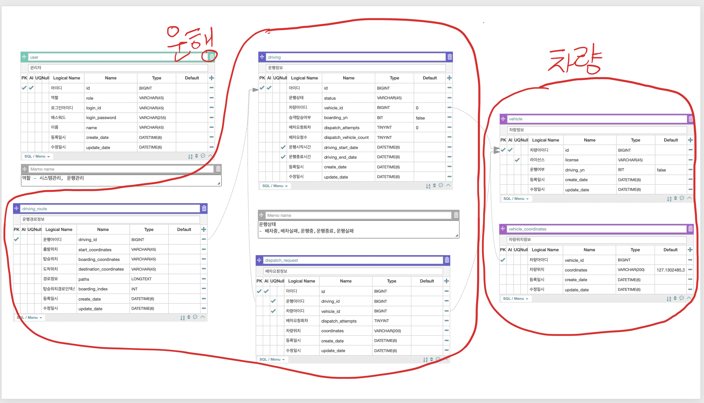
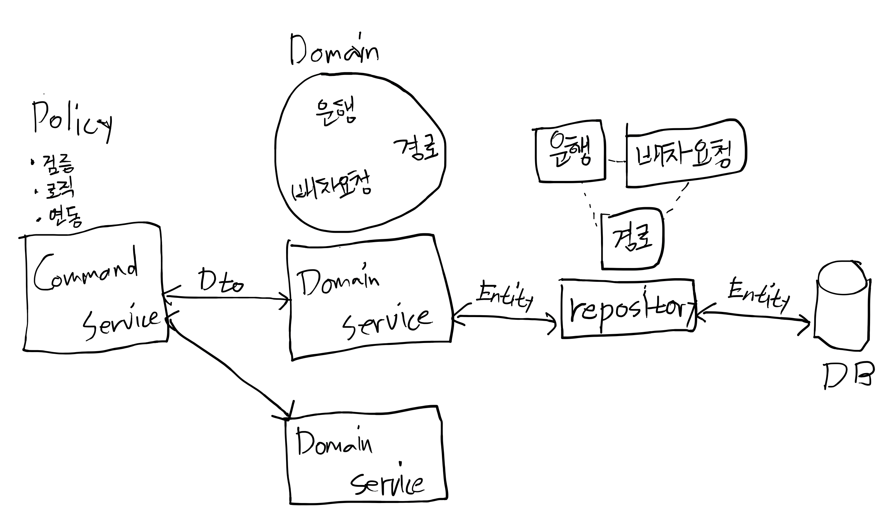
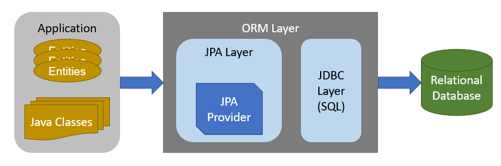

# 도메인 모델과 JPA Repository

## 도메인 모델

### 도메인 모델은?
 
- 소프트웨어 구성요소가 아니다
- 현실 세계의 객체를 구체화 한 것이다.
- 개념적 클래스로 표현이 가능하다.

스키마 구조를 도메인으로 나눈 모습



### 무엇을 할 것인가요?
 
- 다음의 다이어그램을 통해 운행도메인서비스와 차량도메인서비스의 설계를 진행한다.
- 비즈니스 로직이나 검증절차를 제외하고, 순수 도메인 객체와 도메인 서비스를 만든다.


## Entity, Dto, JPA 구조

*도메인서비스와 비즈니스로직의 분리*



*JPA ORM*



## JPA 설정하기

`/build.gradle` 수정

```groovy
buildscript {
    ext {
        //추가
        groovyVersion = '2.5.9'
        spockSpringVersion = '1.3-groovy-2.5'
        mariadbJavaClientVersion = "2.4.1"
    }
}

subprojects {
    dependencies {
        //추가
        testCompile('org.spockframework:spock-core:1.2-groovy-2.4')
        testCompile('org.spockframework:spock-spring:1.2-groovy-2.4')
        testCompile "org.codehaus.groovy:groovy:${groovyVersion}"
    }
    //추가
    sourceSets {
        integrationTest {
            java {
                compileClasspath += main.output + test.output
                runtimeClasspath += main.output + test.output
                srcDir file('src/integrationTest/java')
            }
            groovy {
                compileClasspath += main.output + test.output
                runtimeClasspath += main.output + test.output
                srcDir file('src/integrationTest/groovy')
            }
            resources.srcDir file('src/integrationTest/resources')
        }
    }
    //추가
    configurations {
        integrationTestCompile.extendsFrom testCompile
        integrationTestRuntime.extendsFrom testRuntime
    }
    //추가
    task integrationTest(type: Test) {
        afterTest { desc, result ->
            logger.quiet "Executing integration test ${desc.name} [${desc.className}] with result: ${result.resultType}"
        }
        testClassesDirs = sourceSets.integrationTest.output.classesDirs
        classpath = sourceSets.integrationTest.runtimeClasspath
        outputs.upToDateWhen { false }
    }
}
```

`backend/build.gradle` 수정

```groovy
dependencies {
    //추가
    compile 'org.springframework.boot:spring-boot-starter-data-jpa'
    compile("org.mariadb.jdbc:mariadb-java-client:${mariadbJavaClientVersion}")
}
```

`backend/src/main/resources/application.yml`

```yaml
server:
  port: 8080

spring:
  profiles:
    active: local

---
server:
  port: 8080
spring:
  profiles: local
  datasource:
    url: jdbc:mysql://localhost:4306/mobility
    driverClassName: org.mariadb.jdbc.Driver
    username: root
    password: root
    hikari:
      maximum-pool-size: 10
      connection-test-query: select 1
      connection-timeout: 10000
      pool-name: pool-primary
  jpa:
    hibernate:
      ddl-auto: validate
    properties:
      hibernate:
        dialect: org.hibernate.dialect.MySQL57Dialect
        show_sql: true
        format_sql: true
logging:
  level:
    org.hibernate.type: trace
    org.springframework.cloud: debug
```

`backend/src/main/java/com/fastcampus/mobility/config/ServerConfig.java`

```java
package com.fastcampus.mobility.config;

import org.springframework.boot.autoconfigure.EnableAutoConfiguration;
import org.springframework.context.annotation.Configuration;
import org.springframework.data.jpa.repository.config.EnableJpaAuditing;
import org.springframework.scheduling.annotation.EnableAsync;

@Configuration
@EnableJpaAuditing
@EnableAsync
@EnableAutoConfiguration
public class ServerConfig {

}
```

## Entity 공통클래스

`backend/src/main/java/com/fastcampus/mobility/common/exception/BusinessException.java`

```java
package com.fastcampus.mobility.common.exception;

public class BusinessException extends RuntimeException {

  public BusinessException(String message) {
    super(message);
  }

  public BusinessException(String message, Throwable cause) {
    super(message, cause);
  }
}
```

`backend/src/main/java/com/fastcampus/mobility/common/exception/EntityNotFoundException.java`

```java
package com.fastcampus.mobility.common.exception;

public class EntityNotFoundException extends BusinessException {

  public EntityNotFoundException() {
    super("존재하지 않는 정보 입니다.");
  }

  public EntityNotFoundException(String message) {
    super(message);
  }

  public EntityNotFoundException(String message, Throwable cause) {
    super(message, cause);
  }
}
```

`backend/src/main/java/com/fastcampus/mobility/entity/AbstractEntity.java`

```java
package com.fastcampus.mobility.entity;

import java.io.Serializable;
import java.time.LocalDateTime;
import javax.persistence.Column;
import javax.persistence.EntityListeners;
import javax.persistence.MappedSuperclass;
import lombok.Getter;
import lombok.NoArgsConstructor;
import lombok.Setter;
import org.springframework.data.annotation.CreatedDate;
import org.springframework.data.annotation.LastModifiedDate;
import org.springframework.data.jpa.domain.support.AuditingEntityListener;

@Getter
@Setter
@NoArgsConstructor
@EntityListeners(AuditingEntityListener.class)
@MappedSuperclass
public abstract class AbstractEntity implements Serializable {

  @LastModifiedDate
  @Column(name = "update_date")
  protected LocalDateTime updateDate;

  @CreatedDate
  @Column(name = "create_date", nullable = false, updatable = false)
  protected LocalDateTime createDate;
}
```

## Dto 공통클래스

`backend/src/main/java/com/fastcampus/mobility/dto/AbstractDto.java`

```java
package com.fastcampus.mobility.dto;

import com.fasterxml.jackson.databind.DeserializationFeature;
import com.fasterxml.jackson.databind.ObjectMapper;
import com.fasterxml.jackson.databind.SerializationFeature;
import com.fasterxml.jackson.datatype.jsr310.JavaTimeModule;
import java.io.IOException;
import java.io.Serializable;
import java.util.List;
import java.util.stream.Collectors;

public abstract class AbstractDto implements Serializable {

  private static final long serialVersionUID = 1L;


  public static <T extends AbstractDto> T fromEntity(final Class<T> type, final Object entity) {
    ObjectMapper objectMapper = createObjectMapper();
    try {
      String json = objectMapper.writeValueAsString(entity);
      return objectMapper.readValue(json, type);
    } catch (IOException jpe) {
      throw new IllegalArgumentException(jpe);
    }
  }

  public static <T extends AbstractDto> List<T> fromListEntities(final Class<T> dtoType,
      final List<?> entities) {
    return entities.stream().sequential()
        .map(entity -> AbstractDto.fromEntity(dtoType, entity))
        .collect(Collectors.toList());
  }

  private static ObjectMapper createObjectMapper() {
    ObjectMapper objectMapper = new ObjectMapper();
    objectMapper.configure(DeserializationFeature.FAIL_ON_UNKNOWN_PROPERTIES, false);
    objectMapper.configure(DeserializationFeature.ACCEPT_EMPTY_STRING_AS_NULL_OBJECT, true);
    objectMapper.registerModule(new JavaTimeModule());
    objectMapper.disable(SerializationFeature.WRITE_DATES_AS_TIMESTAMPS);
    return objectMapper;
  }
}
```

## 테스트서포트 클래스

`backend/src/integrationTest/groovy/com/fastcampus/mobility/IntegrationTestSupport.groovy`

```groovy
package com.fastcampus.mobility


import org.springframework.boot.test.autoconfigure.web.servlet.AutoConfigureMockMvc
import org.springframework.boot.test.context.SpringBootTest
import org.springframework.context.annotation.ComponentScan
import org.springframework.test.context.ActiveProfiles
import spock.lang.Specification

@ActiveProfiles("local")
@AutoConfigureMockMvc
@ComponentScan(basePackages = ["com.fastcampus.mobility"])
@SpringBootTest(webEnvironment = SpringBootTest.WebEnvironment.MOCK)
abstract class IntegrationTestSupport extends Specification {
}
```


