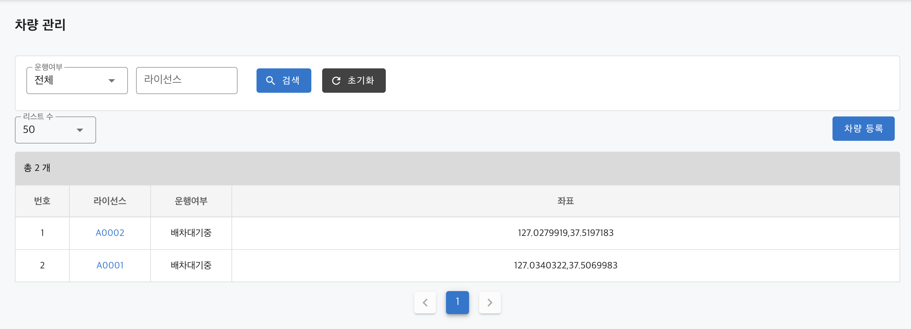
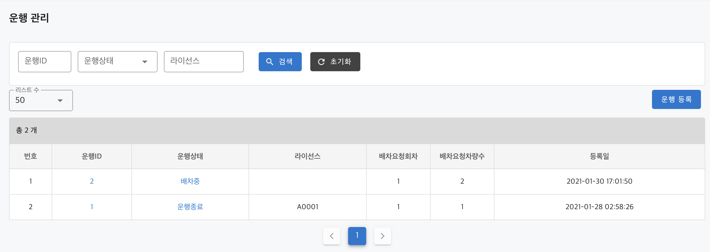

# QueryDSL 을 사용한 쿼리

## 언제 사용하나?

- Spring Data Jpa, 기본으로 제공해주는 Query 로는 다양한 조회 기능을 사용하기에 한계가 있음. 
- 이 문제를 해결하기 위해 정적 타입을 지원하는 조회 프레임워크를 사용 > Querydsl
- JPA 로 구현된 프로젝트 실무에서 많이 쓰인다.
- 주로 `검색조건`, `페이지네이션` 처리가 필요한 조회 페이지에서 사용된다.

## QueryDSL 설정

TODO 아침에 일어나면 레파지토리 테스트 케이스 만들기

## 차량조회

구현해야할 조회 화면

|검색필터|테이블|필드|
|------|----|---|
|운행여부|vehicle|driving_yn|
|라이선스|vehicle|license|

|조회결과|테이블|필드|
|------|----|---|
|운행여부|vehicle|driving_yn|
|라이선스|vehicle|license|
|좌표|`vehicle_coordinates`|coordinates|

> 주의: Bulk 조회는 실제 프로젝트에서는 하지 마세요.

- 실습 간소화를 위해 페이지처리없이 Bulk 조회를 한 후, 가장 근거리인 n 대 차량을 구했지만. 
- 만약 프로덕션 프로젝트였다면 위도,경도 컬럼을 따로 구분하고 가장 근거리인 n 대를 쿼리로 구하세요.  

## 운행조회

구현해야할 조회 화면

|검색필터|테이블|필드|
|------|----|---|
|운행아이디|driving|id|
|운행상태|driving|status|
|라이선스|`vehicle`|license|

|조회결과|테이블|필드|
|------|----|---|
|운행아이디|driving|id|
|운행상태|driving|status|
|라이선스|`vehicle`|license|
|배차요청회차|driving|dispatch_attempts|
|배차요청차량수|driving|dispatch_vehicle_count|
|등록일|driving|create_date|

