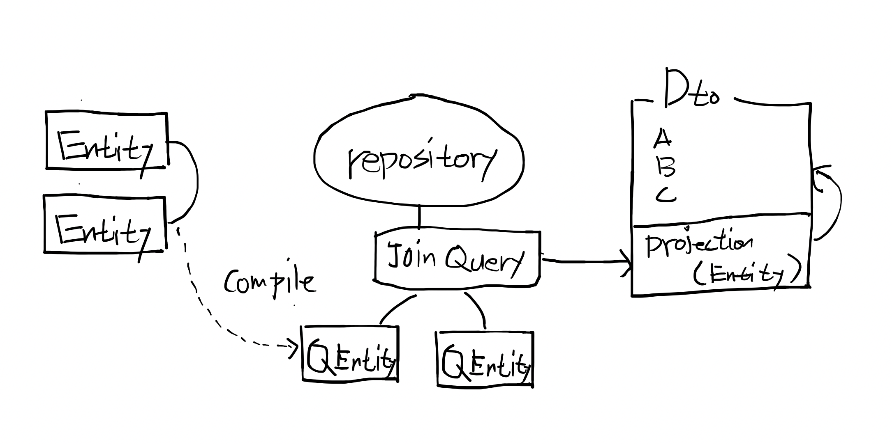

# QueryDSL 을 사용한 쿼리

## 언제 사용하나?

- Spring Data Jpa, 기본으로 제공해주는 Query 로는 다양한 조회 기능을 사용하기에 한계가 있음. 
- 이 문제를 해결하기 위해 정적 타입을 지원하는 조회 프레임워크를 사용 > Querydsl
- JPA 로 구현된 프로젝트 실무에서 많이 쓰인다.
- 주로 `검색조건`, `페이지네이션` 처리가 필요한 조회 페이지에서 사용된다.



## QueryDSL 설정

`build.gradle` 수정

```groovy
buildscript {
    ext {
        //추가
        querydslGradlePluginVersion = "1.0.10"
        queryDslVersion = '4.2.1'
    }
    dependencies {
        //추가
        classpath("gradle.plugin.com.ewerk.gradle.plugins:querydsl-plugin:$querydslGradlePluginVersion")
    }
}

//추가
def querydslProjects = [project(':backend')]
configure(querydslProjects) {
    apply plugin: "com.ewerk.gradle.plugins.querydsl"

    dependencies {
        compile("com.querydsl:querydsl-jpa")
        compile("com.querydsl:querydsl-apt")
    }

    def querydslSrcDir = "src/main/generated"

    querydsl {
        library = "com.querydsl:querydsl-apt:${queryDslVersion}"
        jpa = true
        querydslSourcesDir = querydslSrcDir
    }
    compileQuerydsl {
        options.annotationProcessorPath = configurations.querydsl
    }
    configurations {
        querydsl.extendsFrom compileClasspath
    }
    sourceSets {
        main {
            java {
                srcDirs = ["src/main/java", querydslSrcDir]
            }
        }
    }
    tasks.withType(JavaCompile) {
        options.annotationProcessorGeneratedSourcesDirectory = file(querydslSrcDir)
    }
}
```

`backend/src/main/java/com/fastcampus/mobility/common/querydsl/QueryDslHelper.java`

```java
package com.fastcampus.mobility.common.querydsl;

import java.util.Optional;
import java.util.function.Consumer;

public class QueryDslHelper {

  private QueryDslHelper() {
    throw new UnsupportedOperationException();
  }

  public static class WhereCondition<V> {

    V value;

    public WhereCondition(V value) {
      this.value = value;
    }

    public void then(Consumer<V> consumer) {
      Optional.ofNullable(value).ifPresent(consumer);
    }
  }

  public static <V> WhereCondition<V> optionalWhen(V value) {
    return new WhereCondition<>(value);
  }
}
```

## 차량조회

구현해야할 조회 화면


|검색필터|테이블|필드|
|------|----|---|
|운행여부|vehicle|driving_yn|
|라이선스|vehicle|license|

|조회결과|테이블|필드|
|------|----|---|
|운행여부|vehicle|driving_yn|
|라이선스|vehicle|license|
|좌표|`vehicle_coordinates`|coordinates|

### 차량조회 Dto QueryProjection 

`backend/src/main/java/com/fastcampus/mobility/dto/VehicleCoordinatesDto.java` 수정

```java
//추가
import com.fastcampus.mobility.entity.VehicleCoordinatesEntity;
import com.querydsl.core.annotations.QueryProjection;

@Getter
@Setter
@NoArgsConstructor
@EqualsAndHashCode(onlyExplicitlyIncluded = true, callSuper = false)
public class VehicleCoordinatesDto extends AbstractDto {

  //추가
  @QueryProjection
  public VehicleCoordinatesDto(VehicleCoordinatesEntity vc) {
    this.vehicleId = vc.getVehicleId();
    this.coordinates = vc.getCoordinates();
    this.createDate = vc.getCreateDate();
    this.updateDate = vc.getUpdateDate();
  }
}
```

`backend/src/main/java/com/fastcampus/mobility/dto/VehicleDto.java` 수정

```java
//추가
import com.fastcampus.mobility.entity.VehicleCoordinatesEntity;
import com.fastcampus.mobility.entity.VehicleEntity;
import com.querydsl.core.annotations.QueryProjection;

@Getter
@Setter
@NoArgsConstructor
@EqualsAndHashCode(onlyExplicitlyIncluded = true, callSuper = false)
public class VehicleDto extends AbstractDto {

  //추가
  @QueryProjection
  public VehicleDto(VehicleEntity v, VehicleCoordinatesEntity vc) {
    this.id = v.getId();
    this.license = v.getLicense();
    this.drivingYn = v.isDrivingYn();
    this.createDate = v.getCreateDate();
    this.updateDate = v.getUpdateDate();
    this.vehicleCoordinates = new VehicleCoordinatesDto(vc);
  }
  //추가
  @QueryProjection
  public VehicleDto(VehicleEntity v) {
    this.id = v.getId();
    this.license = v.getLicense();
    this.drivingYn = v.isDrivingYn();
    this.createDate = v.getCreateDate();
    this.updateDate = v.getUpdateDate();
  }
}
```

> 위 클래스들 수정 후 우측 gradle 탭 > Tasks > Other > complieQueryDsl 실행 > backend/src/main/generated/com/fastcampus/mobility 디렉토리에 Q클래스들 생성 확인

### 차량조회 Repository

`backend/src/main/java/com/fastcampus/mobility/repository/VehicleRepositoryCustom.java`

```java
package com.fastcampus.mobility.repository;

import com.fastcampus.mobility.dto.VehicleDto;
import com.fastcampus.mobility.dto.search.VehicleSearchDto;
import java.util.List;
import org.springframework.data.domain.Page;
import org.springframework.data.domain.Pageable;

public interface VehicleRepositoryCustom {

  Page<VehicleDto> findBySearchCondition(VehicleSearchDto vehicleSearchDto,
      Pageable pageable);

  List<VehicleDto> findByBulkSearchCondition(VehicleSearchDto vehicleSearchDto);
}
```

`backend/src/main/java/com/fastcampus/mobility/repository/VehicleRepositoryImpl.java`

```java
package com.fastcampus.mobility.repository;

import static com.fastcampus.mobility.common.querydsl.QueryDslHelper.optionalWhen;

import com.fastcampus.mobility.dto.QVehicleDto;
import com.fastcampus.mobility.dto.VehicleDto;
import com.fastcampus.mobility.dto.search.VehicleSearchDto;
import com.fastcampus.mobility.entity.QVehicleCoordinatesEntity;
import com.fastcampus.mobility.entity.QVehicleEntity;
import com.fastcampus.mobility.entity.VehicleEntity;
import com.querydsl.jpa.JPQLQuery;
import java.util.List;
import lombok.extern.slf4j.Slf4j;
import org.springframework.data.domain.Page;
import org.springframework.data.domain.PageImpl;
import org.springframework.data.domain.PageRequest;
import org.springframework.data.domain.Pageable;
import org.springframework.data.jpa.repository.support.QuerydslRepositorySupport;

@Slf4j
public class VehicleRepositoryImpl extends QuerydslRepositorySupport implements
    VehicleRepositoryCustom {

  private static QVehicleEntity vehicle = QVehicleEntity.vehicleEntity;
  private static QVehicleCoordinatesEntity vehicleCoordinates = QVehicleCoordinatesEntity.vehicleCoordinatesEntity;

  public VehicleRepositoryImpl() {
    super(VehicleEntity.class);
  }

  @Override
  public Page<VehicleDto> findBySearchCondition(VehicleSearchDto vehicleSearchDto,
      Pageable pageable) {
    JPQLQuery<VehicleDto> query = this.createQuery(vehicleSearchDto);
    query.orderBy(vehicle.createDate.desc());

    assert getQuerydsl() != null;
    List<VehicleDto> resultList = getQuerydsl().applyPagination(
        PageRequest.of(pageable.getPageNumber(), pageable.getPageSize()), query).fetch();
    return new PageImpl<>(resultList, pageable, query.fetchCount());
  }

  @Override
  public List<VehicleDto> findByBulkSearchCondition(VehicleSearchDto vehicleSearchDto) {
    JPQLQuery<VehicleDto> query = this.createQuery(vehicleSearchDto);
    query.orderBy(vehicle.createDate.desc());

    assert getQuerydsl() != null;
    return query.fetch();
  }

  private JPQLQuery<VehicleDto> createQuery(VehicleSearchDto vehicleSearchDto) {
    assert (getQuerydsl() != null);

    JPQLQuery<VehicleDto> query = getQuerydsl().createQuery()
        .select(new QVehicleDto(vehicle, vehicleCoordinates))
        .from(vehicle)
        .join(vehicleCoordinates)
        .on(vehicle.id.eq(vehicleCoordinates.vehicleId));

    optionalWhen(vehicleSearchDto.getLicense())
        .then(param -> query.where(vehicle.license.contains(param)));

    optionalWhen(vehicleSearchDto.getDrivingYn())
        .then(
            param -> {
              switch (param) {
                case Y:
                  query.where(vehicle.drivingYn.isTrue());
                  break;
                case N:
                  query.where(vehicle.drivingYn.isFalse());
                  break;
              }
            }
        );
    return query;
  }
}
```

`backend/src/main/java/com/fastcampus/mobility/repository/VehicleRepository.java` 수정

```java
package com.fastcampus.mobility.repository;

import com.fastcampus.mobility.entity.VehicleEntity;
import org.springframework.data.repository.PagingAndSortingRepository;
import org.springframework.stereotype.Repository;

@Repository
public interface VehicleRepository extends PagingAndSortingRepository<VehicleEntity, Long>,
    VehicleRepositoryCustom {

}
```

### 차량조회 DomainService

`backend/src/main/java/com/fastcampus/mobility/service/spec/VehicleDomainService.java` 수정

```java
//추가
import com.fastcampus.mobility.dto.search.VehicleSearchDto;
import org.springframework.data.domain.Page;
import org.springframework.data.domain.Pageable;

public interface VehicleDomainService {
  
  //추가
  Page<VehicleDto> search(VehicleSearchDto vehicleSearchDto, Pageable pageable);
}
```

`backend/src/main/java/com/fastcampus/mobility/service/VehicleDomainServiceImpl.java` 수정

```java
package com.fastcampus.mobility.service;

//추가
import com.fastcampus.mobility.dto.search.VehicleSearchDto;
import org.springframework.data.domain.Page;
import org.springframework.data.domain.Pageable;

@Service
@Slf4j
@Transactional
public class VehicleDomainServiceImpl implements VehicleDomainService {
 
  //추가
  @Override
  @Transactional(readOnly = true)
  public Page<VehicleDto> search(VehicleSearchDto vehicleSearchDto, Pageable pageable) {
    return vehicleRepository.findBySearchCondition(vehicleSearchDto, pageable);
  }
}
```


> 주의: Bulk 조회는 실제 프로젝트에서는 잘 하지 않음.

- 실습 간소화를 위해 페이지처리없이 Bulk 조회를 한 후, 가장 근거리인 n 대 차량을 어플리케이션에서 검색진행. 
- 만약 프로덕션 프로젝트였다면 위도,경도 컬럼을 따로 구분하고 가장 근거리인 n 대를 쿼리로 계산.
- 또는 구역 구분 컬럼을 추가하여 구역 내의 차량들을 Bulk 조회한 후 가장 근거리 n 대 차량을 어플리케이션에서 검색진행.  

## 차량조회 테스트

`backend/src/integrationTest/groovy/com/fastcampus/mobility/repository/VehicleRepositoryIntegrationTest.groovy`

```groovy
package com.fastcampus.mobility.repository

import com.fastcampus.mobility.IntegrationTestSupport
import com.fastcampus.mobility.dto.command.VehicleAddCommand
import com.fastcampus.mobility.dto.search.BooleanCondition
import com.fastcampus.mobility.dto.search.VehicleSearchDto
import com.fastcampus.mobility.repository.VehicleRepository
import com.fastcampus.mobility.service.spec.VehicleDomainService
import org.springframework.beans.factory.annotation.Autowired
import org.springframework.data.domain.PageRequest
import org.springframework.transaction.annotation.Transactional

@Transactional
class VehicleRepositoryIntegrationTest extends IntegrationTestSupport {

    @Autowired
    VehicleRepository vehicleRepository

    @Autowired
    VehicleDomainService vehicleDomainService

    def "QueryDsl 조회 테스트"() {
        given:
        def addCommand1 = new VehicleAddCommand()
        addCommand1.setLicense("A1234")
        addCommand1.setCoordinates("127.1302485,37.3752388")
        vehicleDomainService.insert(addCommand1)

        def addCommand2 = new VehicleAddCommand()
        addCommand2.setLicense("B1234")
        addCommand2.setCoordinates("127.1302485,37.3752388")
        vehicleDomainService.insert(addCommand2)

        when:
        def searchDto = VehicleSearchDto.builder()
                .license("1234")
                .drivingYn(BooleanCondition.N)
                .build()
        def page = vehicleRepository.findBySearchCondition(searchDto, PageRequest.of(0, 20))

        then:
        page.content.size() == 2
        page.content.get(0).license == "B1234"
        page.content.get(0).vehicleCoordinates != null

        page.content.get(1).license == "A1234"
        page.content.get(1).vehicleCoordinates != null
    }
}
```

## 운행조회

구현해야할 조회 화면


|검색필터|테이블|필드|
|------|----|---|
|운행아이디|driving|id|
|운행상태|driving|status|
|라이선스|`vehicle`|license|

|조회결과|테이블|필드|
|------|----|---|
|운행아이디|driving|id|
|운행상태|driving|status|
|라이선스|`vehicle`|license|
|배차요청회차|driving|dispatch_attempts|
|배차요청차량수|driving|dispatch_vehicle_count|
|등록일|driving|create_date|

### 운행조회 Dto QueryProjection

`backend/src/main/java/com/fastcampus/mobility/dto/DrivingDto.java` 수정

```java
//추가
import com.fastcampus.mobility.entity.DrivingEntity;
import com.fastcampus.mobility.entity.VehicleEntity;
import com.querydsl.core.annotations.QueryProjection;

@Getter
@Setter
@NoArgsConstructor
@EqualsAndHashCode(onlyExplicitlyIncluded = true, callSuper = false)
public class DrivingDto extends AbstractDto {

  //추가
  @QueryProjection
  public DrivingDto(DrivingEntity d, VehicleEntity v) {
    this.id = d.getId();
    this.status = d.getStatus();
    this.vehicleId = d.getVehicleId();
    this.boardingYn = d.isBoardingYn();
    this.dispatchAttempts = d.getDispatchAttempts();
    this.dispatchVehicleCount = d.getDispatchVehicleCount();
    this.drivingStartDate = d.getDrivingStartDate();
    this.drivingEndDate = d.getDrivingEndDate();
    this.createDate = d.getCreateDate();
    this.updateDate = d.getUpdateDate();
    if (v != null) {
      this.vehicle = new VehicleDto(v);
    }
  }
}
```
> 위 클래스 수정 후 우측 gradle 탭 > Tasks > Other > complieQueryDsl 실행 > backend/src/main/generated/com/fastcampus/mobility 디렉토리에 Q클래스들 생성 확인

### 운행조회 Repository

`backend/src/main/java/com/fastcampus/mobility/repository/DrivingRepositoryCustom.java`

```java
package com.fastcampus.mobility.repository;

import com.fastcampus.mobility.dto.DrivingDto;
import com.fastcampus.mobility.dto.search.DrivingSearchDto;
import org.springframework.data.domain.Page;
import org.springframework.data.domain.Pageable;

public interface DrivingRepositoryCustom {

  Page<DrivingDto> findBySearchCondition(DrivingSearchDto drivingSearchDto,
      Pageable pageable);
}
```

`backend/src/main/java/com/fastcampus/mobility/repository/DrivingRepositoryImpl.java`

```java
package com.fastcampus.mobility.repository;


import static com.fastcampus.mobility.common.querydsl.QueryDslHelper.optionalWhen;

import com.fastcampus.mobility.dto.DrivingDto;
import com.fastcampus.mobility.dto.QDrivingDto;
import com.fastcampus.mobility.dto.search.DrivingSearchDto;
import com.fastcampus.mobility.entity.DrivingEntity;
import com.fastcampus.mobility.entity.QDrivingEntity;
import com.fastcampus.mobility.entity.QVehicleEntity;
import com.querydsl.jpa.JPQLQuery;
import java.util.List;
import lombok.extern.slf4j.Slf4j;
import org.springframework.data.domain.Page;
import org.springframework.data.domain.PageImpl;
import org.springframework.data.domain.PageRequest;
import org.springframework.data.domain.Pageable;
import org.springframework.data.jpa.repository.support.QuerydslRepositorySupport;

@Slf4j
public class DrivingRepositoryImpl extends QuerydslRepositorySupport implements
    DrivingRepositoryCustom {

  private static QVehicleEntity vehicle = QVehicleEntity.vehicleEntity;
  private static QDrivingEntity driving = QDrivingEntity.drivingEntity;

  public DrivingRepositoryImpl() {
    super(DrivingEntity.class);
  }

  @Override
  public Page<DrivingDto> findBySearchCondition(DrivingSearchDto drivingSearchDto,
      Pageable pageable) {

    assert (getQuerydsl() != null);

    JPQLQuery<DrivingDto> query = getQuerydsl().createQuery()
        .select(new QDrivingDto(driving, vehicle))
        .from(driving)
        .leftJoin(vehicle)
        .on(vehicle.id.eq(driving.vehicleId));

    optionalWhen(drivingSearchDto.getId())
        .then(param -> query.where(driving.id.eq(param)));

    optionalWhen(drivingSearchDto.getStatus())
        .then(param -> query.where(driving.status.eq(param)));

    optionalWhen(drivingSearchDto.getLicense())
        .then(param -> query.where(vehicle.license.contains(param)));

    query.orderBy(driving.createDate.desc());
    List<DrivingDto> resultList = getQuerydsl().applyPagination(
        PageRequest.of(pageable.getPageNumber(), pageable.getPageSize()), query).fetch();
    return new PageImpl<>(resultList, pageable, query.fetchCount());
  }
}
```

`backend/src/main/java/com/fastcampus/mobility/repository/DrivingRepository.java` 수정

```java
package com.fastcampus.mobility.repository;

import com.fastcampus.mobility.entity.DrivingEntity;
import org.springframework.data.repository.PagingAndSortingRepository;
import org.springframework.stereotype.Repository;

@Repository
public interface DrivingRepository extends PagingAndSortingRepository<DrivingEntity, Long>,
    DrivingRepositoryCustom {

}
```

### 운행조회 DomainService

`backend/src/main/java/com/fastcampus/mobility/service/spec/DrivingDomainService.java` 수정

```java
//추가
import com.fastcampus.mobility.dto.search.DrivingSearchDto;
import org.springframework.data.domain.Page;
import org.springframework.data.domain.Pageable;

public interface DrivingDomainService {

  //추가
  Page<DrivingDto> search(DrivingSearchDto drivingSearchDto, Pageable pageable);
}

```

`backend/src/main/java/com/fastcampus/mobility/service/DrivingDomainServiceImpl.java`

```java
//추가
import com.fastcampus.mobility.dto.search.DrivingSearchDto;
import org.springframework.data.domain.Page;
import org.springframework.data.domain.Pageable;

@Service
@Slf4j
@Transactional
public class DrivingDomainServiceImpl implements DrivingDomainService {
  
  //추가
  @Override
  @Transactional(readOnly = true)
  public Page<DrivingDto> search(DrivingSearchDto drivingSearchDto, Pageable pageable) {
    return drivingRepository.findBySearchCondition(drivingSearchDto, pageable);
  }
}
```

## 운행조회 테스트

`backend/src/integrationTest/groovy/com/fastcampus/mobility/repository/DrivingRepositoryIntegrationTest.groovy`

```groovy
package com.fastcampus.mobility.repository

import com.fastcampus.mobility.IntegrationTestSupport
import com.fastcampus.mobility.dto.command.DrivingAddCommand
import com.fastcampus.mobility.dto.command.VehicleAddCommand
import com.fastcampus.mobility.dto.search.DrivingSearchDto
import com.fastcampus.mobility.entity.DrivingStatus
import com.fastcampus.mobility.map.RouteResponse
import com.fastcampus.mobility.service.spec.DrivingDomainService
import com.fastcampus.mobility.service.spec.VehicleDomainService
import org.springframework.beans.factory.annotation.Autowired
import org.springframework.data.domain.PageRequest
import org.springframework.transaction.annotation.Transactional

@Transactional
class DrivingRepositoryIntegrationTest extends IntegrationTestSupport {

    @Autowired
    DrivingRepository drivingRepository

    @Autowired
    DrivingDomainService drivingDomainService

    @Autowired
    VehicleDomainService vehicleDomainService

    def "QueryDsl 조회 테스트"() {
        given:
        def vehicleAddCommand = new VehicleAddCommand()
        vehicleAddCommand.setLicense("A1234")
        vehicleAddCommand.setCoordinates("127.1302485,37.3752388")
        def vehicleDto = vehicleDomainService.insert(vehicleAddCommand)

        def addCommand = new DrivingAddCommand()
        addCommand.setBoardingCoordinates("127.1296048,37.3807975")
        addCommand.setDestinationCoordinates("127.1166015,37.3815819")
        def drivingDto = drivingDomainService.insert(addCommand)

        def routeResponse = new RouteResponse()
        routeResponse.startCoordinates = ""
        routeResponse.boardingCoordinates = ""
        routeResponse.destinationCoordinates = ""
        routeResponse.paths = ""
        routeResponse.boardingIndex = 0
        drivingDomainService.updateDriving(drivingDto.id, vehicleDto.id, routeResponse)

        when:
        def searchDto = DrivingSearchDto.builder()
                .status(DrivingStatus.운행중)
                .license("A1234")
                .build()
        def page = drivingRepository.findBySearchCondition(searchDto, PageRequest.of(0, 20))

        then:
        page.content.size() == 1
        page.content.get(0).status == DrivingStatus.운행중
        page.content.get(0).vehicle.license == "A1234"
    }
}
```

