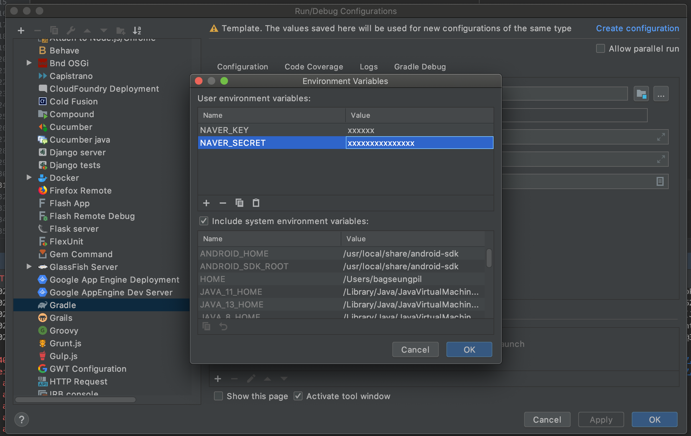

# FeignClient 를 통한 외부서비스 호출

이 실습은 네이버 지도 API 를 필요로 합니다.

[네이버-지도-api-어플리케이션-생성](/monolithic/requirement?id=네이버-지도-api-어플리케이션-생성) 을 확인하세요.

## FeignClient?

- REST 기반 서비스 호출을 추상화한 Spring Cloud Netflix 라이브러리
- 선언적 방식
- 인터페이스를 통해 클라이언트 측 프로그램 작성
- Spring 이 런타임에 구현체를 제공
- 원래는 Spring Cloud Netflix MSA 생태계인 Eureka, Zuul, Ribbon 등과 함께 쓰였음.
- 요즘은 서비스 디스커버리의 역할을 클라우드 에서 제공해주기 때문에 외부서비스 연결 또는 내부 서비스간 연결에 단독으로 쓰이는 추세

## Feign 설정

`backend/build.gradle` 수정

```groovy
dependencies {
    //추가
    compile 'org.springframework.cloud:spring-cloud-starter-openfeign'
}
```

`backend/src/main/java/com/fastcampus/mobility/config/FeignClientConfig.java`

```java
package com.fastcampus.mobility.config;

import com.fasterxml.jackson.databind.DeserializationFeature;
import com.fasterxml.jackson.databind.ObjectMapper;
import com.fasterxml.jackson.databind.SerializationFeature;
import com.fasterxml.jackson.datatype.jsr310.JavaTimeModule;
import feign.Logger;
import org.springframework.beans.factory.ObjectFactory;
import org.springframework.boot.autoconfigure.http.HttpMessageConverters;
import org.springframework.cloud.openfeign.EnableFeignClients;
import org.springframework.cloud.openfeign.support.SpringEncoder;
import org.springframework.context.annotation.Bean;
import org.springframework.context.annotation.Configuration;
import org.springframework.http.converter.json.MappingJackson2HttpMessageConverter;

@Configuration
@EnableFeignClients(basePackages = "com.fastcampus.mobility")
public class FeignClientConfig {

  @Bean
  Logger.Level feignLoggerLevel() {
    return Logger.Level.FULL;
  }

  @Bean
  public SpringEncoder getSpringEncoder() {
    return new SpringEncoder(getObjectFactory());
  }

  public ObjectFactory<HttpMessageConverters> getObjectFactory() {
    return () -> new HttpMessageConverters(
        new MappingJackson2HttpMessageConverter(objectMapper())
    );
  }

  private ObjectMapper objectMapper() {
    ObjectMapper objectMapper = new ObjectMapper();
    objectMapper.configure(DeserializationFeature.FAIL_ON_UNKNOWN_PROPERTIES, false);
    objectMapper.configure(DeserializationFeature.ACCEPT_EMPTY_STRING_AS_NULL_OBJECT, true);
    objectMapper.disable(SerializationFeature.WRITE_DATES_AS_TIMESTAMPS);
    objectMapper.registerModule(new JavaTimeModule());
    return objectMapper;
  }
}
```

## Feign Naver Client

`backend/src/main/java/com/fastcampus/mobility/map/NaverClientConfig.java`

```java
package com.fastcampus.mobility.map;

import feign.RequestInterceptor;
import lombok.Getter;
import lombok.Setter;
import org.springframework.beans.factory.annotation.Value;
import org.springframework.context.annotation.Bean;

@Getter
@Setter
public class NaverClientConfig {

  @Value("${naver.key}")
  private String key;
  @Value("${naver.secret}")
  private String secret;

  @Bean
  public RequestInterceptor requestInterceptor() {
    return requestTemplate -> {
      requestTemplate.header("X-NCP-APIGW-API-KEY-ID", key);
      requestTemplate.header("X-NCP-APIGW-API-KEY", secret);
    };
  }
}
```

`backend/src/main/java/com/fastcampus/mobility/map/NaverClient.java`

```java
package com.fastcampus.mobility.map;

import org.springframework.cloud.openfeign.FeignClient;
import org.springframework.web.bind.annotation.GetMapping;
import org.springframework.web.bind.annotation.RequestParam;

@FeignClient(value = "naver", url = "${naver.url}", configuration = NaverClientConfig.class)
public interface NaverClient {

  @GetMapping("/map-direction/v1/driving")
  String getRoute(
      @RequestParam("start") String start,
      @RequestParam("waypoints") String waypoints,
      @RequestParam("goal") String goal);
}
```

`backend/src/main/resources/application.yml`

```yaml
server:
  port: 8080

spring:
  profiles:
    active: local

//추가
naver:
  key: ${NAVER_KEY:default-key}
  secret: ${NAVER_SECRET:default-secret}
  url: https://naveropenapi.apigw.ntruss.com
```

## Test

- 상단 Run > Edit Configurations > Templates > Gradle > Environment Variables 에 다음을 추가
  - NAVER_KEY : 발급받은 네이버 어플리케이션 키
  - NAVER_SECRET : 발급받은 네이버 어플리케이션 시크릿 키 



`backend/src/integrationTest/groovy/com/fastcampus/mobility/map/NaverClientIntegrationTest.groovy`

```groovy
package com.fastcampus.mobility.map

import com.fastcampus.mobility.IntegrationTestSupport
import groovy.util.logging.Slf4j
import org.springframework.beans.factory.annotation.Autowired
import org.springframework.transaction.annotation.Transactional

@Transactional
@Slf4j
class NaverClientIntegrationTest extends IntegrationTestSupport {

    @Autowired
    NaverClient naverClient

    def "네이버 경로찾기 API 호출 테스트"() {
        given:
        def start = "127.1302485,37.3752388"
        def wayPoint = "127.1296048,37.3807975"
        def destination = "127.1166015,37.3815819"

        when:
        def response = naverClient.getRoute(start, wayPoint, destination)

        then:
        log.info(response)
        1 == 1
    }
}
```


