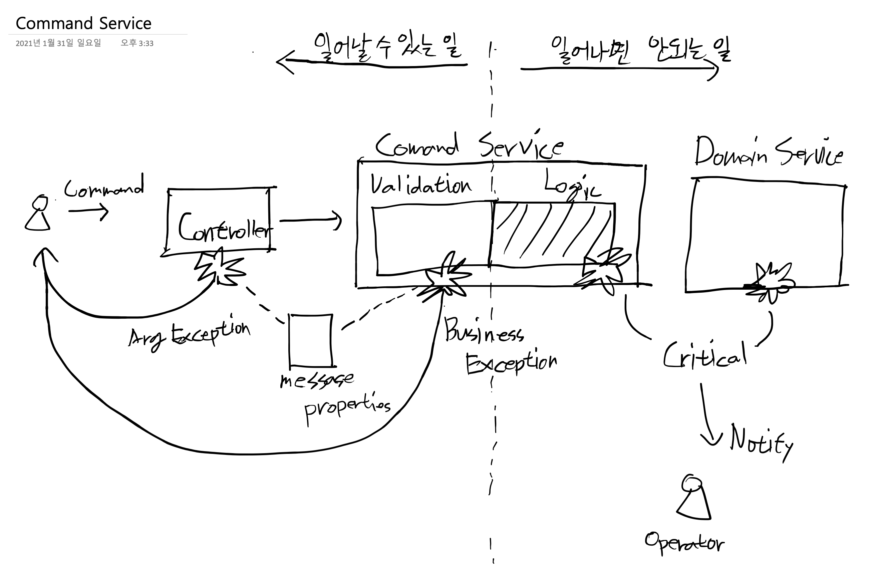
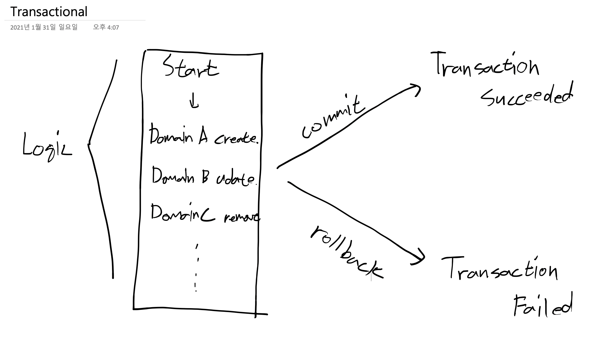

# 비즈니스 로직과 트랜잭션 (차량관리)

## 도메인 Policy 구현 패턴

컨트롤러 > 입력값 밸리데이션 > 정책 밸리데이션 > 비즈니스 로직 > 도메인 서비스



## Transactional

하나의 비즈니스 로직은 하나의 트랜잭션으로 묶인다. 
로직이 Repository 를 통해 여러번의 Entity 를 조작할 때 작업 실패시 롤백하기 위한 단위. 또는 커밋 단위
  
> 트랜잭션의 성질

- 원자성(Atomicity) : 한 트랜잭션 내에서 실행한 작업들은 하나로 간주한다. 즉, 모두 성공 또는 모두 실패. 
- 일관성(Consistency) : 트랜잭션은 일관성 있는 데이타베이스 상태를 유지한다.
- 격리성(Isolation) : 동시에 실행되는 트랜잭션들이 서로 영향을 미치지 않도록 격리해야한다.
- 지속성(Durability) : 트랜잭션을 성공적으로 마치면 결과가 항상 저장되어야 한다.



## CommandService 구현

|이름|설명|밸리데이션|로직|
|---|---|-------|---|
|vehicleAdd|차량등록| 1. license : 5글자이상 20글자이하 | 1. 좌표가 없다면 논현역 인근 5개 전철역 중 하나로 선택된다 <br/> 2. 차량도메인 저장|
|vehicleUpdate|차량등록| 1. id : 필수 <br/> 2. license : 5글자이상 20글자이하 | 1. 좌표가 없다면 기존좌표를 변경하지 않는다 <br/> 2. 차량도메인 저장|

`backend/src/main/java/com/fastcampus/mobility/service/spec/VehicleCommandService.java`

```java
package com.fastcampus.mobility.service.spec;


import com.fastcampus.mobility.dto.VehicleDto;
import com.fastcampus.mobility.dto.command.VehicleAddCommand;
import com.fastcampus.mobility.dto.command.VehicleUpdateCommand;

public interface VehicleCommandService {

  VehicleDto vehicleAdd(final VehicleAddCommand addCommand);

  VehicleDto vehicleUpdate(final VehicleUpdateCommand updateCommand);
}
```

`backend/src/main/java/com/fastcampus/mobility/service/VehicleCommandServiceImpl.java`

```java
package com.fastcampus.mobility.service;

import com.fastcampus.mobility.dto.VehicleDto;
import com.fastcampus.mobility.dto.command.VehicleAddCommand;
import com.fastcampus.mobility.dto.command.VehicleUpdateCommand;
import com.fastcampus.mobility.service.spec.VehicleCommandService;
import com.fastcampus.mobility.service.spec.VehicleDomainService;
import java.util.Arrays;
import java.util.Random;
import lombok.extern.slf4j.Slf4j;
import org.springframework.beans.factory.annotation.Autowired;
import org.springframework.stereotype.Service;
import org.springframework.transaction.annotation.Transactional;
import org.springframework.util.StringUtils;

@Service
@Slf4j
@Transactional
public class VehicleCommandServiceImpl implements VehicleCommandService {

  private final VehicleDomainService vehicleDomainService;

  @Autowired
  public VehicleCommandServiceImpl(
      final VehicleDomainService vehicleDomainService
  ) {
    this.vehicleDomainService = vehicleDomainService;
  }

  @Override
  public VehicleDto vehicleAdd(VehicleAddCommand addCommand) {
    String[] candidateCoordinates = new String[]{
        "127.02134,37.51097", //논현역,
        "127.04885,37.50433", //선릉역,
        "127.10014,37.51323",  //잠실역
        "127.06327,37.50862", //삼성역
        "127.05550,37.49074" //도곡역
    };
    if (StringUtils.isEmpty(addCommand.getCoordinates())) {
      addCommand.setCoordinates(
          Arrays.asList(candidateCoordinates)
              .get(new Random().nextInt(candidateCoordinates.length))
      );
    }
    return vehicleDomainService.insert(addCommand);
  }

  @Override
  public VehicleDto vehicleUpdate(VehicleUpdateCommand updateCommand) {
    VehicleDto vehicleDto = vehicleDomainService.get(updateCommand.getVehicleId());
    if (StringUtils.isEmpty(updateCommand.getCoordinates())) {
      updateCommand.setCoordinates(
          vehicleDto.getVehicleCoordinates().getCoordinates()
      );
    }
    return vehicleDomainService.update(updateCommand);
  }
}
```

## CommandService Test

`backend/src/integrationTest/groovy/com/fastcampus/mobility/service/VehicleCommandServiceIntegrationTest.groovy`

```groovy
package com.fastcampus.mobility.service

import com.fastcampus.mobility.IntegrationTestSupport
import com.fastcampus.mobility.dto.command.VehicleAddCommand
import com.fastcampus.mobility.dto.command.VehicleUpdateCommand
import com.fastcampus.mobility.service.spec.VehicleCommandService
import org.springframework.beans.factory.annotation.Autowired
import org.springframework.transaction.annotation.Transactional

@Transactional
class VehicleCommandServiceIntegrationTest extends IntegrationTestSupport {

    @Autowired
    VehicleCommandService vehicleCommandService

    def "차량이 등록될 때 주어진 좌표가 없다면 논현역 인근 전철역 중 하나로 지정된다. "() {
        given:
        def addCommand = new VehicleAddCommand()
        addCommand.setLicense("A1234")

        when:
        def vehicleDto = vehicleCommandService.vehicleAdd(addCommand)

        then:
        vehicleDto.vehicleCoordinates.coordinates != null
        println(vehicleDto.vehicleCoordinates.coordinates)
    }

    def "차량이 업데이트 될 때 주어진 좌표가 없다면 좌표는 변경되지 않는다"() {
        given:
        def addCommand = new VehicleAddCommand()
        addCommand.setLicense("A1234")
        def vehicleDto = vehicleCommandService.vehicleAdd(addCommand)

        def updateCommand = new VehicleUpdateCommand()
        updateCommand.setVehicleId(vehicleDto.id)
        updateCommand.setLicense("B1234")

        when:
        def updated = vehicleCommandService.vehicleUpdate(updateCommand)

        then:
        updated.vehicleCoordinates.coordinates == vehicleDto.vehicleCoordinates.coordinates
        updated.license == "B1234"
    }
}
```

## Controller & 필수값 Validation

`build.gradle` 수정

```groovy
subprojects {
    dependencies {
        //추가
        compile group: 'javax.validation', name: 'validation-api', version: '2.0.1.Final'
        compile group: 'org.hibernate.validator', name: 'hibernate-validator', version: '6.1.2.Final'
    }
}
```

`backend/src/main/resources/messages.properties`

```properties
vehicle.NotBlank.license=라이선스를 입력 해 주세요.
vehicle.Size.min.license=라이선스는 최소 {min}자 이상 등록 가능합니다.
vehicle.Size.max.license=라이선스는 최대 {max}자 까지 등록 가능합니다.
```

`backend/src/main/java/com/fastcampus/mobility/config/WebMvcConfig.java`

```java
package com.fastcampus.mobility.config;

import com.fasterxml.jackson.databind.DeserializationFeature;
import com.fasterxml.jackson.databind.ObjectMapper;
import com.fasterxml.jackson.databind.SerializationFeature;
import com.fasterxml.jackson.datatype.jsr310.JavaTimeModule;
import org.springframework.context.MessageSource;
import org.springframework.context.annotation.Bean;
import org.springframework.context.annotation.Configuration;
import org.springframework.validation.Validator;
import org.springframework.validation.beanvalidation.LocalValidatorFactoryBean;
import org.springframework.web.servlet.config.annotation.WebMvcConfigurer;

@Configuration
public class WebMvcConfig implements WebMvcConfigurer {

  private final MessageSource messageSource;

  public WebMvcConfig(MessageSource messageSource) {
    this.messageSource = messageSource;
  }

  @Override
  public Validator getValidator() {
    LocalValidatorFactoryBean factoryBean = new LocalValidatorFactoryBean();
    factoryBean.setValidationMessageSource(messageSource);
    return factoryBean;
  }

  @Bean
  public ObjectMapper objectMapper() {
    ObjectMapper objectMapper = new ObjectMapper();
    objectMapper.configure(DeserializationFeature.FAIL_ON_UNKNOWN_PROPERTIES, false);
    objectMapper.configure(DeserializationFeature.ACCEPT_EMPTY_STRING_AS_NULL_OBJECT, true);
    objectMapper.disable(SerializationFeature.WRITE_DATES_AS_TIMESTAMPS);
    objectMapper.registerModule(new JavaTimeModule());
    return objectMapper;
  }
}
```

`backend/src/main/java/com/fastcampus/mobility/dto/command/VehicleAddCommand.java` 수정

```java
package com.fastcampus.mobility.dto.command;

import javax.validation.constraints.NotBlank;
import javax.validation.constraints.Size;
import lombok.Getter;
import lombok.NoArgsConstructor;
import lombok.Setter;

@Getter
@Setter
@NoArgsConstructor
public class VehicleAddCommand {

  @NotBlank(message = "{vehicle.NotBlank.license}")
  @Size(min = 5, message = "{vehicle.Size.min.license}")
  @Size(max = 20, message = "{vehicle.Size.max.license}")
  private String license;
  private String coordinates;
}
```

`backend/src/main/java/com/fastcampus/mobility/dto/command/VehicleUpdateCommand.java` 수정

```java
package com.fastcampus.mobility.dto.command;

import javax.validation.constraints.NotBlank;
import javax.validation.constraints.Size;
import lombok.Getter;
import lombok.NoArgsConstructor;
import lombok.Setter;

@Getter
@Setter
@NoArgsConstructor
public class VehicleUpdateCommand {

  private Long vehicleId;
  @NotBlank(message = "{vehicle.NotBlank.license}")
  @Size(min = 5, message = "{vehicle.Size.min.license}")
  @Size(max = 20, message = "{vehicle.Size.max.license}")
  private String license;
  private String coordinates;
}
```

`backend/src/main/java/com/fastcampus/mobility/controller/VehicleController.java`

```java
package com.fastcampus.mobility.controller;

import com.fastcampus.mobility.dto.VehicleDto;
import com.fastcampus.mobility.dto.command.VehicleAddCommand;
import com.fastcampus.mobility.dto.command.VehicleUpdateCommand;
import com.fastcampus.mobility.dto.search.VehicleSearchDto;
import com.fastcampus.mobility.service.spec.VehicleCommandService;
import com.fastcampus.mobility.service.spec.VehicleDomainService;
import javax.validation.Valid;
import javax.validation.constraints.Min;
import javax.validation.constraints.NotNull;
import org.springframework.beans.factory.annotation.Autowired;
import org.springframework.data.domain.Page;
import org.springframework.data.domain.Pageable;
import org.springframework.data.web.PageableDefault;
import org.springframework.http.HttpStatus;
import org.springframework.http.ResponseEntity;
import org.springframework.validation.annotation.Validated;
import org.springframework.web.bind.annotation.GetMapping;
import org.springframework.web.bind.annotation.PathVariable;
import org.springframework.web.bind.annotation.PostMapping;
import org.springframework.web.bind.annotation.PutMapping;
import org.springframework.web.bind.annotation.RequestBody;
import org.springframework.web.bind.annotation.RequestMapping;
import org.springframework.web.bind.annotation.RestController;

@RestController
@RequestMapping("/api/vehicle")
@Validated
public class VehicleController {

  private final VehicleCommandService vehicleCommandService;
  private final VehicleDomainService vehicleDomainService;

  @Autowired
  public VehicleController(
      final VehicleCommandService vehicleCommandService,
      final VehicleDomainService vehicleDomainService
  ) {
    this.vehicleCommandService = vehicleCommandService;
    this.vehicleDomainService = vehicleDomainService;
  }

  @GetMapping(value = "")
  public ResponseEntity<Page<VehicleDto>> search(
      final VehicleSearchDto vehicleSearchDto,
      final @PageableDefault(size = 50) Pageable pageable) {
    return new ResponseEntity<>(
        vehicleDomainService.search(vehicleSearchDto, pageable), HttpStatus.OK);
  }

  @GetMapping(value = "/{id}")
  public ResponseEntity<VehicleDto> get(
      final @PathVariable("id") @NotNull @Min(1) Long id) {
    return new ResponseEntity<>(vehicleDomainService.get(id), HttpStatus.OK);
  }

  @PostMapping("")
  public ResponseEntity<VehicleDto> add(
      @Valid final @RequestBody VehicleAddCommand addCommand) {
    return new ResponseEntity<>(vehicleCommandService.vehicleAdd(addCommand), HttpStatus.OK);
  }

  @PutMapping(value = "/{id}")
  public ResponseEntity<VehicleDto> update(
      final @PathVariable("id") @NotNull @Min(1) Long id,
      @Valid final @RequestBody VehicleUpdateCommand updateCommand) {
    updateCommand.setVehicleId(id);
    return new ResponseEntity<>(vehicleCommandService.vehicleUpdate(updateCommand), HttpStatus.OK);
  }
}
```

## Exception Handler

`backend/src/main/java/com/fastcampus/mobility/controller/ApiExceptionHandler.java`

```java
package com.fastcampus.mobility.controller;

import com.fastcampus.mobility.common.exception.BusinessException;
import com.fastcampus.mobility.common.exception.EntityNotFoundException;
import java.time.LocalDateTime;
import lombok.Getter;
import lombok.Setter;
import lombok.ToString;
import lombok.extern.slf4j.Slf4j;
import org.apache.catalina.connector.ClientAbortException;
import org.springframework.beans.factory.annotation.Autowired;
import org.springframework.http.HttpStatus;
import org.springframework.http.ResponseEntity;
import org.springframework.validation.BindException;
import org.springframework.web.bind.MethodArgumentNotValidException;
import org.springframework.web.bind.annotation.ExceptionHandler;
import org.springframework.web.bind.annotation.RestControllerAdvice;

@Slf4j
@RestControllerAdvice
public class ApiExceptionHandler {

  @Autowired
  public ApiExceptionHandler() {
  }

  /**
   * Business && Data Exception
   */
  @ExceptionHandler({
      BusinessException.class,
      EntityNotFoundException.class
  })
  private ResponseEntity<ApiErrorResponse> handleBusinessException(BusinessException e) {
    log.error("ApiException > BusinessException : {}", e.getMessage(), e);
    return new ResponseEntity<>(
        new ApiErrorResponse(e.getMessage()), HttpStatus.BAD_REQUEST);
  }

  /**
   * hibernate validator
   */
  @ExceptionHandler({
      MethodArgumentNotValidException.class,
      BindException.class
  })
  public ResponseEntity<ApiErrorResponse> handleValidation(Exception e) {
    log.error("ApiException > BusinessException : {}", e.getMessage(), e);
    String message;
    if (e instanceof MethodArgumentNotValidException) {
      MethodArgumentNotValidException ex = (MethodArgumentNotValidException) e;
      message = ex.getBindingResult().getAllErrors().isEmpty() ?
          ex.getMessage() : ex.getBindingResult().getAllErrors().get(0).getDefaultMessage();
    } else {
      BindException ex = (BindException) e;
      message = ex.getBindingResult().getAllErrors().isEmpty() ?
          ex.getMessage() : ex.getBindingResult().getAllErrors().get(0).getDefaultMessage();
    }
    return new ResponseEntity<>(
        new ApiErrorResponse(message), HttpStatus.BAD_REQUEST);
  }

  /**
   * Broken Pipe
   */
  @ExceptionHandler({ClientAbortException.class})
  public void handleBrokenPipe(ClientAbortException e) {
    log.warn("ApiException > ClientAbortException : {}", e.getMessage(), e);
  }

  /**
   * UNKNOWN_ERROR
   */
  @ExceptionHandler(Exception.class)
  public ResponseEntity<ApiErrorResponse> handleException(Exception e) {
    log.error("ApiException > Exception : {}", e.getMessage(), e);
    return new ResponseEntity<>(
        new ApiErrorResponse("시스템 오류입니다."), HttpStatus.INTERNAL_SERVER_ERROR);
  }

  @Getter
  @Setter
  @ToString
  public static class ApiErrorResponse {

    private String message;
    private LocalDateTime timestamp;

    public ApiErrorResponse(String message) {
      this.message = message;
      this.timestamp = LocalDateTime.now();
    }
  }
}
```

## API Test

- Window 사용자는 [https://curl.haxx.se/download.html](https://curl.haxx.se/download.html) 에서 CURL 설치.
- 또는 [https://www.postman.com/downloads/](https://www.postman.com/downloads/) 에서 Postman 설치 (추천) 

필수값 검증 실패시

```shell script
$ curl --location --request POST 'http://localhost:8080/api/vehicle' \
> --header 'Content-Type: application/json' \
> --data-raw '{
>     "license": "A"
> }'
{"message":"라이선스는 최소 5자 이상 등록 가능합니다.","timestamp":"2021-01-31T17:03:07.304146"}
````

필수값 검증 성공시

```shell script
$ curl --location --request POST 'http://localhost:8080/api/vehicle' \
> --header 'Content-Type: application/json' \
> --data-raw '{
>     "license": "A0001"
> }'
{"id":50,"license":"A0001","drivingYn":false,"createDate":"2021-01-31T17:05:04.27616","updateDate":"2021-01-31T17:05:04.27616","vehicleCoordinates":{"vehicleId":50,"coordinates":"127.05550,37.49074","createDate":"2021-01-31T17:05:04.401954","updateDate":"2021-01-31T17:05:04.401954"}}
```

