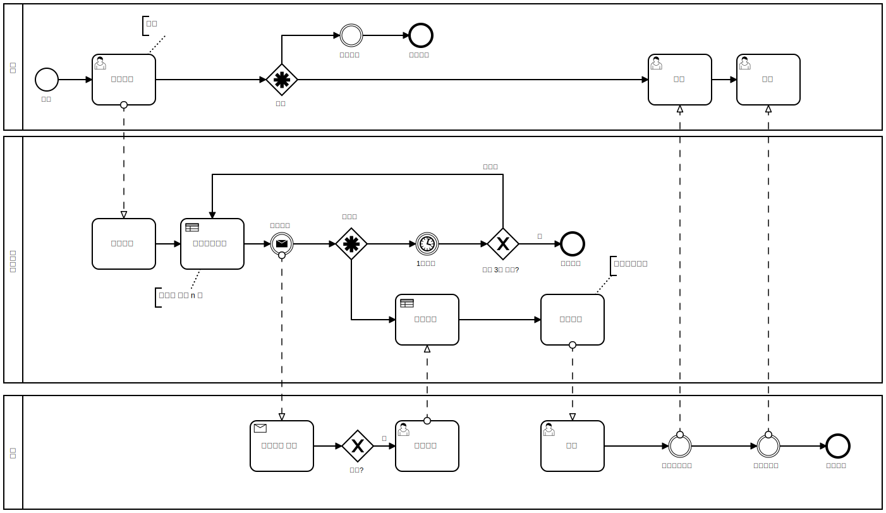

# 비즈니스 로직과 트랜잭션 (운행관리)

## CommandService 동작정의

*다이어그램*



### 운행등록
- 이름: drivingAdd 
- 밸리데이션:
  - boardingCoordinates(필수값)
  - destinationCoordinates(필수값)
- 로직:
  - 운행도메인 저장
  - 배차스케쥴 시작

### 배차요청
- 이름: dispatchRequest
- 밸리데이션:
  - 운행아이디 (필수값)
  - 배차시도회수 (필수값)
  - 운행이 배차중 상태가 아닐시 실패
  - 운행이 배차3회 이상 실패시 배차실패로 상태변경
- 로직:
  - 배차시도회수에 따라 배차요청할 차량수를 계산한다.
  - 운행중이 아닌 차량중 승객과 가장 근거리의 차량들을 배차요청할 차량수만큼 선택한다.
  - 운행도메인에 배차요청차량들을 저장한다.
  - 다음 배차 스케쥴 등록 (1분 후)
    
### 배차수락
- 이름: dispatchAcceptance
- 밸리데이션:
  - 운행아이디 (필수값)
  - 차량아이디 (필수값)
  - 운행상태가 배차중이 아니면 실패
  - 차량이 이미 운행중이면 실패
  - 배차요청된 차량이 아니면 실패
- 로직:
  - 네이버지도 API 로 운전자-승객-목적지 까지 최단경로를 구한다.
  - 운행을 경로정보와 함께 운행중 상태로 변경한다.
  - 배차차량을 운행중 상태로 변경한다.
  - 차량 위치업데이트 스케쥴을 시작한다.

### 승객탑승
- 이름: boarding
- 밸리데이션:
  - 운행아이디 (필수값)
- 로직:
  - 운행도메인을 승객탑승 상태로 변경한다.
  
### 운행종료
- 이름: drivingEnd
- 밸리데이션:
  - 운행아이디 (필수값)
- 로직:
  - 운행도메인을 운행종료 상태로 변경한다.
  - 차량도메인을 배차대기중 상태로 변경한다.
  - 위치갱신 스케쥴러를 중지한다.
  
### 운행종료
- 이름: drivingEnd
- 밸리데이션:
  - 운행아이디 (필수값)
- 로직:
  - 운행도메인을 운행종료 상태로 변경한다.
  - 차량도메인을 배차대기중 상태로 변경한다.
  - 위치갱신 스케쥴러를 중지한다.    

### 위치갱신
- 이름: updateCoordinates
- 밸리데이션:
  - 운행아이디 (필수값)
  - 운행중이 아니면 실패
- 로직:
  - 차량을 시속 100km로 가상하여 출발지-승객-목적지 사이의 좌표를 계산하여 차량도메인의 좌표를 갱신한다.
  - 차량이 승객위치에 도달했을 경우 승객탑승 처리한다.
  - 차량이 목적지에 도달했을 경우 운행종료 처리한다.

### 운행취소
- 이름: cancel
- 밸리데이션:   
  - 운행아이디 (필수값)  
- 로직:   
  - 운행도메인을 운행종료 상태로 변경한다.
  - 운행중이었다면 차량을 배차대기중 상태로 변경한다.
  - 위치갱신 스케쥴러를 중지한다.

### 운행오류 (비기능)
- 이름: systemFail
- 밸리데이션:   
  - 운행아이디 (필수값)
- 로직:   
  - 운행도메인을 운행오류 상태로 변경한다.
  - 운행중이었다면 차량을 배차대기중 상태로 변경한다.
  - 위치갱신 스케쥴러를 중지한다.

## MapService 구현

`build.gradle` 수정

```groovy
subprojects {
    dependencies {
        //추가
        compile 'com.jayway.jsonpath:json-path:2.4.0'
    }
}
```

`backend/src/main/java/com/fastcampus/mobility/map/CoordinatesResponse.java`

```java
package com.fastcampus.mobility.map;

import lombok.Getter;
import lombok.NoArgsConstructor;
import lombok.Setter;

@Getter
@Setter
@NoArgsConstructor
public class CoordinatesResponse {

  private String coordinates;
  private boolean passengerPassed;
  private boolean destinationPassed;
}
```

`backend/src/main/java/com/fastcampus/mobility/map/MapService.java`

```java
package com.fastcampus.mobility.map;

import com.fastcampus.mobility.dto.DrivingRouteDto;
import com.fasterxml.jackson.databind.ObjectMapper;
import com.jayway.jsonpath.JsonPath;
import java.io.IOException;
import java.util.List;
import java.util.concurrent.atomic.AtomicInteger;
import lombok.extern.slf4j.Slf4j;
import org.springframework.beans.factory.annotation.Autowired;
import org.springframework.stereotype.Service;

@Service
@Slf4j
public class MapService {

  private final NaverClient naverClient;
  private final ObjectMapper objectMapper;

  @Autowired
  public MapService(final NaverClient naverClient,
      final ObjectMapper objectMapper) {
    this.naverClient = naverClient;
    this.objectMapper = objectMapper;
  }

  public RouteResponse addPath(String startCoordinates, String boardingCoordinates,
      String destinationCoordinates) throws Exception {
    String route = naverClient.getRoute(
        startCoordinates,
        boardingCoordinates,
        destinationCoordinates);
    List paths = JsonPath.read(route, "$.route.traoptimal[0].path");
    int passengerPathIndex = JsonPath
        .read(route, "$.route.traoptimal[0].summary.waypoints[0].pointIndex");
    RouteResponse routeResponse = new RouteResponse();
    routeResponse.setStartCoordinates(startCoordinates);
    routeResponse.setBoardingCoordinates(boardingCoordinates);
    routeResponse.setDestinationCoordinates(destinationCoordinates);
    routeResponse.setPaths(objectMapper.writeValueAsString(paths));
    routeResponse.setBoardingIndex(passengerPathIndex);
    return routeResponse;
  }

  public CoordinatesResponse getDrivingCoordinates(
      DrivingRouteDto drivingRouteDto, Long elapsedTimeSeconds) throws IOException {

    double kmPerHour = 100;
    double kmPerSecond = kmPerHour / (60 * 60);
    double kmEstimated = kmPerSecond * elapsedTimeSeconds; // 예상 주행 KM
    CoordinatesResponse coordinatesResponse = new CoordinatesResponse();

    List paths = objectMapper.readValue(drivingRouteDto.getPaths(), List.class);
    int passengerPathIndex = drivingRouteDto.getBoardingIndex();
    AtomicInteger currentPathIndex = new AtomicInteger(0);
    double cumulativeDistance = 0;
    while (true) {
      if (currentPathIndex.get() == passengerPathIndex) {
        coordinatesResponse.setPassengerPassed(true);
      }

      List currentCoordinates = (List) paths.get(currentPathIndex.get());
      double lon1 = (double) currentCoordinates.get(0);
      double lat1 = (double) currentCoordinates.get(1);
      if (currentPathIndex.get() == (paths.size() - 1)) {
        coordinatesResponse.setCoordinates(lon1 + "," + lat1);
        coordinatesResponse.setDestinationPassed(true);
        break;
      }
      List nextCoordinates = (List) paths.get(currentPathIndex.get() + 1);
      double lon2 = (double) nextCoordinates.get(0);
      double lat2 = (double) nextCoordinates.get(1);

      double distanceOfPath = this.getKmUnitDistance(lon1, lat1, lon2, lat2);
      double nextCumulativeDistance = cumulativeDistance + distanceOfPath;

      if (cumulativeDistance <= kmEstimated && kmEstimated < nextCumulativeDistance) {
        double remainKm = kmEstimated - cumulativeDistance;
        double remainRate = remainKm / distanceOfPath;
        coordinatesResponse.setCoordinates(
            this.format(lon1 + ((lon2 - lon1) * remainRate)) + "," +
                this.format(lat1 + ((lat2 - lat1) * remainRate))
        );
        break;
      }
      cumulativeDistance = cumulativeDistance + distanceOfPath;
      currentPathIndex.incrementAndGet();
    }
    return coordinatesResponse;
  }

  private double format(double number) {
    return Double.parseDouble(String.format("%.5f", number));
  }

  private double getKmUnitDistance(double lon1, double lat1, double lon2, double lat2) {
    if ((lat1 == lat2) && (lon1 == lon2)) {
      return 0;
    } else {
      double theta = lon1 - lon2;
      double dist = Math.sin(Math.toRadians(lat1)) * Math.sin(Math.toRadians(lat2))
          + Math.cos(Math.toRadians(lat1)) * Math.cos(Math.toRadians(lat2)) * Math
          .cos(Math.toRadians(theta));
      dist = Math.acos(dist);
      dist = Math.toDegrees(dist);
      return dist * 60 * 1.1515 * 1.609344;
    }
  }
}
```

## MapService Test

`backend/src/integrationTest/groovy/com/fastcampus/mobility/service/MapServiceIntegrationTest.groovy`

```groovy
package com.fastcampus.mobility.service

import com.fastcampus.mobility.IntegrationTestSupport
import com.fastcampus.mobility.dto.DrivingRouteDto
import com.fastcampus.mobility.map.MapService
import groovy.util.logging.Slf4j
import org.springframework.beans.factory.annotation.Autowired
import org.springframework.transaction.annotation.Transactional

@Transactional
@Slf4j
class MapServiceIntegrationTest extends IntegrationTestSupport {

    @Autowired
    MapService mapService

    def "출발-경유지-도착지 경로를 구한후 100초 동안 시속 100km 로 이동시 차량위치가 변경되고 승객탑승과 도착여부를 알 수 있다."() {
        given:
        def start = "127.1302485,37.3752388"
        def wayPoint = "127.1296048,37.3807975"
        def destination = "127.1166015,37.3815819"
        def routeResponse = mapService.addPath(start, wayPoint, destination)

        def drivingRouteDto = DrivingRouteDto.builder()
                .startCoordinates(routeResponse.startCoordinates)
                .boardingCoordinates(routeResponse.boardingCoordinates)
                .destinationCoordinates(routeResponse.destinationCoordinates)
                .paths(routeResponse.paths)
                .boardingIndex(routeResponse.boardingIndex)
                .build()

        when:
        for (int i = 1; i < 100; i++) {
            def coordinatesResponse = mapService.getDrivingCoordinates(drivingRouteDto, i)
            log.info("운행시간: {}초, 승객탑승: {}, 운행종료: {}, 차량위치: {}",
                    i,
                    coordinatesResponse.passengerPassed,
                    coordinatesResponse.destinationPassed,
                    coordinatesResponse.coordinates)
        }
        then:
        1 == 1
    }
}
```

## CommandService 구현


다음 스케쥴러 클래스들은 이어지는 스케쥴러 수업에서 완성하고, 지금은 운행서비스의 비즈니스 로직을 위해 메소드만 생성합니다.

`backend/build.gradle` 수정

```groovy
dependencies {
    //추가
    compile 'org.quartz-scheduler:quartz'
}
```

`backend/src/main/java/com/fastcampus/mobility/scheduler/CoordinatesScheduleService.java`

```java
package com.fastcampus.mobility.scheduler;

import lombok.extern.slf4j.Slf4j;
import org.quartz.SchedulerException;
import org.springframework.stereotype.Service;

@Service
@Slf4j
public class CoordinatesScheduleService {

  public void addSchedule(final Long drivingId) throws SchedulerException {

  }

  public void removeSchedule(final Long drivingId) throws SchedulerException{

  }
}
```

`backend/src/main/java/com/fastcampus/mobility/scheduler/DispatchScheduleService.java`

```java
package com.fastcampus.mobility.scheduler;

import lombok.extern.slf4j.Slf4j;
import org.quartz.SchedulerException;
import org.springframework.stereotype.Service;

@Service
@Slf4j
public class DispatchScheduleService {

  public void addSchedule(final Long drivingId, final Integer attempts) throws SchedulerException {

  }

  public void removeSchedule(final Long drivingId, final Integer attempts) throws SchedulerException{

  }
}
```

---

`backend/src/main/java/com/fastcampus/mobility/dto/command/DispatchAcceptanceCommand.java`

```java
package com.fastcampus.mobility.dto.command;

import javax.validation.constraints.NotNull;
import lombok.Getter;
import lombok.NoArgsConstructor;
import lombok.Setter;

@Getter
@Setter
@NoArgsConstructor
public class DispatchAcceptanceCommand {

  @NotNull(message = "{dispatch.NotNull.drivingId}")
  private Long drivingId;

  @NotNull(message = "{dispatch.NotNull.vehicleId}")
  private Long vehicleId;
}
```

`backend/src/main/java/com/fastcampus/mobility/service/spec/DrivingCommandService.java`

```java
package com.fastcampus.mobility.service.spec;


import com.fastcampus.mobility.dto.DrivingDto;
import com.fastcampus.mobility.dto.command.DispatchAcceptanceCommand;
import com.fastcampus.mobility.dto.command.DrivingAddCommand;

public interface DrivingCommandService {

  DrivingDto drivingAdd(final DrivingAddCommand addCommand);

  void dispatchRequest(final Long drivingId, final Integer attempts);

  void dispatchAcceptance(DispatchAcceptanceCommand acceptanceCommand);

  void boarding(final Long drivingId);

  void drivingEnd(final Long drivingId);

  void updateCoordinates(final Long drivingId);

  DrivingDto cancel(final Long drivingId);
}
```

`backend/src/main/java/com/fastcampus/mobility/service/DrivingCommandServiceImpl.java`

```java
package com.fastcampus.mobility.service;

import com.fastcampus.mobility.common.exception.BusinessException;
import com.fastcampus.mobility.dto.DispatchRequestDto;
import com.fastcampus.mobility.dto.DrivingDto;
import com.fastcampus.mobility.dto.VehicleDto;
import com.fastcampus.mobility.dto.command.DispatchAcceptanceCommand;
import com.fastcampus.mobility.dto.command.DrivingAddCommand;
import com.fastcampus.mobility.dto.search.BooleanCondition;
import com.fastcampus.mobility.dto.search.VehicleSearchDto;
import com.fastcampus.mobility.entity.DrivingStatus;
import com.fastcampus.mobility.map.CoordinatesResponse;
import com.fastcampus.mobility.map.MapService;
import com.fastcampus.mobility.map.RouteResponse;
import com.fastcampus.mobility.repository.VehicleRepository;
import com.fastcampus.mobility.scheduler.CoordinatesScheduleService;
import com.fastcampus.mobility.scheduler.DispatchScheduleService;
import com.fastcampus.mobility.service.helper.DrivingErrorHandler;
import com.fastcampus.mobility.service.spec.DrivingCommandService;
import com.fastcampus.mobility.service.spec.DrivingDomainService;
import com.fastcampus.mobility.service.spec.VehicleDomainService;
import java.time.LocalDateTime;
import java.time.temporal.ChronoUnit;
import java.util.Comparator;
import java.util.List;
import java.util.stream.Collectors;
import lombok.extern.slf4j.Slf4j;
import org.quartz.SchedulerException;
import org.springframework.beans.factory.annotation.Autowired;
import org.springframework.stereotype.Service;
import org.springframework.transaction.annotation.Transactional;

@Service
@Slf4j
@Transactional
public class DrivingCommandServiceImpl implements DrivingCommandService {

  private final DispatchScheduleService dispatchScheduleService;
  private final CoordinatesScheduleService coordinatesScheduleService;
  private final VehicleRepository vehicleRepository;
  private final DrivingDomainService drivingDomainService;
  private final VehicleDomainService vehicleDomainService;
  private final MapService mapService;
  private final DrivingErrorHandler drivingErrorHandler;

  @Autowired
  public DrivingCommandServiceImpl(
      final DispatchScheduleService dispatchScheduleService,
      final CoordinatesScheduleService coordinatesScheduleService,
      final VehicleRepository vehicleRepository,
      final DrivingDomainService drivingDomainService,
      final VehicleDomainService vehicleDomainService,
      final MapService mapService,
      final DrivingErrorHandler drivingErrorHandler
  ) {
    this.dispatchScheduleService = dispatchScheduleService;
    this.coordinatesScheduleService = coordinatesScheduleService;
    this.vehicleRepository = vehicleRepository;
    this.drivingDomainService = drivingDomainService;
    this.vehicleDomainService = vehicleDomainService;
    this.mapService = mapService;
    this.drivingErrorHandler = drivingErrorHandler;
  }

  @Override
  public DrivingDto drivingAdd(DrivingAddCommand addCommand) {
    DrivingDto drivingDto = drivingDomainService.insert(addCommand);
    try {
      dispatchScheduleService.addSchedule(drivingDto.getId(), 1);
    } catch (SchedulerException e) {
      throw new RuntimeException(e);
    }
    return drivingDto;
  }

  @Override
  public void dispatchRequest(Long drivingId, Integer attempts) {
    log.info("{} 번 운행 배차요청 {} 회차 시작", drivingId, attempts);
    try {
      DrivingDto drivingDto = drivingDomainService.get(drivingId);
      if (!DrivingStatus.배차중.equals(drivingDto.getStatus())) {
        log.info("{} 번 운행이 배차중 상태가 아님으로 배차종료", drivingId);
        return;
      }
      if (attempts >= 4) {
        log.info("{} 번 운행 배차3회 이상 실패로 배차실패 변경", drivingId);
        drivingDomainService.updateDispatchFail(drivingId);
        return;
      }
      // 최대 요청차량 수
      int dispatchVehicleMaxCount = attempts == 1 ? 4 : attempts == 2 ? 8 : 16;
      // 기존 요청차량수
      int previousRequestedCount = drivingDto.getDrivingRequests().size();
      List<Long> previousRequestedVehicleIdList = drivingDto.getDrivingRequests().stream()
          .map(DispatchRequestDto::getVehicleId).collect(Collectors.toList());

      List<VehicleDto> candidateVehicles = vehicleRepository
          // 운행중이 아닌 차량 구하기
          .findByBulkSearchCondition(
              VehicleSearchDto.builder().drivingYn(BooleanCondition.N).build())
          .stream()
          // 기존 요청차량이 아닌 것 필터링
          .filter(vehicle -> !previousRequestedVehicleIdList.contains(vehicle.getId()))
          // 고객위치로부터 가장 근거리인 차량중 (최대 요청차량 수 - 기존 요청차량수) 만큼 요청하기
          .sorted(Comparator.comparingDouble(vehicle -> {
            Double vlon = Double
                .valueOf(vehicle.getVehicleCoordinates().getCoordinates().split(",")[0]);
            Double vlat = Double
                .valueOf(vehicle.getVehicleCoordinates().getCoordinates().split(",")[1]);

            Double plon = Double
                .valueOf(drivingDto.getDrivingRoute().getBoardingCoordinates().split(",")[0]);
            Double plat = Double
                .valueOf(drivingDto.getDrivingRoute().getBoardingCoordinates().split(",")[1]);

            return Math.abs(plon - vlon) + Math.abs(plat - vlat);
          }))
          .limit(dispatchVehicleMaxCount - previousRequestedCount)
          .collect(Collectors.toList());

      drivingDomainService.updateDispatchRequest(drivingId, attempts, candidateVehicles);
      log.info("{} 번 운행 배차요청 {} 회차 배차요청 수 {}", drivingId, attempts, candidateVehicles.size());

      // 다음 배차 스케쥴 실행
      dispatchScheduleService.addSchedule(drivingId, attempts + 1);

    } catch (Exception ex) {
      log.error("{} 번 운행 배차요청 {} 회차 실패", drivingId, attempts, ex);
      drivingErrorHandler.systemFail(drivingId);
    } finally {
      try {
        dispatchScheduleService.removeSchedule(drivingId, attempts);
      } catch (SchedulerException e) {
        log.error("{} 번 운행 배차요청 {} 회차 스케쥴삭제 실패", drivingId, attempts, e);
      }
    }
  }

  @Override
  public void dispatchAcceptance(DispatchAcceptanceCommand acceptanceCommand) {
    Long drivingId = acceptanceCommand.getDrivingId();
    Long vehicleId = acceptanceCommand.getVehicleId();

    log.info("{} 번 운행에 {} 차량이 배차 수락", drivingId, vehicleId);
    DrivingDto drivingDto = drivingDomainService.get(drivingId);
    if (!DrivingStatus.배차중.equals(drivingDto.getStatus())) {
      throw new BusinessException("운행상태가 배차중이 아니어서 배차수락을 할 수 없습니다.");
    }
    VehicleDto vehicleDto = vehicleDomainService.get(vehicleId);
    if (vehicleDto.isDrivingYn()) {
      throw new BusinessException("차량이 이미 운행중이어서 배차수락을 할 수 없습니다.");
    }
    drivingDto.getDrivingRequests().stream()
        .filter(dispatchRequest -> dispatchRequest.getVehicleId().equals(vehicleId))
        .findAny()
        .orElseThrow(() -> new BusinessException("배차요청된 차량이 아니어서 배차수락을 할 수 없습니다."));
    try {
      // 경로 계산
      RouteResponse routeResponse = mapService.addPath(
          vehicleDto.getVehicleCoordinates().getCoordinates(),
          drivingDto.getDrivingRoute().getBoardingCoordinates(),
          drivingDto.getDrivingRoute().getDestinationCoordinates()
      );
      // 운행중 변경
      drivingDomainService.updateDriving(drivingId, vehicleId, routeResponse);
      // 차량운행중 변경
      vehicleDomainService.updateDriving(vehicleId);
      // 위치변경 스케쥴러 시작
      coordinatesScheduleService.addSchedule(drivingId);
    } catch (Exception ex) {
      log.error("{} 번 운행에 {} 차량이 배차 실패", drivingId, vehicleId, ex);
      drivingErrorHandler.systemFail(drivingId);
      throw new RuntimeException(ex);
    }
  }

  @Override
  public void boarding(Long drivingId) {
    log.info("{} 번 운행 승객 탑승 처리", drivingId);
    drivingDomainService.updateBoarding(drivingId);
  }

  @Override
  public void drivingEnd(Long drivingId) {
    log.info("{} 번 운행 종료 처리", drivingId);
    DrivingDto drivingDto = drivingDomainService.get(drivingId);
    drivingDomainService.updateDrivingEnd(drivingId);
    vehicleDomainService.updateNotDriving(drivingDto.getVehicleId());
    try {
      coordinatesScheduleService.removeSchedule(drivingId);
    } catch (SchedulerException e) {
      log.error("{} 번 운행 종료 처리 실패", drivingId, e);
      drivingErrorHandler.systemFail(drivingId);
    }
  }

  @Override
  public void updateCoordinates(Long drivingId) {
    try {
      DrivingDto drivingDto = drivingDomainService.get(drivingId);
      if (!DrivingStatus.운행중.equals(drivingDto.getStatus())) {
        log.info("{} 번 운행이 운행중 상태가 아님으로 위치스케쥴 종료", drivingId);
        coordinatesScheduleService.removeSchedule(drivingId);
        return;
      }
      long elapsedTimeSeconds = ChronoUnit.SECONDS.between(
          drivingDto.getDrivingStartDate(), LocalDateTime.now());
      CoordinatesResponse drivingCoordinates = mapService
          .getDrivingCoordinates(drivingDto.getDrivingRoute(), elapsedTimeSeconds);

      // 차량 위치 업데이트
      String coordinates = drivingCoordinates.getCoordinates();
      vehicleDomainService.updateCoordinates(drivingDto.getVehicleId(), coordinates);

      // 승객 탑승함
      if ((drivingCoordinates.isPassengerPassed() && !drivingCoordinates.isDestinationPassed()) &&
          !drivingDto.isBoardingYn()) {
        this.boarding(drivingId);
        return;
      }
      // 운행 종료
      if (drivingCoordinates.isDestinationPassed()) {
        this.drivingEnd(drivingId);
      }
    } catch (Exception ex) {
      log.error("{} 번 운행 차량위치 업데이트 실패", drivingId, ex);
      drivingErrorHandler.systemFail(drivingId);
    }
  }

  @Override
  public DrivingDto cancel(Long drivingId) {
    log.info("{} 번 운행 정지 처리", drivingId);
    DrivingDto drivingDto = drivingDomainService.get(drivingId);
    drivingDomainService.updateDrivingCancel(drivingId);
    if (DrivingStatus.운행중.equals(drivingDto.getStatus())) {
      vehicleDomainService.updateNotDriving(drivingDto.getVehicleId());
    }
    try {
      coordinatesScheduleService.removeSchedule(drivingId);
    } catch (SchedulerException e) {
      log.error("{} 번 운행 정지 처리 실패", drivingId, e);
      drivingErrorHandler.systemFail(drivingId);
    }
    return drivingDomainService.get(drivingId);
  }
}
```

`backend/src/main/java/com/fastcampus/mobility/service/helper/DrivingErrorHandler.java`

```java
package com.fastcampus.mobility.service.helper;

import com.fastcampus.mobility.dto.DrivingDto;
import com.fastcampus.mobility.entity.DrivingStatus;
import com.fastcampus.mobility.scheduler.CoordinatesScheduleService;
import com.fastcampus.mobility.service.spec.DrivingDomainService;
import com.fastcampus.mobility.service.spec.VehicleDomainService;
import lombok.extern.slf4j.Slf4j;
import org.quartz.SchedulerException;
import org.springframework.beans.factory.annotation.Autowired;
import org.springframework.scheduling.annotation.Async;
import org.springframework.stereotype.Service;
import org.springframework.transaction.annotation.Transactional;

@Service
@Slf4j
@Transactional
public class DrivingErrorHandler {

  private final CoordinatesScheduleService coordinatesScheduleService;
  private final DrivingDomainService drivingDomainService;
  private final VehicleDomainService vehicleDomainService;

  @Autowired
  public DrivingErrorHandler(
      final CoordinatesScheduleService coordinatesScheduleService,
      final DrivingDomainService drivingDomainService,
      final VehicleDomainService vehicleDomainService
  ) {
    this.coordinatesScheduleService = coordinatesScheduleService;
    this.drivingDomainService = drivingDomainService;
    this.vehicleDomainService = vehicleDomainService;
  }

  @Async
  public void systemFail(Long drivingId) {
    log.info("{} 번 운행 시스템오류 처리", drivingId);
    DrivingDto drivingDto = drivingDomainService.get(drivingId);
    drivingDomainService.updateSystemFail(drivingId);
    if (DrivingStatus.운행중.equals(drivingDto.getStatus())) {
      vehicleDomainService.updateNotDriving(drivingDto.getVehicleId());
    }
    try {
      coordinatesScheduleService.removeSchedule(drivingId);
    } catch (SchedulerException e) {
      log.error("{} 번 운행 시스템오류 처리 실패", drivingId, e);
      throw new RuntimeException(e);
    }
  }
}
```
  
## CommandService Test

`backend/src/integrationTest/groovy/com/fastcampus/mobility/service/DrivingCommandServiceIntegrationTest.groovy`

```groovy
package com.fastcampus.mobility.service

import com.fastcampus.mobility.IntegrationTestSupport
import com.fastcampus.mobility.dto.command.DispatchAcceptanceCommand
import com.fastcampus.mobility.dto.command.DrivingAddCommand
import com.fastcampus.mobility.dto.command.VehicleAddCommand
import com.fastcampus.mobility.entity.DrivingStatus
import com.fastcampus.mobility.service.spec.DrivingCommandService
import com.fastcampus.mobility.service.spec.DrivingDomainService
import com.fastcampus.mobility.service.spec.VehicleCommandService
import groovy.util.logging.Slf4j
import org.springframework.beans.factory.annotation.Autowired
import org.springframework.transaction.annotation.Transactional

@Transactional
@Slf4j
class DrivingCommandServiceIntegrationTest extends IntegrationTestSupport {

    @Autowired
    DrivingCommandService drivingCommandService

    @Autowired
    DrivingDomainService drivingDomainService

    @Autowired
    VehicleCommandService vehicleCommandService

    def "운행등록시 차량이 배차요청을 받게 되고 차량이 배차수락시 운행상태로 변경된다"() {
        given:
        def vehicleAddCommand = new VehicleAddCommand()
        vehicleAddCommand.setLicense("A1234")
        vehicleAddCommand.setCoordinates("127.1302485,37.3752388")
        def vehicleDto = vehicleCommandService.vehicleAdd(vehicleAddCommand)

        def addCommand = new DrivingAddCommand()
        addCommand.setBoardingCoordinates("127.1296048,37.3807975")
        addCommand.setDestinationCoordinates("127.1166015,37.3815819")
        def drivingDto = drivingCommandService.drivingAdd(addCommand)

        drivingCommandService.dispatchRequest(drivingDto.id, 1)

        def acceptanceCommand = new DispatchAcceptanceCommand()
        acceptanceCommand.setVehicleId(vehicleDto.id)
        acceptanceCommand.setDrivingId(drivingDto.id)
        drivingCommandService.dispatchAcceptance(acceptanceCommand)

        when:
        def updateDrivingDto = drivingDomainService.get(drivingDto.id)

        then:
        updateDrivingDto.status == DrivingStatus.운행중
        updateDrivingDto.dispatchAttempts == 1
        updateDrivingDto.dispatchVehicleCount == 1
        updateDrivingDto.getDrivingRequests().get(0).vehicleId == vehicleDto.id
    }
}
```

## Controller & 필수값 Validation

`backend/src/main/resources/messages.properties` 수정

```properties
# 추가
dispatch.NotNull.drivingId=운행아이디가 필요합니다.
dispatch.NotNull.vehicleId=차량아이디가 필요합니다.
driving.NotBlank.boardingCoordinates=탑승지 정보가 필요합니다.
driving.NotBlank.destinationCoordinates=도착지 정보가 필요합니다.
```

`backend/src/main/java/com/fastcampus/mobility/dto/command/DrivingAddCommand.java` 수정

```java
package com.fastcampus.mobility.dto.command;

import javax.validation.constraints.NotBlank;
import lombok.Getter;
import lombok.NoArgsConstructor;
import lombok.Setter;

@Getter
@Setter
@NoArgsConstructor
public class DrivingAddCommand {

  @NotBlank(message = "{driving.NotBlank.boardingCoordinates}")
  private String boardingCoordinates;
  @NotBlank(message = "{driving.NotBlank.destinationCoordinates}")
  private String destinationCoordinates;
}
```

`backend/src/main/java/com/fastcampus/mobility/controller/DrivingController.java`

```java
package com.fastcampus.mobility.controller;

import com.fastcampus.mobility.dto.DrivingDto;
import com.fastcampus.mobility.dto.command.DispatchAcceptanceCommand;
import com.fastcampus.mobility.dto.command.DrivingAddCommand;
import com.fastcampus.mobility.dto.search.DrivingSearchDto;
import com.fastcampus.mobility.service.spec.DrivingCommandService;
import com.fastcampus.mobility.service.spec.DrivingDomainService;
import javax.validation.Valid;
import javax.validation.constraints.Min;
import javax.validation.constraints.NotNull;
import org.springframework.beans.factory.annotation.Autowired;
import org.springframework.data.domain.Page;
import org.springframework.data.domain.Pageable;
import org.springframework.data.web.PageableDefault;
import org.springframework.http.HttpStatus;
import org.springframework.http.ResponseEntity;
import org.springframework.validation.annotation.Validated;
import org.springframework.web.bind.annotation.DeleteMapping;
import org.springframework.web.bind.annotation.GetMapping;
import org.springframework.web.bind.annotation.PathVariable;
import org.springframework.web.bind.annotation.PostMapping;
import org.springframework.web.bind.annotation.RequestBody;
import org.springframework.web.bind.annotation.RequestMapping;
import org.springframework.web.bind.annotation.RestController;

@RestController
@RequestMapping("/api/driving")
@Validated
public class DrivingController {

  private final DrivingCommandService drivingCommandService;
  private final DrivingDomainService drivingDomainService;

  @Autowired
  public DrivingController(
      final DrivingCommandService drivingCommandService,
      final DrivingDomainService drivingDomainService
  ) {
    this.drivingCommandService = drivingCommandService;
    this.drivingDomainService = drivingDomainService;
  }

  @GetMapping(value = "")
  public ResponseEntity<Page<DrivingDto>> search(
      final DrivingSearchDto drivingSearchDto,
      final @PageableDefault(size = 50) Pageable pageable) {
    return new ResponseEntity<>(
        drivingDomainService.search(drivingSearchDto, pageable), HttpStatus.OK);
  }

  @GetMapping(value = "/{id}")
  public ResponseEntity<DrivingDto> get(
      final @PathVariable("id") @NotNull @Min(1) Long id) {
    return new ResponseEntity<>(drivingDomainService.get(id), HttpStatus.OK);
  }

  @PostMapping("")
  public ResponseEntity<DrivingDto> add(
      @Valid final @RequestBody DrivingAddCommand addCommand) {
    return new ResponseEntity<>(drivingCommandService.drivingAdd(addCommand), HttpStatus.OK);
  }

  @DeleteMapping(value = "/{id}")
  public ResponseEntity<DrivingDto> cancel(
      final @PathVariable("id") @NotNull @Min(1) Long id) {
    return new ResponseEntity<>(drivingCommandService.cancel(id), HttpStatus.OK);
  }

  @PostMapping(value = "/acceptance")
  public ResponseEntity<Void> dispatchAcceptance(
      @Valid final @RequestBody DispatchAcceptanceCommand acceptanceCommand) {
    drivingCommandService.dispatchAcceptance(acceptanceCommand);
    return new ResponseEntity<>(HttpStatus.OK);
  }
}
```

## API Test

필수값 검증 실패시

```shell script
$ curl --location --request POST 'http://localhost:8080/api/driving' \
> --header 'Content-Type: application/json' \
> --data-raw '{
>     "boardingCoordinates": "",
>     "destinationCoordinates": "127.069076,37.498413"
> }'
{"message":"탑승지 정보가 필요합니다.","timestamp":"2021-01-31T22:51:42.489901"}
````

필수값 검증 성공시

```shell script
 curl --location --request POST 'http://localhost:8080/api/driving' \
> --header 'Content-Type: application/json' \
> --data-raw '{
>     "boardingCoordinates": "127.033887,37.507297",
>     "destinationCoordinates": "127.069076,37.498413"
> }'
{"id":22,"status":"배차중","vehicleId":0,"boardingYn":false,"dispatchAttempts":0,"dispatchVehicleCount":0,"drivingStartDate":null,"drivingEndDate":null,"createDate":"2021-01-31T22:49:14.708845","updateDate":"2021-01-31T22:49:14.708845","drivingRequests":[],"drivingRoute":{"drivingId":22,"startCoordinates":"","boardingCoordinates":"127.033887,37.507297","destinationCoordinates":"127.069076,37.498413","paths":"","boardingIndex":0,"createDate":"2021-01-31T22:49:14.721835","updateDate":"2021-01-31T22:49:14.721835"},"vehicle":null}
```
