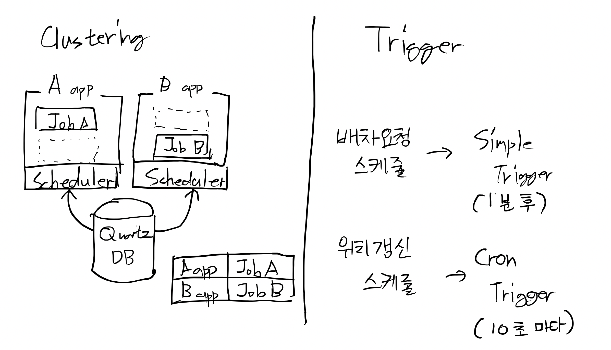

# 비즈니스 로직과 트랜잭션 (스케쥴러)

## Spring Quartz

- DB 기반으로 스케줄러 간의 Clustering 기능을 제공.
- 시스템 Fail-over와 Random 방식의 로드 분산처리를 지원.
- JVM 종료 이벤트를 캐치해서 스케줄러에게 종료를 알려줌.



## Quartz 테이블 추가

`migration/V13__init_스케쥴러.sql`

```sql
CREATE TABLE QRTZ_JOB_DETAILS
(
    SCHED_NAME        VARCHAR(120) NOT NULL,
    JOB_NAME          VARCHAR(190) NOT NULL,
    JOB_GROUP         VARCHAR(190) NOT NULL,
    DESCRIPTION       VARCHAR(250) NULL,
    JOB_CLASS_NAME    VARCHAR(250) NOT NULL,
    IS_DURABLE        VARCHAR(1)   NOT NULL,
    IS_NONCONCURRENT  VARCHAR(1)   NOT NULL,
    IS_UPDATE_DATA    VARCHAR(1)   NOT NULL,
    REQUESTS_RECOVERY VARCHAR(1)   NOT NULL,
    JOB_DATA          BLOB         NULL,
    PRIMARY KEY (SCHED_NAME, JOB_NAME, JOB_GROUP)
)
    ENGINE = InnoDB;

CREATE TABLE QRTZ_TRIGGERS
(
    SCHED_NAME     VARCHAR(120) NOT NULL,
    TRIGGER_NAME   VARCHAR(190) NOT NULL,
    TRIGGER_GROUP  VARCHAR(190) NOT NULL,
    JOB_NAME       VARCHAR(190) NOT NULL,
    JOB_GROUP      VARCHAR(190) NOT NULL,
    DESCRIPTION    VARCHAR(250) NULL,
    NEXT_FIRE_TIME BIGINT(13)   NULL,
    PREV_FIRE_TIME BIGINT(13)   NULL,
    PRIORITY       INTEGER      NULL,
    TRIGGER_STATE  VARCHAR(16)  NOT NULL,
    TRIGGER_TYPE   VARCHAR(8)   NOT NULL,
    START_TIME     BIGINT(13)   NOT NULL,
    END_TIME       BIGINT(13)   NULL,
    CALENDAR_NAME  VARCHAR(190) NULL,
    MISFIRE_INSTR  SMALLINT(2)  NULL,
    JOB_DATA       BLOB         NULL,
    PRIMARY KEY (SCHED_NAME, TRIGGER_NAME, TRIGGER_GROUP),
    FOREIGN KEY (SCHED_NAME, JOB_NAME, JOB_GROUP)
        REFERENCES QRTZ_JOB_DETAILS (SCHED_NAME, JOB_NAME, JOB_GROUP)
)
    ENGINE = InnoDB;

CREATE TABLE QRTZ_SIMPLE_TRIGGERS
(
    SCHED_NAME      VARCHAR(120) NOT NULL,
    TRIGGER_NAME    VARCHAR(190) NOT NULL,
    TRIGGER_GROUP   VARCHAR(190) NOT NULL,
    REPEAT_COUNT    BIGINT(7)    NOT NULL,
    REPEAT_INTERVAL BIGINT(12)   NOT NULL,
    TIMES_TRIGGERED BIGINT(10)   NOT NULL,
    PRIMARY KEY (SCHED_NAME, TRIGGER_NAME, TRIGGER_GROUP),
    FOREIGN KEY (SCHED_NAME, TRIGGER_NAME, TRIGGER_GROUP)
        REFERENCES QRTZ_TRIGGERS (SCHED_NAME, TRIGGER_NAME, TRIGGER_GROUP)
)
    ENGINE = InnoDB;

CREATE TABLE QRTZ_CRON_TRIGGERS
(
    SCHED_NAME      VARCHAR(120) NOT NULL,
    TRIGGER_NAME    VARCHAR(190) NOT NULL,
    TRIGGER_GROUP   VARCHAR(190) NOT NULL,
    CRON_EXPRESSION VARCHAR(120) NOT NULL,
    TIME_ZONE_ID    VARCHAR(80),
    PRIMARY KEY (SCHED_NAME, TRIGGER_NAME, TRIGGER_GROUP),
    FOREIGN KEY (SCHED_NAME, TRIGGER_NAME, TRIGGER_GROUP)
        REFERENCES QRTZ_TRIGGERS (SCHED_NAME, TRIGGER_NAME, TRIGGER_GROUP)
)
    ENGINE = InnoDB;

CREATE TABLE QRTZ_SIMPROP_TRIGGERS
(
    SCHED_NAME    VARCHAR(120)   NOT NULL,
    TRIGGER_NAME  VARCHAR(190)   NOT NULL,
    TRIGGER_GROUP VARCHAR(190)   NOT NULL,
    STR_PROP_1    VARCHAR(512)   NULL,
    STR_PROP_2    VARCHAR(512)   NULL,
    STR_PROP_3    VARCHAR(512)   NULL,
    INT_PROP_1    INT            NULL,
    INT_PROP_2    INT            NULL,
    LONG_PROP_1   BIGINT         NULL,
    LONG_PROP_2   BIGINT         NULL,
    DEC_PROP_1    NUMERIC(13, 4) NULL,
    DEC_PROP_2    NUMERIC(13, 4) NULL,
    BOOL_PROP_1   VARCHAR(1)     NULL,
    BOOL_PROP_2   VARCHAR(1)     NULL,
    PRIMARY KEY (SCHED_NAME, TRIGGER_NAME, TRIGGER_GROUP),
    FOREIGN KEY (SCHED_NAME, TRIGGER_NAME, TRIGGER_GROUP)
        REFERENCES QRTZ_TRIGGERS (SCHED_NAME, TRIGGER_NAME, TRIGGER_GROUP)
)
    ENGINE = InnoDB;

CREATE TABLE QRTZ_BLOB_TRIGGERS
(
    SCHED_NAME    VARCHAR(120) NOT NULL,
    TRIGGER_NAME  VARCHAR(190) NOT NULL,
    TRIGGER_GROUP VARCHAR(190) NOT NULL,
    BLOB_DATA     BLOB         NULL,
    PRIMARY KEY (SCHED_NAME, TRIGGER_NAME, TRIGGER_GROUP),
    INDEX (SCHED_NAME, TRIGGER_NAME, TRIGGER_GROUP),
    FOREIGN KEY (SCHED_NAME, TRIGGER_NAME, TRIGGER_GROUP)
        REFERENCES QRTZ_TRIGGERS (SCHED_NAME, TRIGGER_NAME, TRIGGER_GROUP)
)
    ENGINE = InnoDB;

CREATE TABLE QRTZ_CALENDARS
(
    SCHED_NAME    VARCHAR(120) NOT NULL,
    CALENDAR_NAME VARCHAR(190) NOT NULL,
    CALENDAR      BLOB         NOT NULL,
    PRIMARY KEY (SCHED_NAME, CALENDAR_NAME)
)
    ENGINE = InnoDB;

CREATE TABLE QRTZ_PAUSED_TRIGGER_GRPS
(
    SCHED_NAME    VARCHAR(120) NOT NULL,
    TRIGGER_GROUP VARCHAR(190) NOT NULL,
    PRIMARY KEY (SCHED_NAME, TRIGGER_GROUP)
)
    ENGINE = InnoDB;

CREATE TABLE QRTZ_FIRED_TRIGGERS
(
    SCHED_NAME        VARCHAR(120) NOT NULL,
    ENTRY_ID          VARCHAR(95)  NOT NULL,
    TRIGGER_NAME      VARCHAR(190) NOT NULL,
    TRIGGER_GROUP     VARCHAR(190) NOT NULL,
    INSTANCE_NAME     VARCHAR(190) NOT NULL,
    FIRED_TIME        BIGINT(13)   NOT NULL,
    SCHED_TIME        BIGINT(13)   NOT NULL,
    PRIORITY          INTEGER      NOT NULL,
    STATE             VARCHAR(16)  NOT NULL,
    JOB_NAME          VARCHAR(190) NULL,
    JOB_GROUP         VARCHAR(190) NULL,
    IS_NONCONCURRENT  VARCHAR(1)   NULL,
    REQUESTS_RECOVERY VARCHAR(1)   NULL,
    PRIMARY KEY (SCHED_NAME, ENTRY_ID)
)
    ENGINE = InnoDB;

CREATE TABLE QRTZ_SCHEDULER_STATE
(
    SCHED_NAME        VARCHAR(120) NOT NULL,
    INSTANCE_NAME     VARCHAR(190) NOT NULL,
    LAST_CHECKIN_TIME BIGINT(13)   NOT NULL,
    CHECKIN_INTERVAL  BIGINT(13)   NOT NULL,
    PRIMARY KEY (SCHED_NAME, INSTANCE_NAME)
)
    ENGINE = InnoDB;

CREATE TABLE QRTZ_LOCKS
(
    SCHED_NAME VARCHAR(120) NOT NULL,
    LOCK_NAME  VARCHAR(40)  NOT NULL,
    PRIMARY KEY (SCHED_NAME, LOCK_NAME)
)
    ENGINE = InnoDB;

CREATE INDEX IDX_QRTZ_J_REQ_RECOVERY ON QRTZ_JOB_DETAILS (SCHED_NAME, REQUESTS_RECOVERY);
CREATE INDEX IDX_QRTZ_J_GRP ON QRTZ_JOB_DETAILS (SCHED_NAME, JOB_GROUP);

CREATE INDEX IDX_QRTZ_T_J ON QRTZ_TRIGGERS (SCHED_NAME, JOB_NAME, JOB_GROUP);
CREATE INDEX IDX_QRTZ_T_JG ON QRTZ_TRIGGERS (SCHED_NAME, JOB_GROUP);
CREATE INDEX IDX_QRTZ_T_C ON QRTZ_TRIGGERS (SCHED_NAME, CALENDAR_NAME);
CREATE INDEX IDX_QRTZ_T_G ON QRTZ_TRIGGERS (SCHED_NAME, TRIGGER_GROUP);
CREATE INDEX IDX_QRTZ_T_STATE ON QRTZ_TRIGGERS (SCHED_NAME, TRIGGER_STATE);
CREATE INDEX IDX_QRTZ_T_N_STATE ON QRTZ_TRIGGERS (SCHED_NAME, TRIGGER_NAME, TRIGGER_GROUP, TRIGGER_STATE);
CREATE INDEX IDX_QRTZ_T_N_G_STATE ON QRTZ_TRIGGERS (SCHED_NAME, TRIGGER_GROUP, TRIGGER_STATE);
CREATE INDEX IDX_QRTZ_T_NEXT_FIRE_TIME ON QRTZ_TRIGGERS (SCHED_NAME, NEXT_FIRE_TIME);
CREATE INDEX IDX_QRTZ_T_NFT_ST ON QRTZ_TRIGGERS (SCHED_NAME, TRIGGER_STATE, NEXT_FIRE_TIME);
CREATE INDEX IDX_QRTZ_T_NFT_MISFIRE ON QRTZ_TRIGGERS (SCHED_NAME, MISFIRE_INSTR, NEXT_FIRE_TIME);
CREATE INDEX IDX_QRTZ_T_NFT_ST_MISFIRE ON QRTZ_TRIGGERS (SCHED_NAME, MISFIRE_INSTR, NEXT_FIRE_TIME, TRIGGER_STATE);
CREATE INDEX IDX_QRTZ_T_NFT_ST_MISFIRE_GRP ON QRTZ_TRIGGERS (SCHED_NAME, MISFIRE_INSTR,
                                                             NEXT_FIRE_TIME, TRIGGER_GROUP,
                                                             TRIGGER_STATE);

CREATE INDEX IDX_QRTZ_FT_TRIG_INST_NAME ON QRTZ_FIRED_TRIGGERS (SCHED_NAME, INSTANCE_NAME);
CREATE INDEX IDX_QRTZ_FT_INST_JOB_REQ_RCVRY ON QRTZ_FIRED_TRIGGERS (SCHED_NAME, INSTANCE_NAME, REQUESTS_RECOVERY);
CREATE INDEX IDX_QRTZ_FT_J_G ON QRTZ_FIRED_TRIGGERS (SCHED_NAME, JOB_NAME, JOB_GROUP);
CREATE INDEX IDX_QRTZ_FT_JG ON QRTZ_FIRED_TRIGGERS (SCHED_NAME, JOB_GROUP);
CREATE INDEX IDX_QRTZ_FT_T_G ON QRTZ_FIRED_TRIGGERS (SCHED_NAME, TRIGGER_NAME, TRIGGER_GROUP);
CREATE INDEX IDX_QRTZ_FT_TG ON QRTZ_FIRED_TRIGGERS (SCHED_NAME, TRIGGER_GROUP);

ALTER TABLE QRTZ_TRIGGERS
    MODIFY COLUMN DESCRIPTION VARCHAR(255) CHARACTER SET utf8mb4 COLLATE utf8mb4_unicode_ci;
ALTER TABLE QRTZ_JOB_DETAILS
    MODIFY COLUMN DESCRIPTION VARCHAR(255) CHARACTER SET utf8mb4 COLLATE utf8mb4_unicode_ci;

commit;
```

DB 에 flyway 스키마 업데이트

```shell script
$ ./gradlew :migration:flywayClean :migration:flywayBaseline :migration:flywayMigrate
```

## Quartz 설정

`backend/build.gradle` 수정

```groovy
dependencies {
    //추가
    compile 'org.springframework.boot:spring-boot-starter-quartz'
}
```

`backend/src/main/resources/application.yml` 수정

```yaml
server:
  port: 8080

spring:
  profiles:
    active: local
  # 추가
  quartz:
    job-store-type: jdbc
    jdbc:
      initialize-schema: never
    properties:
      org.quartz.threadPool.threadCount: 5
      org.quartz.scheduler.instanceName: mobility
      org.quartz.scheduler.instanceId: AUTO
      org.quartz.jobStore.class: org.quartz.impl.jdbcjobstore.JobStoreTX
      org.quartz.jobStore.driverDelegateClass: org.quartz.impl.jdbcjobstore.StdJDBCDelegate
      org.quartz.jobStore.useProperties: true
      org.quartz.jobStore.isClustered: true
```

## Schedule Service

`backend/src/main/java/com/fastcampus/mobility/scheduler/DispatchScheduleService.java`

```java
package com.fastcampus.mobility.scheduler;

import java.time.LocalDateTime;
import java.time.ZoneId;
import java.util.Date;
import lombok.extern.slf4j.Slf4j;
import org.quartz.JobBuilder;
import org.quartz.JobDataMap;
import org.quartz.JobDetail;
import org.quartz.JobKey;
import org.quartz.Scheduler;
import org.quartz.SchedulerException;
import org.quartz.SimpleScheduleBuilder;
import org.quartz.SimpleTrigger;
import org.quartz.TriggerBuilder;
import org.springframework.beans.factory.annotation.Autowired;
import org.springframework.stereotype.Service;

@Service
@Slf4j
public class DispatchScheduleService {

  private static String GROUP_PREFIX = "dispatch-request";
  private final Scheduler scheduler;

  @Autowired
  public DispatchScheduleService(
      final Scheduler scheduler
  ) {
    this.scheduler = scheduler;
  }

  public void addSchedule(final Long drivingId, final Integer attempts) throws SchedulerException {
    String jobName = String.format("%s-%s", drivingId, attempts);

    JobDataMap jobDataMap = new JobDataMap();
    jobDataMap.putAsString("drivingId", drivingId);
    jobDataMap.putAsString("attempts", attempts);

    JobDetail jobDetail = JobBuilder.newJob(DispatchRequestJob.class)
        .withIdentity(jobName, GROUP_PREFIX)
        .usingJobData(jobDataMap)
        .storeDurably()
        .build();

    LocalDateTime startAt;
    if (attempts == 1) {
      startAt = LocalDateTime.now();
    } else {
      startAt = LocalDateTime.now().plusMinutes(1L);
    }

    SimpleTrigger simpleTrigger = TriggerBuilder.newTrigger()
        .forJob(jobDetail)
        .withIdentity(jobName, GROUP_PREFIX)
        .startAt(Date.from(startAt.atZone(ZoneId.systemDefault()).toInstant()))
        .withSchedule(
            SimpleScheduleBuilder.simpleSchedule().withMisfireHandlingInstructionFireNow())
        .build();
    scheduler.scheduleJob(jobDetail, simpleTrigger);
  }

  public void removeSchedule(final Long drivingId, final Integer attempts)
      throws SchedulerException {
    String jobName = String.format("%s-%s", drivingId, attempts);
    JobKey jobKey = new JobKey(jobName, GROUP_PREFIX);
    scheduler.deleteJob(jobKey);
  }
}
```

`backend/src/main/java/com/fastcampus/mobility/scheduler/DispatchRequestJob.java`

```java
package com.fastcampus.mobility.scheduler;

import com.fastcampus.mobility.service.spec.DrivingCommandService;
import lombok.extern.slf4j.Slf4j;
import org.quartz.JobDataMap;
import org.quartz.JobExecutionContext;
import org.springframework.beans.factory.annotation.Autowired;
import org.springframework.scheduling.quartz.QuartzJobBean;
import org.springframework.stereotype.Component;

@Slf4j
@Component
public class DispatchRequestJob extends QuartzJobBean {

  private final DrivingCommandService drivingCommandService;

  @Autowired
  public DispatchRequestJob(
      final DrivingCommandService drivingCommandService
  ) {
    this.drivingCommandService = drivingCommandService;
  }

  @Override
  protected void executeInternal(
      JobExecutionContext jobExecutionContext) {
    JobDataMap jobDataMap = jobExecutionContext.getMergedJobDataMap();
    long drivingId = jobDataMap.getLongFromString("drivingId");
    int attempts = jobDataMap.getIntFromString("attempts");
    drivingCommandService.dispatchRequest(drivingId, attempts);
  }
}
```

`backend/src/main/java/com/fastcampus/mobility/scheduler/CoordinatesScheduleService.java`

```java
package com.fastcampus.mobility.scheduler;

import lombok.extern.slf4j.Slf4j;
import org.quartz.CronScheduleBuilder;
import org.quartz.CronTrigger;
import org.quartz.JobBuilder;
import org.quartz.JobDataMap;
import org.quartz.JobDetail;
import org.quartz.JobKey;
import org.quartz.Scheduler;
import org.quartz.SchedulerException;
import org.quartz.TriggerBuilder;
import org.springframework.beans.factory.annotation.Autowired;
import org.springframework.stereotype.Service;

@Service
@Slf4j
public class CoordinatesScheduleService {

  private static String GROUP_PREFIX = "vehicle-coordinates";
  private final Scheduler scheduler;

  @Autowired
  public CoordinatesScheduleService(
      final Scheduler scheduler
  ) {
    this.scheduler = scheduler;
  }

  public void addSchedule(final Long drivingId) throws SchedulerException {
    String jobName = String.format("%s", drivingId);

    JobDataMap jobDataMap = new JobDataMap();
    jobDataMap.putAsString("drivingId", drivingId);

    JobDetail jobDetail = JobBuilder.newJob(CoordinatesUpdateJob.class)
        .withIdentity(jobName, GROUP_PREFIX)
        .usingJobData(jobDataMap)
        .storeDurably()
        .build();

    CronTrigger cronTrigger = TriggerBuilder.newTrigger()
        .forJob(jobDetail)
        .withIdentity(jobName, GROUP_PREFIX)
        .withSchedule(
            CronScheduleBuilder.cronSchedule(this.generateCronExpression())
        ).build();
    scheduler.scheduleJob(jobDetail, cronTrigger);
  }

  public void removeSchedule(final Long drivingId) throws SchedulerException {
    String jobName = String.format("%s", drivingId);
    JobKey jobKey = new JobKey(jobName, GROUP_PREFIX);
    scheduler.deleteJob(jobKey);
  }

  private String generateCronExpression() {
    return "0/10 * * ? * * *";
  }
}
```

`backend/src/main/java/com/fastcampus/mobility/scheduler/CoordinatesUpdateJob.java`

```java
package com.fastcampus.mobility.scheduler;

import com.fastcampus.mobility.service.spec.DrivingCommandService;
import lombok.extern.slf4j.Slf4j;
import org.quartz.JobDataMap;
import org.quartz.JobExecutionContext;
import org.springframework.beans.factory.annotation.Autowired;
import org.springframework.scheduling.quartz.QuartzJobBean;
import org.springframework.stereotype.Component;

@Slf4j
@Component
public class CoordinatesUpdateJob extends QuartzJobBean {

  private final DrivingCommandService drivingCommandService;

  @Autowired
  public CoordinatesUpdateJob(
      final DrivingCommandService drivingCommandService
  ) {
    this.drivingCommandService = drivingCommandService;
  }

  @Override
  protected void executeInternal(
      JobExecutionContext jobExecutionContext) {
    JobDataMap jobDataMap = jobExecutionContext.getMergedJobDataMap();
    long drivingId = jobDataMap.getLongFromString("drivingId");
    drivingCommandService.updateCoordinates(drivingId);
  }
}
```

## 배차요청 스케쥴 테스트

[환경변수와 함께 구동](/monolithic/develop/02?id=환경변수와-함께-구동) 으로 네이버 키,시크릿키 환경변수로 포함하여 구동중인지 확인.

- 운행아이디, 차량아이디는 Response 내용에 따라 달라질 수 있습니다.

차량 등록 5 대

```shell script
$ curl --location --request POST 'http://localhost:8080/api/vehicle' \
  --header 'Content-Type: application/json' \
  --data-raw '{
      "license": "A0001"
  }'

$ curl --location --request POST 'http://localhost:8080/api/vehicle' \
  --header 'Content-Type: application/json' \
  --data-raw '{
      "license": "A0002"
  }'
$ curl --location --request POST 'http://localhost:8080/api/vehicle' \
  --header 'Content-Type: application/json' \
  --data-raw '{
      "license": "A0003"
  }'
$ curl --location --request POST 'http://localhost:8080/api/vehicle' \
  --header 'Content-Type: application/json' \
  --data-raw '{
      "license": "A0004"
  }'
$ curl --location --request POST 'http://localhost:8080/api/vehicle' \
  --header 'Content-Type: application/json' \
  --data-raw '{
      "license": "A0005"
  }'
```

운행등록

```shell script
$ curl --location --request POST 'http://localhost:8080/api/driving' \
  --header 'Content-Type: application/json' \
  --data-raw '{
      "boardingCoordinates": "127.1296048,37.3807975",
      "destinationCoordinates": "127.1166015,37.3815819"
  }'

{"id":1,"status":"배차중","vehicleId":0,"boardingYn":false,"dispatchAttempts":0,"dispatchVehicleCount":0,"drivingStartDate":null,"drivingEndDate":null,"createDate":"2021-02-01T16:28:32.637856","updateDate":"2021-02-01T16:28:32.637856","drivingRequests":[],"drivingRoute":{"drivingId":1,"startCoordinates":"","boardingCoordinates":"127.1296048,37.3807975","destinationCoordinates":"127.1166015,37.3815819","paths":"","boardingIndex":0,"createDate":"2021-02-01T16:28:32.656956","updateDate":"2021-02-01T16:28:32.656956"},"vehicle":null}
```

1분 이상 경과 후 1번운행 운행상태 확인 (배차2회차, 충 차량수 5대)

```shell script
$ curl --location --request GET 'http://localhost:8080/api/driving/1'

{
  "id": 1,
  "status": "배차중",
  "vehicleId": 0,
  "boardingYn": false,
  "dispatchAttempts": 2,
  "dispatchVehicleCount": 5,
  "drivingStartDate": null,
  "drivingEndDate": null,
  "createDate": "2021-02-01T16:28:32.637856",
  "updateDate": "2021-02-01T16:30:33.379673",
  "drivingRequests": [
    {
      "id": 1,
      "drivingId": 1,
      "vehicleId": 3,
      "dispatchAttempts": 1,
      "coordinates": "127.10014,37.51323",
      "createDate": "2021-02-01T16:28:33.086322",
      "updateDate": "2021-02-01T16:28:33.086322"
    },
    {
      "id": 2,
      "drivingId": 1,
      "vehicleId": 2,
      "dispatchAttempts": 1,
      "coordinates": "127.10014,37.51323",
      "createDate": "2021-02-01T16:28:33.100175",
      "updateDate": "2021-02-01T16:28:33.100175"
    },
    {
      "id": 3,
      "drivingId": 1,
      "vehicleId": 1,
      "dispatchAttempts": 1,
      "coordinates": "127.10014,37.51323",
      "createDate": "2021-02-01T16:28:33.117539",
      "updateDate": "2021-02-01T16:28:33.117539"
    },
    {
      "id": 4,
      "drivingId": 1,
      "vehicleId": 4,
      "dispatchAttempts": 1,
      "coordinates": "127.06327,37.50862",
      "createDate": "2021-02-01T16:28:33.129871",
      "updateDate": "2021-02-01T16:28:33.129871"
    },
    {
      "id": 5,
      "drivingId": 1,
      "vehicleId": 5,
      "dispatchAttempts": 2,
      "coordinates": "127.02134,37.51097",
      "createDate": "2021-02-01T16:29:33.219782",
      "updateDate": "2021-02-01T16:29:33.219782"
    }
  ],
  "drivingRoute": {
    "drivingId": 1,
    "startCoordinates": "",
    "boardingCoordinates": "127.1296048,37.3807975",
    "destinationCoordinates": "127.1166015,37.3815819",
    "paths": "",
    "boardingIndex": 0,
    "createDate": "2021-02-01T16:28:32.656956",
    "updateDate": "2021-02-01T16:28:32.656956"
  },
  "vehicle": null
}
```

3 분 경과후 1번운행 배차실패 확인

```shell script
$ curl --location --request GET 'http://localhost:8080/api/driving/1'

{
    "id": 1,
    "status": "배차실패",
    "vehicleId": 0,
    "boardingYn": false,
    "dispatchAttempts": 3,
    "dispatchVehicleCount": 5,
    "drivingStartDate": null,
    "drivingEndDate": null,
    "createDate": "2021-02-01T16:28:32.637856",
    "updateDate": "2021-02-01T16:31:33.429255",
    "drivingRequests": [
        {
            "id": 1,
            "drivingId": 1,
            "vehicleId": 3,
            "dispatchAttempts": 1,
            "coordinates": "127.10014,37.51323",
            "createDate": "2021-02-01T16:28:33.086322",
            "updateDate": "2021-02-01T16:28:33.086322"
        },
        {
            "id": 2,
            "drivingId": 1,
            "vehicleId": 2,
            "dispatchAttempts": 1,
            "coordinates": "127.10014,37.51323",
            "createDate": "2021-02-01T16:28:33.100175",
            "updateDate": "2021-02-01T16:28:33.100175"
        },
        {
            "id": 3,
            "drivingId": 1,
            "vehicleId": 1,
            "dispatchAttempts": 1,
            "coordinates": "127.10014,37.51323",
            "createDate": "2021-02-01T16:28:33.117539",
            "updateDate": "2021-02-01T16:28:33.117539"
        },
        {
            "id": 4,
            "drivingId": 1,
            "vehicleId": 4,
            "dispatchAttempts": 1,
            "coordinates": "127.06327,37.50862",
            "createDate": "2021-02-01T16:28:33.129871",
            "updateDate": "2021-02-01T16:28:33.129871"
        },
        {
            "id": 5,
            "drivingId": 1,
            "vehicleId": 5,
            "dispatchAttempts": 2,
            "coordinates": "127.02134,37.51097",
            "createDate": "2021-02-01T16:29:33.219782",
            "updateDate": "2021-02-01T16:29:33.219782"
        }
    ],
    "drivingRoute": {
        "drivingId": 1,
        "startCoordinates": "",
        "boardingCoordinates": "127.1296048,37.3807975",
        "destinationCoordinates": "127.1166015,37.3815819",
        "paths": "",
        "boardingIndex": 0,
        "createDate": "2021-02-01T16:28:32.656956",
        "updateDate": "2021-02-01T16:28:32.656956"
    },
    "vehicle": null
}
```

## 차량 위치업데이트 스케쥴 테스트

[환경변수와 함께 구동](/monolithic/develop/02?id=환경변수와-함께-구동) 으로 네이버 키,시크릿키 환경변수로 포함하여 구동중인지 확인.

- 운행아이디, 차량아이디는 Response 내용에 따라 달라질 수 있습니다.

운행등록

```shell script
$ curl --location --request POST 'http://localhost:8080/api/driving' \
  --header 'Content-Type: application/json' \
  --data-raw '{
      "boardingCoordinates": "127.1296048,37.3807975",
      "destinationCoordinates": "127.1166015,37.3815819"
  }'

{
    "id": 2,
    "status": "배차중",
    "vehicleId": 0,
    "boardingYn": false,
    "dispatchAttempts": 0,
    "dispatchVehicleCount": 0,
    "drivingStartDate": null,
    "drivingEndDate": null,
    "createDate": "2021-02-01T16:32:33.853753",
    "updateDate": "2021-02-01T16:32:33.853753",
    "drivingRequests": [],
    "drivingRoute": {
        "drivingId": 2,
        "startCoordinates": "",
        "boardingCoordinates": "127.1296048,37.3807975",
        "destinationCoordinates": "127.1166015,37.3815819",
        "paths": "",
        "boardingIndex": 0,
        "createDate": "2021-02-01T16:32:33.865859",
        "updateDate": "2021-02-01T16:32:33.865859"
    },
    "vehicle": null
}
```

2번 운행의 배차요청차량 리스트 확인

```shell script
curl --location --request GET 'http://localhost:8080/api/driving/2'

{
    "id": 2,
    "status": "배차중",
    "vehicleId": 0,
    "boardingYn": false,
    "dispatchAttempts": 2,
    "dispatchVehicleCount": 5,
    "drivingStartDate": null,
    "drivingEndDate": null,
    "createDate": "2021-02-01T16:32:33.853753",
    "updateDate": "2021-02-01T16:33:34.252942",
    "drivingRequests": [
        {
            "id": 8,
            "drivingId": 2,
            "vehicleId": 1,
            "dispatchAttempts": 1,
            "coordinates": "127.10014,37.51323",
            "createDate": "2021-02-01T16:32:34.04973",
            "updateDate": "2021-02-01T16:32:34.04973"
        },
        {
            "id": 7,
            "drivingId": 2,
            "vehicleId": 2,
            "dispatchAttempts": 1,
            "coordinates": "127.10014,37.51323",
            "createDate": "2021-02-01T16:32:34.043688",
            "updateDate": "2021-02-01T16:32:34.043688"
        },
        {
            "id": 6,
            "drivingId": 2,
            "vehicleId": 3,
            "dispatchAttempts": 1,
            "coordinates": "127.10014,37.51323",
            "createDate": "2021-02-01T16:32:34.034267",
            "updateDate": "2021-02-01T16:32:34.034267"
        },
        {
            "id": 9,
            "drivingId": 2,
            "vehicleId": 4,
            "dispatchAttempts": 1,
            "coordinates": "127.06327,37.50862",
            "createDate": "2021-02-01T16:32:34.072901",
            "updateDate": "2021-02-01T16:32:34.072901"
        },
        {
            "id": 10,
            "drivingId": 2,
            "vehicleId": 5,
            "dispatchAttempts": 2,
            "coordinates": "127.02134,37.51097",
            "createDate": "2021-02-01T16:33:34.179787",
            "updateDate": "2021-02-01T16:33:34.179787"
        }
    ],
    "drivingRoute": {
        "drivingId": 2,
        "startCoordinates": "",
        "boardingCoordinates": "127.1296048,37.3807975",
        "destinationCoordinates": "127.1166015,37.3815819",
        "paths": "",
        "boardingIndex": 0,
        "createDate": "2021-02-01T16:32:33.865859",
        "updateDate": "2021-02-01T16:32:33.865859"
    },
    "vehicle": null
}
```

1번차량을 2번 운행에 배차수락

```shell script
$ curl --location --request POST 'http://localhost:8080/api/driving/acceptance' \
  --header 'Content-Type: application/json' \
  --data-raw '{
      "drivingId": 2,
      "vehicleId": 1
  }'
```

10초 주기로 1번차량 차량위치 변경 확인

```shell script
curl --location --request GET 'http://localhost:8080/api/vehicle/1'

{
    "id": 1,
    "license": "A0001",
    "drivingYn": true,
    "createDate": "2021-02-01T16:26:37.25864",
    "updateDate": "2021-02-01T16:45:58.430299",
    "vehicleCoordinates": {
        "vehicleId": 1,
        "coordinates": "127.10597,37.49497",
        "createDate": "2021-02-01T16:26:37.327433",
        "updateDate": "2021-02-01T16:47:40.067243"
    }
}
```


