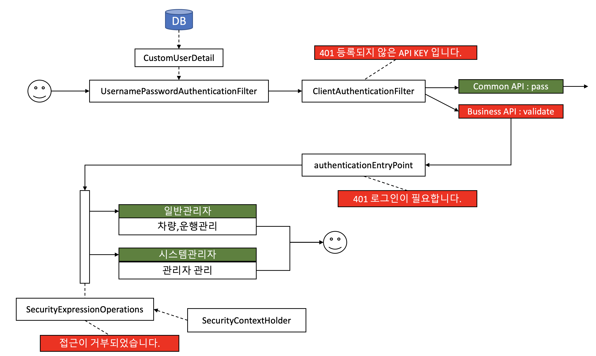

# SpringSecurity 인증처리 (사용자관리)

## SpringSecurity Filter Chain


1. HTTP 요청을 받음. 로그인,로그아웃,인증확인등 다양항 요청종류가 있으며 각각의 요청에 해당하는 필터체인에 도달할 때까지 필터를 통과한다.
2. 사용자가 입력한 아이디,패스워드 기반의 AuthenticationToken 을 생성 (아이디,패스워드 정보만 담고있는 토큰이고 아직 로그인된 것은 아니다)
3. 생성된 AuthenticationToken 를 AuthenticationManagager 에 전달
4. 등록된 AuthenticationProvider(s) 들마다 인증수행
5. UserDetailsService 에서 아이디,패스워드 기반으로 사용자 정보를 쿼리
6. UserDetails (사용자 정보) 오브젝트 반환
7. 위와 동일
8. 위와 동일
9. 위와 동일
10. SecurityContext 에 Authentication Object 세팅. 이후 설정에 따라 SessionManager 를 통해 세션에 저장되기도 하고, 1번 과정에서 세션에서부터 인증정보를 가져오기도 한다.


## SpringSecurity Customizing



## User Entity & Repository & Dto

`backend/src/main/java/com/fastcampus/mobility/entity/UserRole.java`

```java
package com.fastcampus.mobility.entity;

public enum UserRole {
  시스템관리, 일반관리
}
```

`backend/src/main/java/com/fastcampus/mobility/entity/UserEntity.java`

```java
package com.fastcampus.mobility.entity;

import java.time.LocalDateTime;
import javax.persistence.Column;
import javax.persistence.Entity;
import javax.persistence.EnumType;
import javax.persistence.Enumerated;
import javax.persistence.GeneratedValue;
import javax.persistence.GenerationType;
import javax.persistence.Id;
import lombok.Builder;
import lombok.EqualsAndHashCode;
import lombok.Getter;
import lombok.NoArgsConstructor;
import lombok.Setter;

@Getter
@Setter
@NoArgsConstructor
@Entity(name = "user")
@EqualsAndHashCode(onlyExplicitlyIncluded = true, callSuper = false)
public class UserEntity extends AbstractEntity {

  @Id
  @GeneratedValue(strategy = GenerationType.IDENTITY)
  @Column(name = "id", nullable = false)
  private long id;

  @Column(name = "role", nullable = false)
  @Enumerated(EnumType.STRING)
  private UserRole role;

  @Column(name = "login_id", nullable = false)
  private String loginId;

  @Column(name = "login_password", nullable = false)
  private String loginPassword;

  @Column(name = "name", nullable = false)
  private String name;

  @Builder(toBuilder = true)
  public UserEntity(long id, UserRole role, String loginId, String loginPassword,
      String name, LocalDateTime createDate, LocalDateTime updateDate) {
    this.id = id;
    this.role = role;
    this.loginId = loginId;
    this.loginPassword = loginPassword;
    this.name = name;
    this.createDate = createDate;
    this.updateDate = updateDate;
  }
}
```

`backend/src/main/java/com/fastcampus/mobility/dto/UserDto.java`

```java
package com.fastcampus.mobility.dto;

import com.fastcampus.mobility.entity.UserEntity;
import com.fastcampus.mobility.entity.UserRole;
import com.querydsl.core.annotations.QueryProjection;
import java.time.LocalDateTime;
import lombok.Builder;
import lombok.EqualsAndHashCode;
import lombok.Getter;
import lombok.NoArgsConstructor;
import lombok.Setter;

@Getter
@Setter
@NoArgsConstructor
@EqualsAndHashCode(onlyExplicitlyIncluded = true, callSuper = false)
public class UserDto extends AbstractDto {

  @EqualsAndHashCode.Include
  private Long id = 0L;
  private UserRole role = UserRole.일반관리;
  private String loginId;
  private String loginPassword;
  private String name;
  private LocalDateTime createDate;
  private LocalDateTime updateDate;

  @Builder
  public UserDto(Long id, UserRole role, String loginId, String loginPassword, String name,
      LocalDateTime createDate, LocalDateTime updateDate) {
    this.id = id;
    this.role = role;
    this.loginId = loginId;
    this.loginPassword = loginPassword;
    this.name = name;
    this.createDate = createDate;
    this.updateDate = updateDate;
  }

  @QueryProjection
  public UserDto(UserEntity u) {
    this.id = u.getId();
    this.role = u.getRole();
    this.loginId = u.getLoginId();
    this.loginPassword = u.getLoginPassword();
    this.name = u.getName();
    this.createDate = u.getCreateDate();
    this.updateDate = u.getUpdateDate();
  }
}
```

> 위 클래스들 추가 후 우측 gradle 탭 > Tasks > Other > complieQueryDsl 실행 > backend/src/main/generated/com/fastcampus/mobility 디렉토리에 Q클래스들 생성 확인

`backend/src/main/java/com/fastcampus/mobility/dto/search/UserSearchDto.java`

```java
package com.fastcampus.mobility.dto.search;

import com.fastcampus.mobility.entity.UserRole;
import lombok.Builder;
import lombok.Getter;
import lombok.NoArgsConstructor;
import lombok.Setter;

@Getter
@Setter
@NoArgsConstructor
public class UserSearchDto {

  private String loginId;
  private String name;
  private UserRole role;

  @Builder
  public UserSearchDto(String loginId, String name, UserRole role) {
    this.loginId = loginId;
    this.name = name;
    this.role = role;
  }
}
```

`backend/src/main/java/com/fastcampus/mobility/repository/UserRepository.java`

```java
package com.fastcampus.mobility.repository;

import com.fastcampus.mobility.entity.UserEntity;
import java.util.Optional;
import org.springframework.data.repository.PagingAndSortingRepository;
import org.springframework.stereotype.Repository;

@Repository
public interface UserRepository extends PagingAndSortingRepository<UserEntity, Long>,
    UserRepositoryCustom {

  Optional<UserEntity> findByLoginId(final String loginId);
}
```

`backend/src/main/java/com/fastcampus/mobility/repository/UserRepositoryCustom.java`

```java
package com.fastcampus.mobility.repository;

import com.fastcampus.mobility.dto.UserDto;
import com.fastcampus.mobility.dto.search.UserSearchDto;
import org.springframework.data.domain.Page;
import org.springframework.data.domain.Pageable;

public interface UserRepositoryCustom {

  Page<UserDto> findBySearchCondition(UserSearchDto userSearchDto,
      Pageable pageable);
}
```

`backend/src/main/java/com/fastcampus/mobility/repository/UserRepositoryImpl.java`

```java
package com.fastcampus.mobility.repository;


import static com.fastcampus.mobility.common.querydsl.QueryDslHelper.optionalWhen;

import com.fastcampus.mobility.dto.QUserDto;
import com.fastcampus.mobility.dto.UserDto;
import com.fastcampus.mobility.dto.search.UserSearchDto;
import com.fastcampus.mobility.entity.QUserEntity;
import com.fastcampus.mobility.entity.UserEntity;
import com.querydsl.jpa.JPQLQuery;
import java.util.List;
import lombok.extern.slf4j.Slf4j;
import org.springframework.data.domain.Page;
import org.springframework.data.domain.PageImpl;
import org.springframework.data.domain.PageRequest;
import org.springframework.data.domain.Pageable;
import org.springframework.data.jpa.repository.support.QuerydslRepositorySupport;

@Slf4j
public class UserRepositoryImpl extends QuerydslRepositorySupport implements
    UserRepositoryCustom {

  private static QUserEntity user = QUserEntity.userEntity;

  public UserRepositoryImpl() {
    super(UserEntity.class);
  }

  @Override
  public Page<UserDto> findBySearchCondition(UserSearchDto userSearchDto,
      Pageable pageable) {

    assert (getQuerydsl() != null);

    JPQLQuery<UserDto> query = getQuerydsl().createQuery()
        .select(new QUserDto(user))
        .from(user);

    optionalWhen(userSearchDto.getLoginId())
        .then(param -> query.where(user.loginId.eq(param)));

    optionalWhen(userSearchDto.getName())
        .then(param -> query.where(user.name.contains(param)));

    optionalWhen(userSearchDto.getRole())
        .then(param -> query.where(user.role.eq(param)));

    query.orderBy(user.createDate.desc());
    List<UserDto> resultList = getQuerydsl().applyPagination(
        PageRequest.of(pageable.getPageNumber(), pageable.getPageSize()), query).fetch();
    return new PageImpl<>(resultList, pageable, query.fetchCount());
  }
}
```

## User Repository Test

`backend/src/integrationTest/groovy/com/fastcampus/mobility/repository/UserRepositoryIntegrationTest.groovy`

```groovy
package com.fastcampus.mobility.repository

import com.fastcampus.mobility.IntegrationTestSupport
import com.fastcampus.mobility.dto.search.UserSearchDto
import com.fastcampus.mobility.entity.UserEntity
import com.fastcampus.mobility.entity.UserRole
import org.springframework.beans.factory.annotation.Autowired
import org.springframework.data.domain.PageRequest
import org.springframework.transaction.annotation.Transactional

@Transactional
class UserRepositoryIntegrationTest extends IntegrationTestSupport {

    @Autowired
    UserRepository userRepository

    def "QueryDsl 조회 테스트"() {
        given:
        userRepository.save(
                UserEntity.builder()
                        .name("name")
                        .role(UserRole.일반관리)
                        .loginId("loginId")
                        .loginPassword("loginPassword")
                        .build()
        )
        when:
        def searchDto = UserSearchDto.builder()
                .name("name")
                .loginId("loginId")
                .role(UserRole.일반관리)
                .build()
        def page = userRepository.findBySearchCondition(searchDto, PageRequest.of(0, 20))

        then:
        page.content.size() == 1
        page.content.get(0).name == "name"
        page.content.get(0).loginId == "loginId"
        page.content.get(0).role == UserRole.일반관리
    }
}
```

## User DomainService & PasswordEncoder

`backend/src/main/java/com/fastcampus/mobility/security/PasswordEncoderConfig.java`

```java
package com.fastcampus.mobility.security;

import org.springframework.context.annotation.Bean;
import org.springframework.context.annotation.Configuration;
import org.springframework.security.crypto.bcrypt.BCryptPasswordEncoder;
import org.springframework.security.crypto.password.PasswordEncoder;

@Configuration
public class PasswordEncoderConfig {

  @Bean
  public PasswordEncoder passwordEncoder() {
    return new BCryptPasswordEncoder();
  }
}
```

`backend/src/main/java/com/fastcampus/mobility/dto/command/UserAddCommand.java`

```java
package com.fastcampus.mobility.dto.command;

import com.fastcampus.mobility.entity.UserRole;
import javax.validation.constraints.NotBlank;
import javax.validation.constraints.NotNull;
import lombok.Getter;
import lombok.NoArgsConstructor;
import lombok.Setter;

@Getter
@Setter
@NoArgsConstructor
public class UserAddCommand {

  @NotNull(message = "{user.NotNull.role}")
  private UserRole role;
  @NotBlank(message = "{user.NotBlank.loginId}")
  private String loginId;
  @NotBlank(message = "{user.NotBlank.loginPassword}")
  private String loginPassword;
  @NotBlank(message = "{user.NotBlank.name}")
  private String name;
}
```

`backend/src/main/java/com/fastcampus/mobility/dto/command/UserUpdateCommand.java`

```java
package com.fastcampus.mobility.dto.command;

import com.fastcampus.mobility.entity.UserRole;
import javax.validation.constraints.NotBlank;
import javax.validation.constraints.NotNull;
import lombok.Getter;
import lombok.NoArgsConstructor;
import lombok.Setter;

@Getter
@Setter
@NoArgsConstructor
public class UserUpdateCommand {

  private Long userId;
  @NotNull(message = "{user.NotNull.role}")
  private UserRole role;
  private String loginPassword;
  @NotBlank(message = "{user.NotBlank.name}")
  private String name;
}
```

`backend/src/main/resources/messages.properties` 수정

```properties
# 추가
user.NotNull.role=역할정보를 입력 해 주세요.
user.NotBlank.loginId=로그인아이디를 입력 해 주세요.
user.NotBlank.loginPassword=로그인패스워드를 입력 해 주세요.
user.NotBlank.name=이름을 입력 해 주세요.
```

`backend/src/main/java/com/fastcampus/mobility/service/spec/UserDomainService.java`

```java
package com.fastcampus.mobility.service.spec;


import com.fastcampus.mobility.dto.UserDto;
import com.fastcampus.mobility.dto.command.UserAddCommand;
import com.fastcampus.mobility.dto.command.UserUpdateCommand;
import com.fastcampus.mobility.dto.search.UserSearchDto;
import org.springframework.data.domain.Page;
import org.springframework.data.domain.Pageable;

public interface UserDomainService {

  UserDto get(final Long userId);

  Page<UserDto> search(UserSearchDto userSearchDto, Pageable pageable);

  UserDto insert(final UserAddCommand addCommand);

  UserDto update(final UserUpdateCommand updateCommand);
}
```

`backend/src/main/java/com/fastcampus/mobility/service/UserDomainServiceImpl.java`

```java
package com.fastcampus.mobility.service;

import com.fastcampus.mobility.common.exception.EntityNotFoundException;
import com.fastcampus.mobility.dto.AbstractDto;
import com.fastcampus.mobility.dto.UserDto;
import com.fastcampus.mobility.dto.command.UserAddCommand;
import com.fastcampus.mobility.dto.command.UserUpdateCommand;
import com.fastcampus.mobility.dto.search.UserSearchDto;
import com.fastcampus.mobility.entity.UserEntity;
import com.fastcampus.mobility.repository.UserRepository;
import com.fastcampus.mobility.service.spec.UserDomainService;
import lombok.extern.slf4j.Slf4j;
import org.springframework.beans.factory.annotation.Autowired;
import org.springframework.data.domain.Page;
import org.springframework.data.domain.Pageable;
import org.springframework.security.crypto.password.PasswordEncoder;
import org.springframework.stereotype.Service;
import org.springframework.transaction.annotation.Transactional;
import org.springframework.util.StringUtils;

@Service
@Slf4j
@Transactional
public class UserDomainServiceImpl implements UserDomainService {

  private final UserRepository userRepository;
  private final PasswordEncoder passwordEncoder;

  @Autowired
  public UserDomainServiceImpl(
      final UserRepository userRepository,
      final PasswordEncoder passwordEncoder
  ) {
    this.userRepository = userRepository;
    this.passwordEncoder = passwordEncoder;
  }

  @Override
  @Transactional(readOnly = true)
  public UserDto get(Long userId) {
    UserDto userDto = AbstractDto.fromEntity(UserDto.class,
        userRepository.findById(userId).orElseThrow(EntityNotFoundException::new));
    userDto.setLoginPassword("");
    return userDto;
  }

  @Override
  @Transactional(readOnly = true)
  public Page<UserDto> search(UserSearchDto userSearchDto, Pageable pageable) {
    return userRepository.findBySearchCondition(userSearchDto, pageable);
  }

  @Override
  public UserDto insert(UserAddCommand addCommand) {
    return AbstractDto.fromEntity(
        UserDto.class,
        userRepository.save(
            UserEntity.builder()
                .loginId(addCommand.getLoginId())
                .loginPassword(passwordEncoder.encode(addCommand.getLoginPassword()))
                .name(addCommand.getName())
                .role(addCommand.getRole())
                .build()
        ));
  }

  @Override
  public UserDto update(UserUpdateCommand updateCommand) {
    UserEntity userEntity = userRepository.findById(updateCommand.getUserId())
        .orElseThrow(EntityNotFoundException::new);
    return AbstractDto.fromEntity(
        UserDto.class,
        userRepository.save(
            userEntity.toBuilder()
                .loginPassword(
                    StringUtils.isEmpty(updateCommand.getLoginPassword()) ?
                        userEntity.getLoginPassword() :
                        passwordEncoder.encode(updateCommand.getLoginPassword())
                )
                .name(updateCommand.getName())
                .role(updateCommand.getRole())
                .build()
        ));
  }
}
```

## User DomainService Test

`backend/src/integrationTest/groovy/com/fastcampus/mobility/service/UserDomainServiceIntegrationTest.groovy`

```groovy
package com.fastcampus.mobility.service

import com.fastcampus.mobility.IntegrationTestSupport
import com.fastcampus.mobility.dto.command.UserAddCommand
import com.fastcampus.mobility.entity.UserRole
import com.fastcampus.mobility.service.spec.UserDomainService
import org.springframework.beans.factory.annotation.Autowired
import org.springframework.security.crypto.password.PasswordEncoder
import org.springframework.transaction.annotation.Transactional

@Transactional
class UserDomainServiceIntegrationTest extends IntegrationTestSupport {

    @Autowired
    UserDomainService userDomainService

    @Autowired
    PasswordEncoder passwordEncoder

    def "사용자 등록시 패스워드가 암호화되고 입력받은 비밀번호와 암호화된 비밀번호가 일치함을 알 수 있다."() {
        given:
        def addCommand = new UserAddCommand()
        addCommand.setName("name")
        addCommand.setLoginId("loginId")
        addCommand.setLoginPassword("password")
        addCommand.setRole(UserRole.일반관리)

        when:
        def userDto = userDomainService.insert(addCommand)

        then:
        print 'encodedPassword: ' + userDto.loginPassword + ' :'
        passwordEncoder.matches("password", userDto.loginPassword)
    }
}
```

## User Controller

`backend/src/main/java/com/fastcampus/mobility/controller/UserController.java`

```java
package com.fastcampus.mobility.controller;

import com.fastcampus.mobility.dto.UserDto;
import com.fastcampus.mobility.dto.command.UserAddCommand;
import com.fastcampus.mobility.dto.command.UserUpdateCommand;
import com.fastcampus.mobility.dto.search.UserSearchDto;
import com.fastcampus.mobility.service.spec.UserDomainService;
import javax.validation.Valid;
import javax.validation.constraints.Min;
import javax.validation.constraints.NotNull;
import org.springframework.beans.factory.annotation.Autowired;
import org.springframework.data.domain.Page;
import org.springframework.data.domain.Pageable;
import org.springframework.data.web.PageableDefault;
import org.springframework.http.HttpStatus;
import org.springframework.http.ResponseEntity;
import org.springframework.security.access.prepost.PreAuthorize;
import org.springframework.validation.annotation.Validated;
import org.springframework.web.bind.annotation.GetMapping;
import org.springframework.web.bind.annotation.PathVariable;
import org.springframework.web.bind.annotation.PostMapping;
import org.springframework.web.bind.annotation.PutMapping;
import org.springframework.web.bind.annotation.RequestBody;
import org.springframework.web.bind.annotation.RequestMapping;
import org.springframework.web.bind.annotation.RestController;

@RestController
@RequestMapping("/api/user")
@Validated
public class UserController {

  private final UserDomainService userDomainService;

  @Autowired
  public UserController(
      final UserDomainService userDomainService
  ) {
    this.userDomainService = userDomainService;
  }

  @GetMapping(value = "")
  public ResponseEntity<Page<UserDto>> search(
      final UserSearchDto userSearchDto,
      final @PageableDefault(size = 50) Pageable pageable) {
    return new ResponseEntity<>(
        userDomainService.search(userSearchDto, pageable), HttpStatus.OK);
  }

  @GetMapping(value = "/{id}")
  public ResponseEntity<UserDto> get(
      final @PathVariable("id") @NotNull @Min(1) Long id) {
    return new ResponseEntity<>(userDomainService.get(id), HttpStatus.OK);
  }

  @PreAuthorize("hasAuthority('시스템관리')")
  @PostMapping("")
  public ResponseEntity<UserDto> add(
      @Valid final @RequestBody UserAddCommand addCommand) {
    return new ResponseEntity<>(userDomainService.insert(addCommand), HttpStatus.OK);
  }

  @PreAuthorize("hasAuthority('시스템관리')")
  @PutMapping(value = "/{id}")
  public ResponseEntity<UserDto> update(
      final @PathVariable("id") @NotNull @Min(1) Long id,
      @Valid final @RequestBody UserUpdateCommand updateCommand) {
    updateCommand.setUserId(id);
    return new ResponseEntity<>(userDomainService.update(updateCommand), HttpStatus.OK);
  }
}
```

`backend/src/main/java/com/fastcampus/mobility/controller/ApiExceptionHandler.java` 수정

```java
//추가
import org.springframework.security.access.AccessDeniedException;

@Slf4j
@RestControllerAdvice
public class ApiExceptionHandler {
  
  //추가
  /**
   * security exception
   */
  @ExceptionHandler(AccessDeniedException.class)
  public ResponseEntity<ApiErrorResponse> handleException(AccessDeniedException e) {
    log.warn("ApiException > AccessDeniedException : {}", e.getMessage(), e);
    return new ResponseEntity<>(
        new ApiErrorResponse("접근이 허용되지 않은 사용자입니다."), HttpStatus.UNAUTHORIZED);
  }
}
```

## SecurityConfig & Filter & EndPoints

`backend/src/main/java/com/fastcampus/mobility/security/SecurityConfig.java`

```java
package com.fastcampus.mobility.security;

import javax.servlet.http.HttpServletRequest;
import lombok.extern.slf4j.Slf4j;
import org.springframework.beans.factory.annotation.Autowired;
import org.springframework.context.annotation.ComponentScan;
import org.springframework.context.annotation.Configuration;
import org.springframework.security.config.annotation.authentication.builders.AuthenticationManagerBuilder;
import org.springframework.security.config.annotation.method.configuration.EnableGlobalMethodSecurity;
import org.springframework.security.config.annotation.web.builders.HttpSecurity;
import org.springframework.security.config.annotation.web.builders.WebSecurity;
import org.springframework.security.config.annotation.web.configuration.EnableWebSecurity;
import org.springframework.security.config.annotation.web.configuration.WebSecurityConfigurerAdapter;
import org.springframework.security.config.http.SessionCreationPolicy;
import org.springframework.security.core.userdetails.UserDetailsService;
import org.springframework.security.crypto.password.PasswordEncoder;
import org.springframework.security.web.authentication.UsernamePasswordAuthenticationFilter;
import org.springframework.security.web.util.matcher.AntPathRequestMatcher;

@Slf4j
@Configuration
@EnableGlobalMethodSecurity(securedEnabled = true, prePostEnabled = true)
@EnableWebSecurity
@ComponentScan(basePackages = "com.fastcampus.mobility.security")
public class SecurityConfig extends WebSecurityConfigurerAdapter {

  public static final String[] WEB_IGNORE_PATHS = new String[]{
      "/static/**", "/favicon.ico", "/index.html", "/error", "/health",
      "/login", "/swagger-ui.html", "/swagger-ui/**", "/v3/api-docs"
  };

  public static final String[] API_PATHS = new String[]{
      "/api/**"
  };
  public static final String[] COMMON_API_PATHS = new String[]{
      "/api/security/**"
  };

  public static boolean isApiPath(HttpServletRequest request) {
    return new AntPathRequestMatcher("/api/**").matches(request);
  }

  private final PasswordEncoder passwordEncoder;
  private final CustomUserDetailsService customUserDetailsService;
  private final CustomAuthenticationSuccessHandler authenticationSuccessHandler;
  private final CustomAuthenticationFailureHandler authenticationFailureHandler;
  private final CustomLogoutHandler customLogoutHandler;
  private final ClientAuthenticationFilter clientAuthenticationFilter;
  private final SecurityErrorResponseHandler errorResponseHandler;
  private final CustomLogoutSuccessHandler customLogoutSuccessHandler;

  @Autowired
  public SecurityConfig(
      final PasswordEncoder passwordEncoder,
      final CustomUserDetailsService customUserDetailsService,
      final CustomAuthenticationSuccessHandler authenticationSuccessHandler,
      final CustomAuthenticationFailureHandler authenticationFailureHandler,
      final CustomLogoutHandler customLogoutHandler,
      final ClientAuthenticationFilter clientAuthenticationFilter,
      final SecurityErrorResponseHandler errorResponseHandler,
      final CustomLogoutSuccessHandler customLogoutSuccessHandler
  ) {
    this.passwordEncoder = passwordEncoder;
    this.customUserDetailsService = customUserDetailsService;
    this.authenticationSuccessHandler = authenticationSuccessHandler;
    this.authenticationFailureHandler = authenticationFailureHandler;
    this.customLogoutHandler = customLogoutHandler;
    this.clientAuthenticationFilter = clientAuthenticationFilter;
    this.errorResponseHandler = errorResponseHandler;
    this.customLogoutSuccessHandler = customLogoutSuccessHandler;
  }

  @SuppressWarnings("RedundantThrows")
  @Override
  public void configure(WebSecurity web) throws Exception {
    web.ignoring().antMatchers(WEB_IGNORE_PATHS);
  }

  @Override
  protected void configure(HttpSecurity http) throws Exception {
    http.exceptionHandling().authenticationEntryPoint((request, response, authException) -> {
      errorResponseHandler.send(response, "로그인이 필요합니다.");
    });

    http.exceptionHandling().accessDeniedHandler((request, response, accessDeniedException) -> {
      errorResponseHandler.send(response, "접근이 허용되지 않은 사용자입니다.");
    });

    http.headers();
    http.csrf().disable();
    http.cors().disable();
    http
        .authorizeRequests()
        .antMatchers(COMMON_API_PATHS).permitAll()
        .antMatchers(API_PATHS).authenticated()
        .anyRequest().permitAll()
        .and()
        .sessionManagement()
        .sessionCreationPolicy(SessionCreationPolicy.IF_REQUIRED);

    http.formLogin()
        .loginPage("/login")
        .loginProcessingUrl("/api/security/login")
        .successHandler(authenticationSuccessHandler)
        .failureHandler(authenticationFailureHandler)
        .and()
        .logout()
        .logoutUrl("/api/security/logout")
        .addLogoutHandler(customLogoutHandler)
        .deleteCookies("SESSION")
        .invalidateHttpSession(true)
        .logoutSuccessHandler(customLogoutSuccessHandler);

    http
        .addFilterAfter(clientAuthenticationFilter, UsernamePasswordAuthenticationFilter.class);
  }

  @Override
  protected void configure(AuthenticationManagerBuilder auth) throws Exception {
    auth.userDetailsService(userDetailsServiceBean())
        .passwordEncoder(passwordEncoder);
  }

  @Override
  public UserDetailsService userDetailsServiceBean() {
    return customUserDetailsService;
  }
}
```

`backend/src/main/java/com/fastcampus/mobility/security/ClientAuthenticationFilter.java`

```java
package com.fastcampus.mobility.security;

import java.io.IOException;
import java.util.List;
import javax.servlet.FilterChain;
import javax.servlet.ServletException;
import javax.servlet.ServletRequest;
import javax.servlet.ServletResponse;
import javax.servlet.http.HttpServletRequest;
import javax.servlet.http.HttpServletResponse;
import javax.servlet.http.HttpSession;
import lombok.extern.slf4j.Slf4j;
import org.springframework.security.authentication.UsernamePasswordAuthenticationToken;
import org.springframework.security.core.GrantedAuthority;
import org.springframework.security.core.authority.AuthorityUtils;
import org.springframework.security.core.context.SecurityContextHolder;
import org.springframework.security.core.userdetails.UserDetails;
import org.springframework.stereotype.Component;
import org.springframework.util.StringUtils;
import org.springframework.web.filter.GenericFilterBean;

@Slf4j
@Component
public class ClientAuthenticationFilter extends GenericFilterBean {

  private final SecurityErrorResponseHandler errorResponseHandler;
  private static String API_KEY_HEADER = "x-api-key";
  private static String API_KEY_VALUE = "VdDrxiT03k5pb4yNKNAkFxQ7v8wvw5DT";

  public ClientAuthenticationFilter(
      final SecurityErrorResponseHandler errorResponseHandler
  ) {
    this.errorResponseHandler = errorResponseHandler;
  }

  @Override
  public void doFilter(ServletRequest servletRequest, ServletResponse servletResponse,
      FilterChain chain) throws IOException, ServletException {
    HttpServletRequest request = (HttpServletRequest) servletRequest;
    HttpServletResponse response = (HttpServletResponse) servletResponse;

    // API 가 아닐경우 다음 필터로 넘어간다.
    if (!SecurityConfig.isApiPath(request)) {
      chain.doFilter(servletRequest, servletResponse);
      return;
    }

    // 클라이언트 헤더키가 없으면 다음 필터로 넘어간다.
    String apiKey = request.getHeader(API_KEY_HEADER);
    if (StringUtils.isEmpty(apiKey)) {
      chain.doFilter(servletRequest, servletResponse);
      return;
    }

    // 클라이언트 헤더키가 맞다면 인증정보를 생성하고, 필터종료시 인증정보를 삭제하여 재사용을 방지한다.
    if (API_KEY_VALUE.equals(apiKey)) {
      try {
        List<GrantedAuthority> authorities = AuthorityUtils
            .createAuthorityList("CLIENT");
        UserDetails userDetails = new CustomUserDetail(
            "system",
            "",
            authorities
        );
        SecurityContextHolder.getContext().setAuthentication(
            new UsernamePasswordAuthenticationToken(userDetails, userDetails.getPassword(),
                userDetails.getAuthorities()));
        chain.doFilter(servletRequest, servletResponse);
      } finally {
        HttpSession session = request.getSession(false);
        if (session != null) {
          logger.debug("Invalidating session: " + session.getId());
          session.invalidate();
        }
        SecurityContextHolder.getContext().setAuthentication(null);
        SecurityContextHolder.clearContext();
      }
    } else {
      errorResponseHandler.send(response, "등록되지 않은 API KEY 입니다.");
    }
  }
}
```

`backend/src/main/java/com/fastcampus/mobility/security/SecurityController.java`

```java
package com.fastcampus.mobility.security;

import org.springframework.beans.factory.annotation.Autowired;
import org.springframework.http.HttpStatus;
import org.springframework.http.ResponseEntity;
import org.springframework.validation.annotation.Validated;
import org.springframework.web.bind.annotation.GetMapping;
import org.springframework.web.bind.annotation.RequestMapping;
import org.springframework.web.bind.annotation.RestController;

@RestController
@RequestMapping("/api/security")
@Validated
public class SecurityController {

  private final CustomUserDetailsHelper userDetailsHelper;

  @Autowired
  public SecurityController(
      final CustomUserDetailsHelper userDetailsHelper) {
    this.userDetailsHelper = userDetailsHelper;
  }

  @GetMapping("/session")
  public ResponseEntity<SessionDto> getSession() {
    return new ResponseEntity<>(userDetailsHelper.getLoginSession(), HttpStatus.OK);
  }
}
```

## CustomUserDetail

`backend/src/main/java/com/fastcampus/mobility/security/SessionDto.java`

```java
package com.fastcampus.mobility.security;

import com.fastcampus.mobility.entity.UserEntity;
import com.fastcampus.mobility.entity.UserRole;
import java.io.Serializable;
import lombok.Builder;
import lombok.Getter;
import lombok.NoArgsConstructor;
import lombok.Setter;

@Getter
@Setter
@NoArgsConstructor
public class SessionDto implements Serializable {

  private Long id;
  private UserRole role;
  private String loginId;
  private String name;
  private boolean authenticated;

  @Builder
  public SessionDto(UserEntity userEntity) {
    this.id = userEntity.getId();
    this.role = userEntity.getRole();
    this.loginId = userEntity.getLoginId();
    this.name = userEntity.getName();
    this.authenticated = true;
  }
}
```

`backend/src/main/java/com/fastcampus/mobility/security/CustomUserDetail.java`

```java
package com.fastcampus.mobility.security;

import java.util.Collection;
import org.springframework.security.core.GrantedAuthority;
import org.springframework.security.core.userdetails.User;

public class CustomUserDetail extends User {

  private SessionDto session;

  public CustomUserDetail(
      String username,
      String password,
      Collection<? extends GrantedAuthority> authorities, SessionDto sessionDto) {
    super(username, password, authorities);
    this.session = sessionDto;
  }

  public CustomUserDetail(
      String username,
      String password,
      Collection<? extends GrantedAuthority> authorities) {
    super(username, password, authorities);
  }

  public SessionDto getSession() {
    return session;
  }
}
```

`backend/src/main/java/com/fastcampus/mobility/security/CustomUserDetailsHelper.java`

```java
package com.fastcampus.mobility.security;

import lombok.extern.slf4j.Slf4j;
import org.springframework.security.core.Authentication;
import org.springframework.security.core.context.SecurityContextHolder;
import org.springframework.stereotype.Component;

@Slf4j
@Component
public class CustomUserDetailsHelper {

  public CustomUserDetailsHelper() {
  }

  public SessionDto getLoginSession() {
    //로그인된 사용자의 경우
    Authentication authentication = SecurityContextHolder.getContext().getAuthentication();
    if (authentication != null && authentication.getPrincipal() instanceof CustomUserDetail) {
      CustomUserDetail customUserDetail = (CustomUserDetail) authentication.getPrincipal();
      if (customUserDetail.getSession() != null) {
        return customUserDetail.getSession();
      }
    }
    //로그인되지 않은 사용자의 경우
    return new SessionDto();
  }
}
```

`backend/src/main/java/com/fastcampus/mobility/security/CustomUserDetailsService.java`

```java
package com.fastcampus.mobility.security;

import com.fastcampus.mobility.entity.UserEntity;
import com.fastcampus.mobility.repository.UserRepository;
import java.util.List;
import java.util.Optional;
import lombok.extern.slf4j.Slf4j;
import org.springframework.beans.factory.annotation.Autowired;
import org.springframework.security.core.GrantedAuthority;
import org.springframework.security.core.authority.AuthorityUtils;
import org.springframework.security.core.userdetails.UserDetailsService;
import org.springframework.security.core.userdetails.UsernameNotFoundException;
import org.springframework.stereotype.Service;

@Slf4j
@Service
public class CustomUserDetailsService implements UserDetailsService {

  private final UserRepository userRepository;

  @Autowired
  public CustomUserDetailsService(
      final UserRepository userRepository) {
    this.userRepository = userRepository;
  }

  @Override
  public CustomUserDetail loadUserByUsername(String username) throws UsernameNotFoundException {
    Optional<UserEntity> userEntity = userRepository.findByLoginId(username);
    userEntity.ifPresent(entity -> log.info("Login username: {}, id: {}",
        entity.getLoginId(), entity.getId()));

    return userEntity
        .map(entity -> {
          List<GrantedAuthority> authorities = AuthorityUtils
              .createAuthorityList(entity.getRole().name());
          return new CustomUserDetail(
              entity.getLoginId(),
              entity.getLoginPassword(),
              authorities,
              new SessionDto(entity)
          );
        })
        .orElseThrow(() -> new UsernameNotFoundException(
            String.format("로그인 아이디 %s 를 찾을 수 없습니다.", username)
        ));
  }
}
```

## CustomHandlers

`backend/src/main/java/com/fastcampus/mobility/security/CustomAuthenticationSuccessHandler.java`

```java
package com.fastcampus.mobility.security;

import com.fasterxml.jackson.databind.ObjectMapper;
import java.io.IOException;
import javax.servlet.http.HttpServletRequest;
import javax.servlet.http.HttpServletResponse;
import org.springframework.security.core.Authentication;
import org.springframework.security.web.authentication.SimpleUrlAuthenticationSuccessHandler;
import org.springframework.stereotype.Component;

@Component
public class CustomAuthenticationSuccessHandler extends SimpleUrlAuthenticationSuccessHandler {

  private final ObjectMapper objectMapper;
  private final CustomUserDetailsHelper userDetailsHelper;

  public CustomAuthenticationSuccessHandler(
      final ObjectMapper objectMapper,
      final CustomUserDetailsHelper userDetailsHelper) {
    this.objectMapper = objectMapper;
    this.userDetailsHelper = userDetailsHelper;
  }

  @Override
  public void onAuthenticationSuccess(HttpServletRequest request, HttpServletResponse response,
      Authentication authentication) throws IOException {
    request.getSession().setMaxInactiveInterval(60 * 60 * 3);
    response.setContentType("application/json;charset=UTF-8");
    response.getWriter().write(
        objectMapper.writeValueAsString(userDetailsHelper.getLoginSession())
    );
  }
}
```

`backend/src/main/java/com/fastcampus/mobility/security/CustomAuthenticationFailureHandler.java`

```java
package com.fastcampus.mobility.security;

import com.fastcampus.mobility.controller.ApiExceptionHandler.ApiErrorResponse;
import com.fasterxml.jackson.databind.ObjectMapper;
import java.io.IOException;
import javax.servlet.http.HttpServletRequest;
import javax.servlet.http.HttpServletResponse;
import org.springframework.security.core.AuthenticationException;
import org.springframework.security.web.authentication.SimpleUrlAuthenticationFailureHandler;
import org.springframework.stereotype.Component;

@Component
public class CustomAuthenticationFailureHandler extends SimpleUrlAuthenticationFailureHandler {

  private final ObjectMapper objectMapper;

  public CustomAuthenticationFailureHandler(
      final ObjectMapper objectMapper) {
    this.objectMapper = objectMapper;
  }

  @Override
  public void onAuthenticationFailure(HttpServletRequest request, HttpServletResponse response,
      AuthenticationException exception) throws IOException {
    response.setContentType("application/json;charset=UTF-8");
    response.getWriter().write(
        objectMapper.writeValueAsString(
            new ApiErrorResponse("로그인에 실패하였습니다.")
        )
    );
  }
}
```

`backend/src/main/java/com/fastcampus/mobility/security/CustomLogoutSuccessHandler.java`

```java
package com.fastcampus.mobility.security;

import com.fasterxml.jackson.databind.ObjectMapper;
import java.io.IOException;
import javax.servlet.http.HttpServletRequest;
import javax.servlet.http.HttpServletResponse;
import org.springframework.security.core.Authentication;
import org.springframework.security.web.authentication.logout.HttpStatusReturningLogoutSuccessHandler;
import org.springframework.stereotype.Component;

@Component
public class CustomLogoutSuccessHandler extends HttpStatusReturningLogoutSuccessHandler {

  private final ObjectMapper objectMapper;
  private final CustomUserDetailsHelper userDetailsHelper;

  public CustomLogoutSuccessHandler(
      final ObjectMapper objectMapper,
      final CustomUserDetailsHelper userDetailsHelper) {
    this.objectMapper = objectMapper;
    this.userDetailsHelper = userDetailsHelper;
  }

  @Override
  public void onLogoutSuccess(HttpServletRequest request, HttpServletResponse response,
      Authentication authentication) throws IOException {
    response.setContentType("application/json;charset=UTF-8");
    response.getWriter().write(
        objectMapper.writeValueAsString(userDetailsHelper.getLoginSession())
    );
  }
}
```

`backend/src/main/java/com/fastcampus/mobility/security/CustomLogoutHandler.java`

```java
package com.fastcampus.mobility.security;

import javax.servlet.http.HttpServletRequest;
import javax.servlet.http.HttpServletResponse;
import org.springframework.security.core.Authentication;
import org.springframework.security.web.authentication.logout.LogoutHandler;
import org.springframework.stereotype.Component;

@Component
public class CustomLogoutHandler implements LogoutHandler {

  public CustomLogoutHandler() {
  }

  @Override
  public void logout(HttpServletRequest request, HttpServletResponse response,
      Authentication authentication) {
  }
}
```

`backend/src/main/java/com/fastcampus/mobility/security/SecurityErrorResponseHandler.java`

```java
package com.fastcampus.mobility.security;

import com.fastcampus.mobility.controller.ApiExceptionHandler.ApiErrorResponse;
import com.fasterxml.jackson.databind.ObjectMapper;
import java.io.IOException;
import javax.servlet.http.HttpServletResponse;
import lombok.extern.slf4j.Slf4j;
import org.springframework.http.HttpStatus;
import org.springframework.stereotype.Component;

@Slf4j
@Component
public class SecurityErrorResponseHandler {

  private final ObjectMapper objectMapper;

  public SecurityErrorResponseHandler(final ObjectMapper objectMapper) {
    this.objectMapper = objectMapper;
  }

  public void send(HttpServletResponse response, String message)
      throws IOException {
    response.setContentType("application/json;charset=UTF-8");
    response.setStatus(HttpStatus.UNAUTHORIZED.value());
    response.getWriter().write(
        objectMapper.writeValueAsString(
            new ApiErrorResponse(message)
        )
    );
  }
}
```

## Api Test

SpringBoot 재부팅 후

일반사용자 로그인 시 차량 조회는 성공, 사용자 추가는 시스템 관리자가 아니므로 실패한다

- 로그인

```shell script
$ curl -v --location --request POST 'http://localhost:8080/api/security/login?username=member&password=1234'
*   Trying ::1...
* TCP_NODELAY set
* Connected to localhost (::1) port 8080 (#0)
> POST /api/security/login?username=member&password=1234 HTTP/1.1
> Host: localhost:8080
> User-Agent: curl/7.63.0
> Accept: */*
>
< HTTP/1.1 200
< Set-Cookie: JSESSIONID=77461A6E6E68DBCD89D890195B69C39B; Path=/; HttpOnly
<
{"id":2,"role":"일반관리","loginId":"member","name":"MEMBER","authenticated":true}
```

- 세션쿠키를 사용하여 차량 조회

```shell script
$ curl --location --request GET 'http://localhost:8080/api/vehicle' \
> --header 'Cookie: JSESSIONID=77461A6E6E68DBCD89D890195B69C39B' \
> --data-raw ''
{"content":[],"pageable":{"sort":{"sorted":false,"unsorted":true,"empty":true},"pageNumber":0,"pageSize":50,"offset":0,"paged":true,"unpaged":false},"last":true,"totalPages":0,"totalElements":0,"first":true,"number":0,"numberOfElements":0,"size":50,"sort":{"sorted":false,"unsorted":true,"empty":true},"empty":true}
```

- 세션쿠키를 없이 차량 조회

```shell script
$ curl --location --request GET 'http://localhost:8080/api/vehicle' \
> --data-raw ''
{"message":"로그인이 필요합니다.","timestamp":"2021-02-02T11:29:03.35174"}
```

- 세션쿠키를 사용하여 사용자 추가

```shell script
$ curl --location --request POST 'http://localhost:8080/api/user' \
> --header 'Content-Type: application/json' \
> --header 'Cookie: JSESSIONID=77461A6E6E68DBCD89D890195B69C39B' \
> --data-raw '{
>     "role": "일반관리",
>     "loginId": "newid",
>     "loginPassword": "password",
>     "name": "OOO"
> }'
{"message":"접근이 허용되지 않은 사용자입니다.","timestamp":"2021-02-02T11:37:36.436579"}
```

