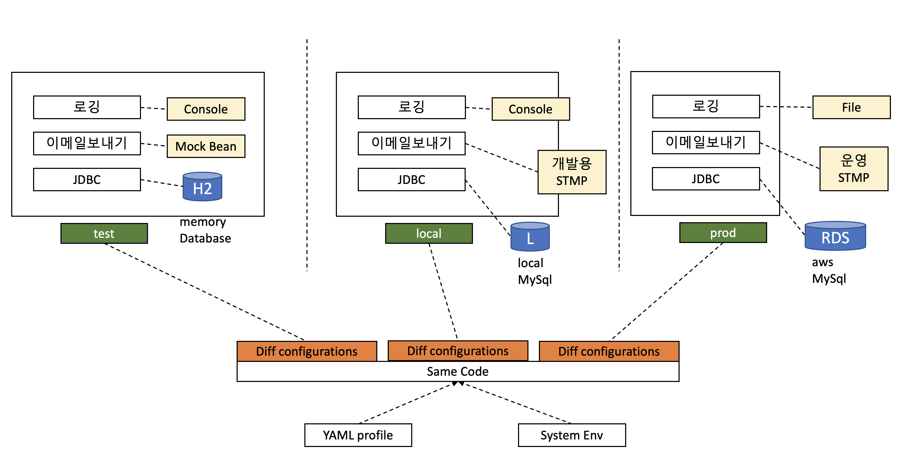

# SpringBoot 프로파일과 운영환경 분리

## SpringProfile?



## Yaml 프로파일 분리

`backend/src/main/resources/application.yml`

```yaml
# 추가
---
server:
  port: 8080
spring:
  profiles: prod
  datasource:
    url: jdbc:mysql://localhost:4306/mobility
    driverClassName: org.mariadb.jdbc.Driver
    username: root
    password: root
    hikari:
      maximum-pool-size: 10
      connection-test-query: select 1
      connection-timeout: 10000
      pool-name: pool-primary
  jpa:
    hibernate:
      ddl-auto: validate
    properties:
      hibernate:
        dialect: org.hibernate.dialect.MySQL57Dialect
        show_sql: true
        format_sql: true
```

## 운영 프로파일 로그 설정

`backend/src/main/java/com/fastcampus/mobility/security/MdcTrackingFilter.java`

```java
package com.fastcampus.mobility.security;

import java.io.IOException;
import javax.servlet.FilterChain;
import javax.servlet.ServletException;
import javax.servlet.ServletRequest;
import javax.servlet.ServletResponse;
import javax.servlet.http.HttpServletRequest;
import lombok.extern.slf4j.Slf4j;
import org.slf4j.MDC;
import org.springframework.security.core.Authentication;
import org.springframework.security.core.context.SecurityContextHolder;
import org.springframework.stereotype.Component;
import org.springframework.util.StringUtils;
import org.springframework.web.filter.GenericFilterBean;

@Slf4j
@Component
public class MdcTrackingFilter extends GenericFilterBean {

  public MdcTrackingFilter() {
  }

  @Override
  public void doFilter(ServletRequest servletRequest, ServletResponse servletResponse,
      FilterChain chain) throws IOException, ServletException {
    HttpServletRequest request = (HttpServletRequest) servletRequest;
    try {
      String requestURI = request.getRequestURI() +
          (StringUtils.isEmpty(request.getQueryString()) ? "" : "?" + request.getQueryString());
      MDC.put("uri", requestURI);
      Authentication authentication = SecurityContextHolder.getContext().getAuthentication();
      if (authentication != null && authentication.getPrincipal() instanceof CustomUserDetail) {
        CustomUserDetail userDetail = (CustomUserDetail) authentication.getPrincipal();
        MDC.put("username", userDetail.getUsername());
      }
      chain.doFilter(servletRequest, servletResponse);
    } finally {
      MDC.remove("username");
      MDC.remove("uri");
    }
  }
}
```

`backend/src/main/java/com/fastcampus/mobility/security/SecurityConfig.java` 수정

```java
public class SecurityConfig extends WebSecurityConfigurerAdapter {
  //추가
  private final MdcTrackingFilter mdcTrackingFilter;

  @Autowired
  public SecurityConfig(
      //추가
      final MdcTrackingFilter mdcTrackingFilter
  ) {
    //추가
    this.mdcTrackingFilter = mdcTrackingFilter;
  }

  @Override
  protected void configure(HttpSecurity http) throws Exception {
  
    //수정
    http
        .addFilterAfter(clientAuthenticationFilter, UsernamePasswordAuthenticationFilter.class)
        .addFilterAfter(mdcTrackingFilter, ClientAuthenticationFilter.class);
  }
}
```

`backend/src/main/resources/logback/file-appender.xml`

```xml
<?xml version="1.0" encoding="UTF-8"?>
<appender name="FILE" class="ch.qos.logback.core.rolling.RollingFileAppender">
  <file>${LOG_PATH}app.log</file>
  <rollingPolicy class="ch.qos.logback.core.rolling.TimeBasedRollingPolicy">
    <fileNamePattern>${LOG_PATH}backup/app-%d{yyyy-MM-dd}.%i.log.zip
    </fileNamePattern> <!-- rollover daily -->
    <maxHistory>7</maxHistory>
    <timeBasedFileNamingAndTriggeringPolicy
      class="ch.qos.logback.core.rolling.SizeAndTimeBasedFNATP">
      <maxFileSize>100MB</maxFileSize> <!-- or whenever the file size reaches 100MB -->
    </timeBasedFileNamingAndTriggeringPolicy>
  </rollingPolicy>
  <encoder>
    <pattern>
      %d{yyyy-MM-dd HH:mm:ss.SSS} %X{transactionId} %X{username} ${LOG_LEVEL_PATTERN:-%5p} ${PID:- } --- [%t] %-40.40logger{39} : %m%n
    </pattern>
  </encoder>
</appender>
```

`backend/src/main/resources/logback-spring.xml` 수정

```xml
<?xml version="1.0" encoding="UTF-8"?>
<configuration scan="true" scanPeriod="30 seconds">
<!--  추가-->
  <springProfile name="prod">
    <property name="LOG_PATH" value="/var/log/spring/"/>
    <include resource="logback/file-appender.xml"/>
    <logger name="org.springframework.web" level="DEBUG"/>
    <logger name="org.springframework.web.servlet.handler" level="INFO"/>
    <logger name="org.hibernate.SQL" level="info"/>
    <logger name="org.hibernate.type" level="info"/>

    <root level="INFO">
      <appender-ref ref="FILE"/>
    </root>
  </springProfile>

  <jmxConfigurator/>
</configuration>
```

## Test

### prod 프로파일로 구동

```shell script
$ gradle :backend:build
$ java -jar backend/build/libs/backend.jar --spring.profiles.active=prod
```

### 로그 Tail

```shell script
$ tail -f /var/log/spring/app.log
2021-02-02 16:48:03.444   DEBUG 68027 --- [main] s.w.s.m.m.a.RequestMappingHandlerMapping : 17 mappings in 'requestMappingHandlerMapping'
2021-02-02 16:48:03.615   DEBUG 68027 --- [main] .m.m.a.ExceptionHandlerExceptionResolver : ControllerAdvice beans: 1 @ExceptionHandler, 1 ResponseBodyAdvice
2021-02-02 16:48:03.896    INFO 68027 --- [main] o.s.b.a.e.web.EndpointLinksResolver      : Exposing 2 endpoint(s) beneath base path '/actuator'
2021-02-02 16:48:03.928    INFO 68027 --- [main] o.a.coyote.http11.Http11NioProtocol      : Starting ProtocolHandler ["http-nio-8080"]
2021-02-02 16:48:03.966    INFO 68027 --- [main] o.s.b.w.embedded.tomcat.TomcatWebServer  : Tomcat started on port(s): 8080 (http) with context path ''
2021-02-02 16:48:03.971    INFO 68027 --- [main] o.s.s.quartz.SchedulerFactoryBean        : Starting Quartz Scheduler now
2021-02-02 16:48:04.010    INFO 68027 --- [main] o.s.s.quartz.LocalDataSourceJobStore     : ClusterManager: detected 1 failed or restarted instances.
2021-02-02 16:48:04.010    INFO 68027 --- [main] o.s.s.quartz.LocalDataSourceJobStore     : ClusterManager: Scanning for instance "spparkui-MacBookPro.local1612236467351"'s failed in-progress jobs.
2021-02-02 16:48:04.019    INFO 68027 --- [main] org.quartz.core.QuartzScheduler          : Scheduler mobility_$_spparkui-MacBookPro.local1612252081220 started.
2021-02-02 16:48:04.038    INFO 68027 --- [main] com.fastcampus.mobility.Application      : Started Application in 20.38 seconds (JVM running for 21.002)
```

### 로그인 후 차량조회시 로그에 사용자 loginId 출력 확인

- 로그인

```shell script
$ curl -v --location --request POST 'http://localhost:8080/api/security/login?username=member&password=1234'
*   Trying ::1...
* TCP_NODELAY set
* Connected to localhost (::1) port 8080 (#0)
> POST /api/security/login?username=member&password=1234 HTTP/1.1
> Host: localhost:8080
> User-Agent: curl/7.63.0
> Accept: */*
>
< HTTP/1.1 200
< Set-Cookie: JSESSIONID=77461A6E6E68DBCD89D890195B69C39B; Path=/; HttpOnly
<
{"id":2,"role":"일반관리","loginId":"member","name":"MEMBER","authenticated":true}
```

- 세션쿠키를 사용하여 차량 조회

```shell script
$ curl --location --request GET 'http://localhost:8080/api/vehicle' \
> --header 'Cookie: JSESSIONID=77461A6E6E68DBCD89D890195B69C39B' \
> --data-raw ''
{"content":[],"pageable":{"sort":{"sorted":false,"unsorted":true,"empty":true},"pageNumber":0,"pageSize":50,"offset":0,"paged":true,"unpaged":false},"last":true,"totalPages":0,"totalElements":0,"first":true,"number":0,"numberOfElements":0,"size":50,"sort":{"sorted":false,"unsorted":true,"empty":true},"empty":true}
```

- 로그에 사용자 loginId `member` 출력 확인

```shell script
2021-02-02 16:49:44.509  member DEBUG 68027 --- [http-nio-8080-exec-3] o.s.web.servlet.DispatcherServlet        : GET "/api/vehicle", parameters={}
2021-02-02 16:49:44.516  member DEBUG 68027 --- [http-nio-8080-exec-3] s.w.s.m.m.a.RequestMappingHandlerMapping : Mapped to com.fastcampus.mobility.controller.VehicleController#search(VehicleSearchDto, Pageable)
2021-02-02 16:49:44.776  member DEBUG 68027 --- [http-nio-8080-exec-3] o.s.w.s.m.m.a.HttpEntityMethodProcessor  : Using 'application/json', given [*/*] and supported [application/json, application/*+json, application/json, application/*+json]
2021-02-02 16:49:44.778  member DEBUG 68027 --- [http-nio-8080-exec-3] o.s.w.s.m.m.a.HttpEntityMethodProcessor  : Writing [Page 1 of 0 containing UNKNOWN instances]
2021-02-02 16:49:44.812  member DEBUG 68027 --- [http-nio-8080-exec-3] o.s.web.servlet.DispatcherServlet        : Completed 200 OK
``` 


