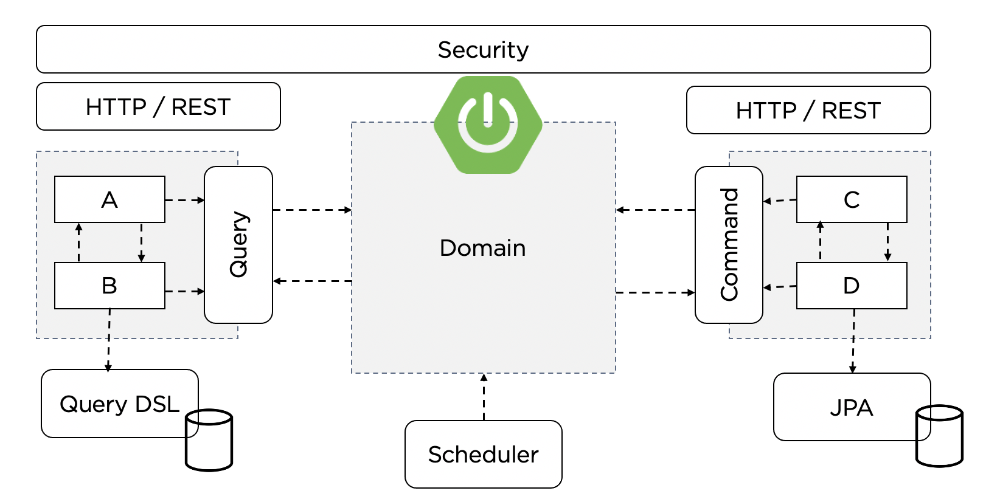

# 소규모 아키텍트 개요 (모놀로식 아키텍트 기반한 모빌리티 어플리케이션)

## 학습목표 - 벡엔드

1. 모빌리티 서비스의 기능요건과 비기능요건을 분석하고 모놀리씩 아키텍트를 위한 도메인 설계를 진행한다.
2. 분석된 도메인 설계를 바탕으로 SpringBoot, JPA, QueryDSL 로 Rest API 서비스를 만든다.
3. Spring Quartz 로 스케쥴 작업을 등록하고 관리하는 실습을 해 본다.
4. Spring Security 를 통해 권한있는 사용자에게만 API 를 제공 해 보는 실습을 한다.

## 학습목표 - 프론트엔드

1. VueJS Single Page Application 의 UI 라우팅 분리와 컴포넌트 개념을 실습한다.
2. API 통신과 메시지 처리에 대해 실습한다.
3. 로그인과 권한에 따른 접근 차단을 실습한다.
4. 모빌리티 서비스 페이지를 만들어보는 실습을 진행한다.

## 학습목표 - AWS

1. 3 tire 어플리케이션의 AWS 상에서 구축방법을 알아본다.
2. RDS 데이터베이스와 파라미터 설정 실습을 진행하고 Spring Boot 와 연동한다.
3. Nginx 웹서버 구축실습과 DNS Resolve 처리시 주의점 등을 살펴본다.
4. Spring Boot 어플리케이션을 EC2 에 설치하고 Launch Template 을 통한 Auto Scaling 설정을 실습한다.

