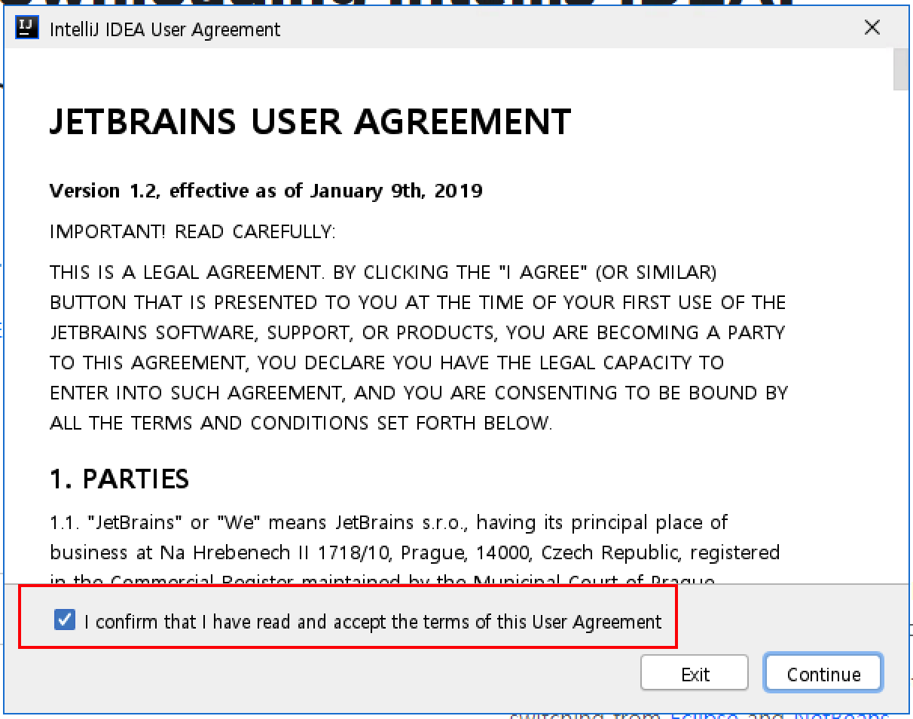
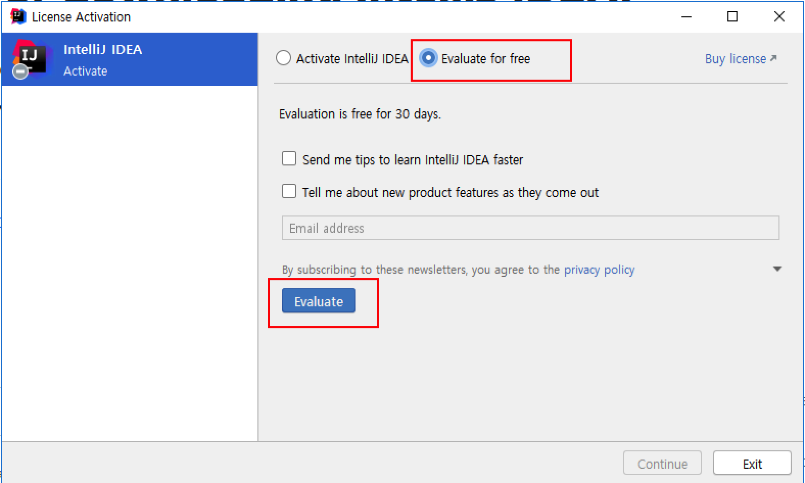
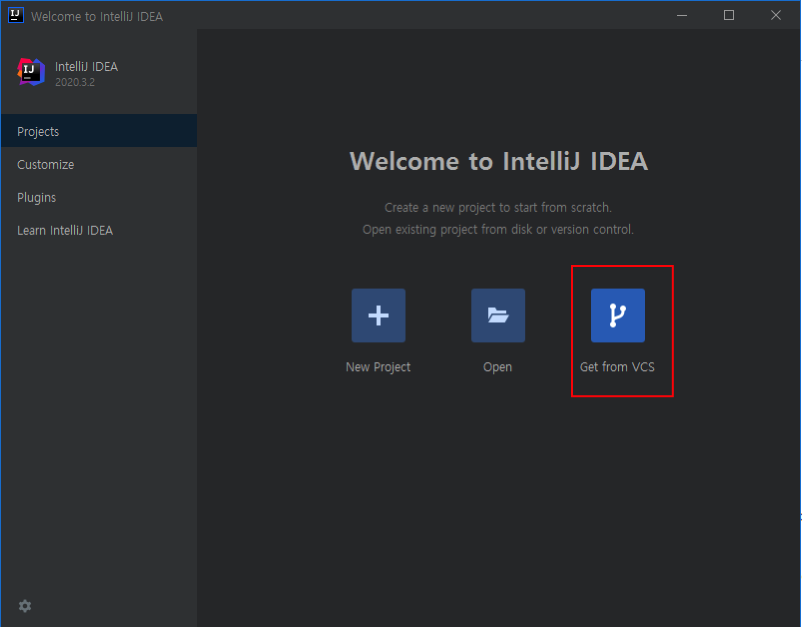
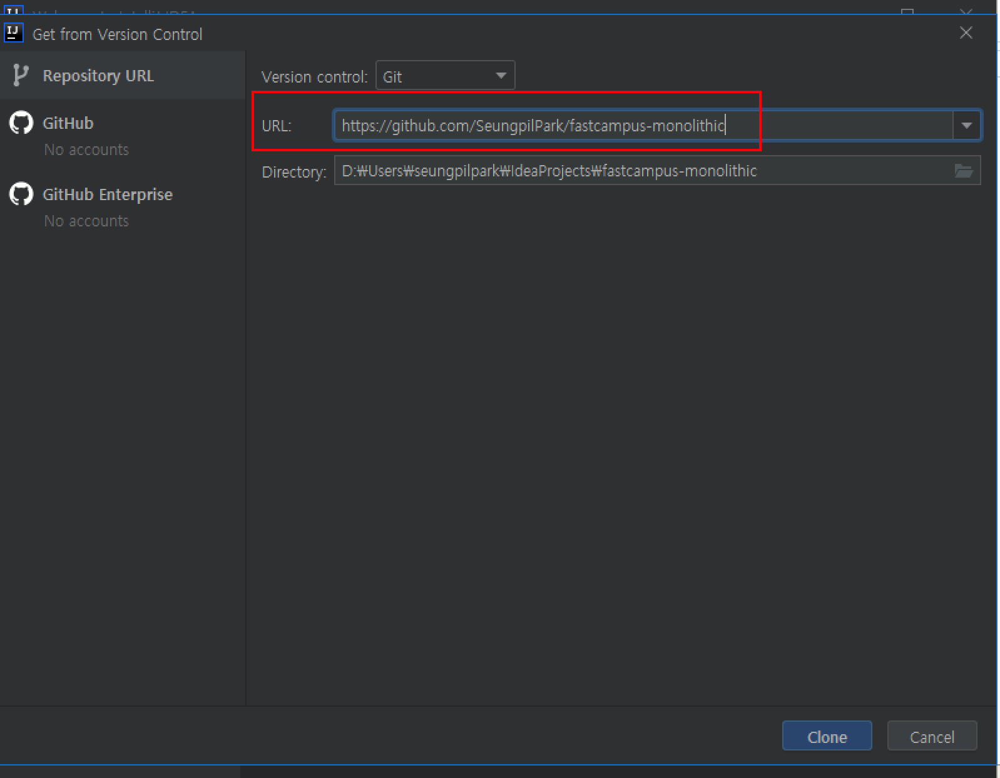
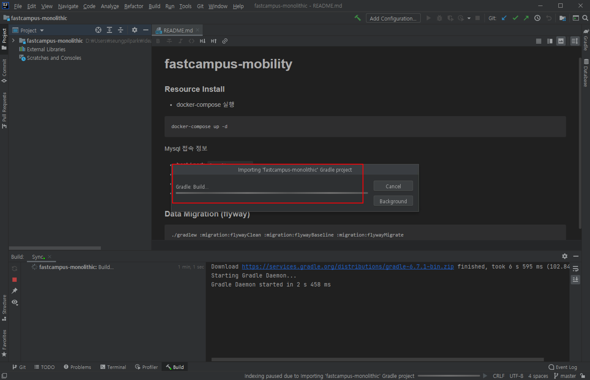
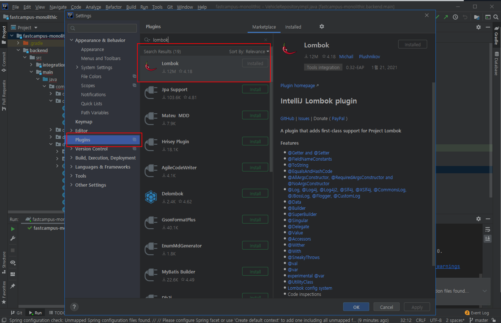
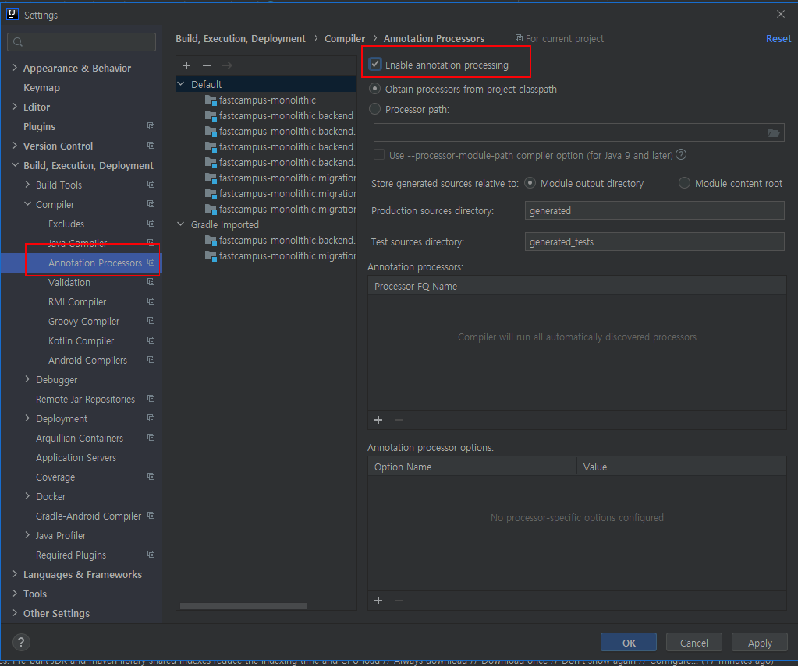
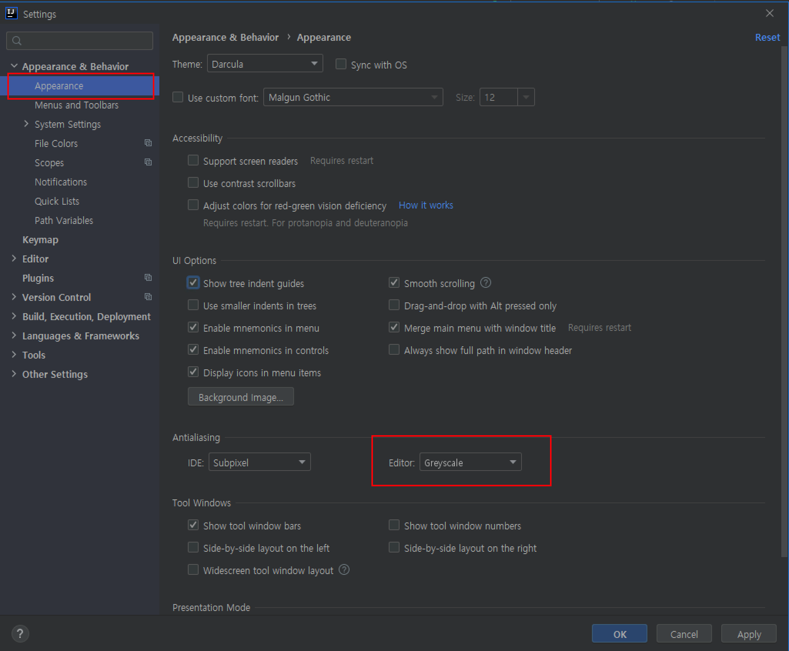
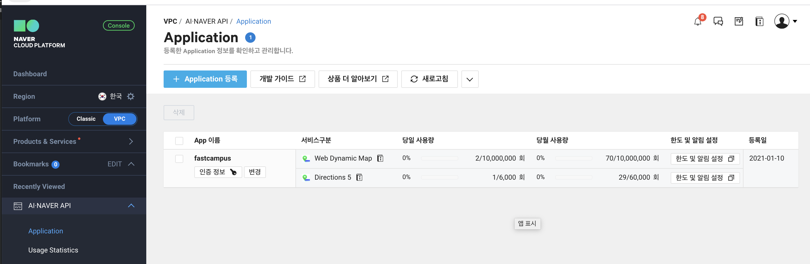

# 실습준비

## JDK 11

### 다운로드

- [https://jdk.java.net/java-se-ri/11](https://jdk.java.net/java-se-ri/11) 접속
- Java SE 11 클릭하여  zip 클릭하여 *Windows/x64 Java Development Kit (sha256) 178.7 MB* 다운로드

### 압축해제 및 이동
- C:\Program Files 폴더에 OpenJDK 폴더 생성
- openjdk-11.0.1_windows-x64_bin.zip 압축해제
- jdk-11 폴더를 OpenJDK 폴더 안으로 이동

### 시스템 환경변수 및 Path 등록

- 윈도우 검색창 "고급 시스템 설정" 입력
- 시스템 환경변수 등록

| 변수명	| 값 |
|-------|---|
| JAVA_HOME | C:\Program Files\OpenJDK\jdk-11 |
| Path 에 추가 | %JAVA_HOME%\bin |

### 확인

- 새로운 cmd 창을 열어서 확인

```shell script
C:\Users\win10user>echo %JAVA_HOME%

C:\Program Files\OpenJDK\jdk-11

C:\Users\win10user>javac -version
javac 11

```

## NodeJS

### 다운로드

- [https://nodejs.org/ko/download/](https://nodejs.org/ko/download/) 접속
- LTS > Windows Installer (.msi) > 64bit 다운로드
- .msi 파일 실행 > 안내문대로 인스톨 진행

### 확인

- 새로운 cmd 창을 열어서 확인

```shell script
D:\Users\seungpilpark>node -v
v14.15.4
```

## Gradle

### 다운로드

- [https://gradle.org/releases/](https://gradle.org/releases/) 접속
- v6.8.1 > Download > binary-only 다운로드

### 압축해제 및 이동
- C:\Program Files 폴더에 Gradle 폴더 생성
- gradle-6.8.1-bin 압축해제
- gradle-6.8.1 폴더를 Gradle 폴더 안으로 이동

### 시스템 환경변수 및 Path 등록

- 윈도우 검색창 "고급 시스템 설정" 입력
- 시스템 환경변수 등록

| 변수명	| 값 |
|-------|---|
| GRADLE_HOME | C:\Program Files\Gradle\gradle-6.8.1 |
| Path 에 추가 | %GRADLE_HOME%\bin |

### 확인

- 새로운 cmd 창을 열어서 확인

```shell script
C:\Users\win10user>echo %GRADLE_HOME%

C:\Program Files\Gradle\gradle-6.8.1

C:\Users\win10user>gradle -v

Welcome to Gradle 6.8.1!

Here are the highlights of this release:
 - Faster Kotlin DSL script compilation
 - Vendor selection for Java toolchains
 - Convenient execution of tasks in composite builds
 - Consistent dependency resolution

For more details see https://docs.gradle.org/6.8.1/release-notes.html


------------------------------------------------------------
Gradle 6.8.1
------------------------------------------------------------

```

## Git

- [https://git-scm.com/downloads](https://git-scm.com/downloads) 접속
- Windows > 64-bit Git for Windows Setup. 다운로드 > 실행 


## IntelliJ

### 다운로드

- [https://www.jetbrains.com/idea/](https://www.jetbrains.com/idea/) 접속
- Download > Ultimate (30 free) > .exe 다운로드 > 실행

### Intellij 라이선스 정책

- 기본 30일 무료. 
- [90일 팀 라이선스 무료요청](https://www.jetbrains.com/shop/eform/extended-trial/idea/)
- 스타트업 할인 프로그램 (50%OFF)
- 경쟁제품 전환 할인 프로그램(25%OFF)
- 학생용 무료 라이센스(100%OFF)
- 오픈소스 프로젝트 무료 라이센스(100%OFF)
- 상업용 라이센스 수량별 할인 프로그램
- 팀툴 소규모 무료 라이센스(TeamCity, Upsource, YouTrack)
- JetBrains 활용 사례 제공시 DC 협의 가능(기업 only)

### Intellij 세팅

- 약관동의



- 무료 라이선스 선택



- VCS 에서 프로젝트 시작하기 선택



- [https://github.com/SeungpilPark/fastcampus-monolithic](https://github.com/SeungpilPark/fastcampus-monolithic) 주소 입력 후 clone



- Gradle build 가 종료될 때까지 대기



- File > Settings > Plugins > Lombok 플러그인 설치 여부 확인. 미설치시 Install 하고 Intellij 재시작 



- File > Settings > Build,Execution,Deployment > Compiler > Annotation Processor > Enable 체크 



- File > Settings > Appearance & Behaviors > Appearance > Editor > GreyScale 변경




## Docker

[https://docs.docker.com/docker-for-windows/install/](https://docs.docker.com/docker-for-windows/install/) 내용을 기준으로 window 환경에 맞는 인스톨 과정 진행.

튜토리얼에서는 Window 10 기준으로 진행함.

### 다운로드

- [https://hub.docker.com/editions/community/docker-ce-desktop-windows/](https://hub.docker.com/editions/community/docker-ce-desktop-windows/) 접속 및 다운로드
- 인스톨러 실행
- 구성 페이지에서 Hyper-V Windows 기능 사용 옵션이 선택되어 있는지 확인.
- 설치 마법사의 지침에 따라 설치 프로그램을 인증하고 설치를 계속.
- 관리자 계정이 사용자 계정과 다른 경우 사용자를 docker-users 그룹에 추가필요. 
    - 관리자 권한으로 컴퓨터 관리를 실행하고 로컬 사용자 및 그룹 > 그룹 > docker-users 로 이동.
    - 그룹에 사용자를 추가하려면 마우스 오른쪽 버튼을 클릭. 변경 사항을 적용하려면 로그 아웃했다가 다시 로그인.

### 확인

- 새로운 cmd 창을 열어서 확인
- 다음과 같은 명령어에서 ubuntu 프롬프트가 나온다면 성공

```shell script
C:\Users\win10user>docker run -it ubuntu:14.04 /bin/bash
 
Unable to find image 'ubuntu:14.04' locally
14.04: Pulling from library/ubuntu
83ee3a23efb7: Pull complete
db98fc6f11f0: Pull complete
f611acd52c6c: Pull complete
...
root@6d2037ed3fd3:/#

```

## 네이버 지도 API 어플리케이션 생성

네이버 지도 API 사용처:
- 경로찾기 (1회 호출당 5월)
- 화면에 경로표기 (무제한 무료)

네이버 클라우드 플랫폼 가입시 최초 10만원 무료 !!

- 네이버 클라우드 플랫폼 [https://www.ncloud.com/](https://www.ncloud.com/) 가입
- [콘솔 이동](https://console.ncloud.com/mc/solution/naverService/application)
- AI-NAVER API > Application > Application 등록 > Web Dynamic Map,Directions 선택하여 생성
- 인증 정보 저장



> Application 인증정보는 별도로 저장하시고 절대로 외부에 노출되거나 Github 에 올리지 않도록 주의!!

   
 
